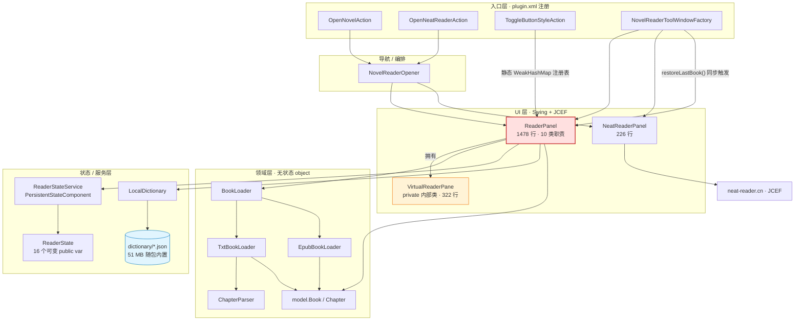
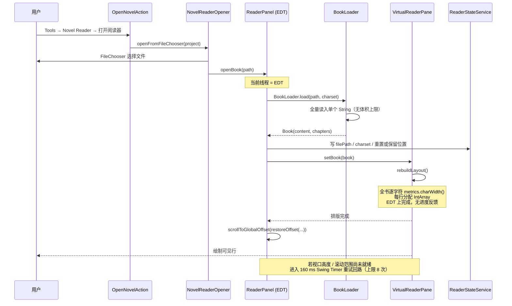
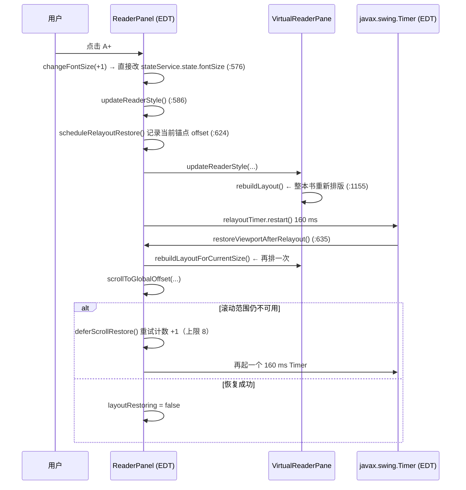

# Novel Reader 插件架构评审报告

- 评审人：高见远（架构师）
- 评审日期：2026-09-19
- 评审对象：`IntelliJ IDEA-reader`（Novel Reader）v0.4.6
- 评审方式：**只读静态分析**（通读 14 个 Kotlin 源文件、2 份文档、构建配置与资源清单），未修改任何生产代码
- 性质：现状摸底 + 风险识别 + 演进路线建议，**不包含重构实施**

---

## 0. 结论速览

| 维度 | 结论 |
|---|---|
| 分层是否清晰 | **雏形是对的**（领域层与 UI 层已分离，领域层全是无状态 `object`），但**只有两层**：`ReaderPanel` 一人承担了"UI 层 + 应用层 + 状态层"的全部工作 |
| 最大结构性问题 | `ReaderPanel.kt` 1478 行 = 10 类业务职责 + 1 个 322 行的内嵌 `VirtualReaderPane` + 11 个可变状态标志 |
| 最紧迫的运行时问题 | **EDT 阻塞**：整本文件的 IO 读取、全书逐字符排版、51 MB 词典解析，全部在主线程，`javax.swing.Timer` 只做合并、不做线程切换 |
| 历史返工的根因 | 不是"算法选错了"，而是**核心算法无法被独立验证**：位置恢复逻辑是 `ReaderPanel` 的 private 方法，绑定 `Project` + Swing 视口，只能靠手工点击回归 |
| 可测试性 | **零**。无 `src/test`，无测试依赖，无 CI |
| 建议态度 | 不要重写。现有虚拟渲染方向是正确的，应做**渐进式抽取 + 补测试网** |

对 team-lead 提出的假设（"阅读渲染/滚动/位置恢复这块状态模型耦合过重、边界不清"）——**判断成立**，但需要修正一处：**问题不在算法本身**。`globalOffset + anchorText + permille` 这套三级冗余设计、以及"全书虚拟行 + 只画可见行"的渲染策略，思路都是对的（0.3.0 之后滚动类 bug 确实消失了，日志可证）。真正的病根是：**这些正确的设计全部以 private 方法的形式塞进了一个 Swing 面板类里，没有任何可自动化的验证边界**，所以每次只能靠"打补丁 + 手点"逼近，表现为版本日志里的反复推翻。

---

## 1. 架构总览

### 1.1 现状分层

项目实际只形成了 **两层半**：

- **入口层**（`plugin.xml` 注册的 3 个 Action + 1 个 ToolWindowFactory）：薄，职责正确。
- **领域层**（`BookLoader` / `TxtBookLoader` / `EpubBookLoader` / `ChapterParser` / `LocalDictionary` / `model.Book`）：**这是全项目最健康的部分**——全部是无状态 `object` 或纯数据类，不依赖 Swing、不依赖 `Project`。0.4.0 能平滑接入 EPUB 且"复用现有阅读器、章节导航、进度和阅读记忆能力"（`docs/requirements-and-design.md:235`），正是因为这一层的边界是干净的。
- **UI 层**：只有 `ReaderPanel` 一个类。它同时扮演了 Controller、ViewModel、持久化写入方、渲染引擎宿主、快捷键管理器、右键菜单控制器、图标绘制器 7 个角色。所谓的"应用层/状态层"并不存在。

### 1.2 组件依赖图



图中标红的 `ReaderPanel` 是全项目唯一的汇聚点：它向上承接 3 个 Action，向下直连领域层、持久化层、词典层，向内拥有渲染引擎。**入度 4、出度 5、内部职责 10+** —— 这是典型的 God Object 拓扑特征。

### 1.3 关键数据流：打开一本书（同步、全程 EDT）



### 1.4 关键数据流：改一次字号（触发全书重排）



注意这张图里 **160 ms 的 `javax.swing.Timer` 回调与 `rebuildLayoutForCurrentSize()` 都在 EDT 上执行**（`ReaderPanel.kt:23` 显式 `import javax.swing.Timer`；`:644` 的 `SwingUtilities.invokeLater` 同样落在 EDT）。所谓"延迟重排"只是**合并了连续缩放事件、并没有把工作移出主线程**。

---

## 2. 职责与耦合分析：`ReaderPanel.kt` 里到底塞了多少东西

文件共 **1478 行**，占全项目 2597 行的 **57%**。逐段拆解如下（行号来自当前源码）：

| # | 职责 | 代表成员 / 函数 | 行区间 | 行数 | 是否与 Swing 强绑定 |
|---|---|---|---|---|---|
| 1 | 组件字段与状态标志声明 | 30–66（含 6 个 `updatingXxxSelector` 重入标志） | 30–66 | ~37 | 是 |
| 2 | 面板装配 + 事件绑定 + 监听器注册 | `init` | 68–167 | **100** | 是 |
| 3 | 工具栏 / 设置区 UI 构建 | `createToolbar` `findSettingsPanel` `toggleSettingsPanel` | 169–207, 276–287 | ~55 | 是 |
| 4 | 章节下拉框渲染器 | `configureChapterSelector` `compactChapterTitle` | 245–269, 859–866 | ~33 | 是 |
| 5 | 6 个设置选择器初始化与回填 | `initializeFontSelector` 等 + `getIndexOf` | 289–339, 923–930 | ~62 | 是 |
| 6 | **文件加载与书籍打开** | `restoreLastBook` `openBook` `isSameBookPath` | 341–385 | ~45 | 否（但被放在 EDT） |
| 7 | **章节导航** | `moveChapter` `renderChapter` `updateChapterSelector` | 387–419, 567–572 | ~45 | 是 |
| 8 | **滚动定位 / 延迟恢复状态机** | `scrollToGlobalOffset` `shouldDeferScrollRestore` `deferScrollRestore` `scheduleRelayoutRestore` `restoreViewportAfterRelayout` `scrollLines/Page/By` `handleWheelScroll` | 421–480, 624–657, 700–726, 784–788 | **~170** | 是 |
| 9 | **阅读位置记录与恢复算法** | `updateReadingPositionForGlobalOffset` `saveReadingAnchor` `restoreOffset` `findAnchorNear` `anchorTextAt` `viewportAnchorOffset` | 486–565 | **~80** | 否（纯算法，却被埋在面板里） |
| 10 | **样式 / 主题 / 宽度 / 字体 / 内边距** | `changeFontSize` `changeLineSpacing` `updateReaderStyle` `applyTheme` `updateReaderInsets` `selectedXxx` `loadFontFamilies` | 574–622, 790–797, 855–868, 932–944 | ~120 | 部分 |
| 11 | **快捷键绑定** | `installKeyboardShortcuts` `bindShortcut` `bindShortcutTo` | 663–698 | ~36 | 是 |
| 12 | **划词 / 右键菜单 / 查词 / 外部跳转** | `createSelectionPopupMenu` `showLocalDictionaryLookup` `openDictionaryLookup` `openBrowserSearch` | 209–243, 734–788 | ~120 | 是 |
| 13 | 状态栏与控件可用性 | `updateControls` `updateStatus` `chapterProgress` `bookProgress` | 799–853 | ~55 | 是 |
| 14 | 按钮样式切换 + 自绘图标 | `updateButtonStyle` `configureButton` `ReaderButtonIcon` `ButtonIconKind` | 870–921, 1045–1122 | ~130 | 是 |
| 15 | 常量表（主题 / 颜色 / 字重 / 字体 / 宽度） | companion object | 946–1003 | ~58 | 否 |
| 16 | 跨面板静态注册表 | `panelsByProject` `registerPanel` `toggleButtonStyle` | 1004–1019 | ~16 | 否（但是隐式全局） |
| 17 | **虚拟阅读引擎**（排版 + 绘制 + 选区 + 命中测试） | `VirtualReaderPane` | 1124–1445 | **322** | 是 |
| 18 | 辅助类型 | `VirtualLine` `ReaderTheme` `FontWeight` `createHiddenCursor` | 1029–1043, 1447–1478 | ~45 | 部分 |

**汇总**：

- `ReaderPanel` 类自身（第 1–16 项）≈ **1110 行，承载 10 类互不相关的业务职责**
- 内嵌私有类 `VirtualReaderPane` ≈ **322 行**（一个完整的文本渲染引擎：换行排版、可见区裁剪绘制、拖选、选区绘制、坐标命中测试、滚动增量计算）
- 辅助类型 ≈ 45 行

也就是说，这一个文件里同时住了 **一个应用、一个控制器、一个视图模型、一个持久化写入器、一个渲染引擎**。

### 2.1 隐式状态机：11 个可变标志互相耦合

仅为了协调"滚动 / 重排 / 选择器回填"，`ReaderPanel` 维护了以下可变状态（`ReaderPanel.kt:51–66`）：

```
currentBook              当前书籍
updatingChapterSelector  章节下拉重入守卫
updatingFontSelector     字体下拉重入守卫
updatingTextColorSelector
updatingThemeSelector
updatingWidthSelector
updatingFontWeightSelector   ← 以上 6 个：靠布尔标志模拟"程序化 setSelectedItem 不触发回调"
settingsVisible
lastScrollValue          ← 只写不读（见 L1）
layoutRestoring          重排期间禁止滚动条回写
relayoutAnchorOffset     重排前锁定的锚点
pendingScrollRestore     待恢复任务
pendingScrollRestoreAttempts  重试计数（上限 8）
```

其中 `relayoutAnchorOffset` + `layoutRestoring` + `pendingScrollRestore` + `pendingScrollRestoreAttempts` 四个变量构成了一个**手写的、基于 160 ms Swing Timer 的重试状态机**（`deferScrollRestore:475` → `restoreViewportAfterRelayout:635` → 可再次 `deferScrollRestore`，最多 8 次）。这个状态机的每一次尝试都会调用 `updateReadingPositionForGlobalOffset`（`:455`），进而调用 `saveReadingAnchor`（`:506`）**写入持久化状态**——也就是说，**恢复过程本身会污染被恢复的状态**。这正是 0.3.2 那次"阅读记忆恢复被初始化布局回写覆盖"（`docs/requirements-and-design.md:234`）的机理，目前只是用 `layoutRestoring` 标志压住了，并没有从结构上消除。

### 2.2 UI 直接读写持久化状态：34 处

`ReaderPanel.kt` 中 `stateService.state.` 出现 **34 次**，其中至少 **12 处是直接写入**（`:101, 108, 115, 122, 130, 131, 137, 152, 295, 400, 454, 498`），另有 `openBook:358–364`、`saveReadingAnchor:513–516`、`changeFontSize:576`、`changeLineSpacing:582` 等通过局部 `val state = stateService.state` 写入。

**后果**：持久化对象 `ReaderState` 同时被当作"配置真源""运行时状态""UI 模型"三用。UI 事件 → 直接改持久化字段 → 触发重排 → 重排又回写持久化字段。**没有单向数据流，真源归属模糊**。这是"改一个字号会顺带把阅读位置写坏"这类问题的结构性温床。

---

## 3. 风险清单

分级标准：**高** = 会导致 IDE 卡死/数据丢失/无法继续迭代；**中** = 明显影响质量或合规，但不阻塞；**低** = 卫生问题。

### 3.1 高风险（H）

---

#### H1 · God Object：`ReaderPanel` 单类承载 10 类职责，1478 行

- **问题**：`ReaderPanel.kt` 1478 行，占全项目 57%；同时承担 UI 构建、文件加载、章节导航、滚动状态机、位置持久化算法、样式设置、快捷键、划词查词、状态栏、图标绘制 10 类职责，并内嵌一个 322 行的渲染引擎。
- **证据**：见第 2 节职责拆解表；`ReaderPanel.kt:28` 单类声明；`:1124` 私有类 `VirtualReaderPane` 内嵌同文件。
- **影响**：
  1. 任何一处改动都可能牵动滚动/恢复状态机 —— 这正是 0.2.6「滚轮空转」、0.2.7「滚轮抽搐」、0.2.8「被旧窗口章节拉回」、0.3.0-alpha.1「全书虚拟渲染重构」、0.3.2「恢复被覆盖」五次返工的直接成本来源（`docs/requirements-and-design.md:226–234`）。
  2. 无法并行开发、无法做代码评审（一个 diff 跨 6 个关注点）。
  3. 新人（包括半年后的自己）无法定位"改字号应该动哪里"。
- **建议方向**：按第 4 节 P1 做**机械式抽取**（先搬不改），目标是把 `ReaderPanel` 降到 200 行以内的"装配 + 转发"角色。

---

#### H2 · EDT 阻塞：整本文件 IO + 全书逐字符排版 + 词典解析全在主线程

- **问题**：打开书籍、恢复上次阅读、每次调整字号/行距/宽度，都在 EDT 上做整本书级别的同步工作，且没有进度反馈。
- **证据**：
  - `ReaderPanel.kt:91` `openButton.addActionListener { NovelReaderOpener.openFromFileChooser(project) }` → `NovelReaderOpener.kt:39–43` `toolWindow.activate { panel.openBook(path) }` → `ReaderPanel.kt:353` `BookLoader.load(path, preferredCharset)` —— **无任何后台任务包装**。
  - `TxtBookLoader.kt:53` `reader.readText()` 整文件读入；`EpubBookLoader.kt:43–90` ZipFile + DOM 解析 + 20+ 次正则全量替换，同样在 EDT。
  - `ReaderPanel.kt:355` `textPane.setBook(book)` → `:1146` `rebuildLayout()` → `:1305–1328` **逐字符** `metrics.charWidth(char)` 遍历全书，`:1427–1436` 每行分配一个 `IntArray`。
  - `ReaderPanel.kt:586–596` `updateReaderStyle()` 每次都触发 `textPane.updateReaderStyle(...)` → `:1155` `rebuildLayout()`，**全书重排**。
  - `ReaderPanel.kt:64` `relayoutTimer = Timer(160) { ... }`，`import javax.swing.Timer`（`:23`）→ 回调在 EDT；`:645` `textPane.rebuildLayoutForCurrentSize()` 仍在 EDT。
  - `NovelReaderToolWindowFactory.kt:19` `readerPanel.restoreLastBook()` 在工具窗口创建时同步执行 → **每次打开工具窗口都要重读 + 重排整本书**。
  - 启动叠加：`createToolWindowContent` 里 `:11–17` 同时创建 `ReaderPanel`（触发加载+排版）和 `NeatReaderPanel`（`:34–43` EDT 上构造 `JBCefBrowser`）。
- **影响**：
  - 打开一本 3–5 MB 的小说，UI 冻结可达**秒级**；连点 A+ 会因每次全书重排（约数十 MB 的临时对象分配/回收）产生明显卡顿与 GC 抖动。
  - 打开工具窗口时 IDE 整体卡顿（JCEF 初始化 + 书籍加载 + 排版三件事撞在一起）。
  - 无任何进度条/取消入口，用户只能等待。
- **建议方向**：
  1. `openBook` 改为 `Task.Backgroundable` / `ProgressManager` 包 `BookLoader.load`，EDT 只做 `setBook` + 一次 layout（P0，见 S1）。
  2. `restoreLastBook()` 延后到面板真正可见后再执行（`ToolWindow` 显示回调或首次 `componentShown`），不要挤在工具窗口构造期。
  3. 中期：给 `layoutContent` 加宽度的**字符宽度缓存**（中英文等宽/半宽查表），或改为按块增量排版。

---

#### H3 · 阅读位置 / 滚动状态模型：隐式状态机 + 不可测的核心算法

- **问题**：位置恢复是本项目**返工次数最多**的功能（0.2.3 引入三元组、0.3.2 修"恢复被覆盖"），但其核心算法是 `ReaderPanel` 的 private 方法，与 Swing 视口、`Project` 绑死，无法单测；四周还围着 11 个可变状态标志和一个 160 ms × 8 次的重试回路。
- **证据**：
  - 核心算法全部 private：`restoreOffset:519`、`findAnchorNear:540`、`anchorTextAt:552`、`saveReadingAnchor:506`、`updateReadingPositionForGlobalOffset:490` —— 均需 `ReaderPanel` 实例（构造需 `Project`）+ 真实 `JBScrollPane` 视口才能调用。
  - 恢复回路写入状态：`scrollToGlobalOffset:455` 无条件调用 `updateReadingPositionForGlobalOffset` → `saveReadingAnchor` 写 `state.globalOffset/anchorText/progressInChapterPermille`；而滚动条监听器 `:147–157` 却用 `layoutRestoring` 做了守卫。**两条写入路径守卫不一致**。
  - `:652` `if (pendingScrollRestore == null)` 这个判断发生在 `invokeLater` 内部，而 `pendingScrollRestore` 可能已被嵌套的 `deferScrollRestore` 重新赋值 → 回路终止条件依赖时序。
  - 重试上限 `MAX_DEFERRED_RESTORE_ATTEMPTS = 8`（`:998`），每次间隔 160 ms → 最坏 1.28 s 的静默重试窗口，期间用户滚动会被 `layoutRestoring` 吞掉。
- **影响**：
  - 恢复失败时**没有任何诊断信息**（全项目零日志，见 M6），只能靠用户"感觉位置不对"来发现。
  - 每修一次都可能引入新的边界 bug —— 与开发日志里 0.2.6/0.2.7/0.2.8 三连修完全吻合。
- **建议方向**：把算法抽成**纯函数**（`ReadingPosition.snapshot(content, offset)` / `ReadingPosition.resolve(content, chapters, saved)`），不依赖 `Project`/Swing，然后立刻补表驱动单测覆盖：锚点命中、锚点漂移、锚点失效回落 permille、offset 越界、章节增删后偏移变化。这一步的投入产出比最高。

---

#### H4 · 内存：词典常驻 ~90–120 MB，书籍排版结构数十 MB 且频繁重建

- **问题**：词典全量载入堆内存且永不释放；书籍排版结构在每次样式变更时整体丢弃重建。
- **证据**：
  - `LocalDictionary.kt:8` `data ... by lazy(LazyThreadSafetyMode.SYNCHRONIZED)`，`object` 单例 → 一旦加载，**IDE 生命周期内常驻**。
  - `LocalDictionary.kt:47` `HashMap<String, String>(270_000)`、`:73` `HashMap<String, WordEntry>(18_000)`。粗估：27 万条短语 × (key 字符串 ~50 B + 释义字符串 ~200 B + HashMap.Node ~32 B) ≈ **80–100 MB**，加上字表约 **90–120 MB 常驻堆**。
  - `VirtualReaderPane` 的 `lines: List<VirtualLine>`（`:1126`），每行含 `text: String` 子串 + `xPositions: IntArray`（`:1427–1436`）。一本 300 万字、每行 ~40 字的小说 ≈ 7.5 万行 × (IntArray 41×4 B + 子串) ≈ **15–25 MB**，且 `rebuildLayout()` 每次整体重建。
  - 书籍 `content` 本身以 UTF-16 `String` 常驻（300 万字 ≈ 6 MB）。
- **影响**：
  - 插件显著推高 IDE 常驻内存（IDE 默认堆通常 2–4 GB，词典一项就占 3–5%）。
  - 连点 A+/A- 时产生大量短命大对象 → GC 压力 → 表现为卡顿（与 H2 叠加）。
- **建议方向**：词典改为**可关闭 / 按需下载 / 软引用缓存 + LRU**（见 P2-9）；`xPositions` 改为**按需计算**（只有选区命中与绘制才需要，可见行约 30–50 行），可立即砍掉绝大部分内存。

---

### 3.2 中风险（M）

---

#### M1 · 可测试性为零

- **问题**：无 `src/test` 目录（已确认 `Test-Path src/test = False`），`build.gradle.kts` 无任何测试依赖，无 CI（无 `.github/`，只有 `.gitignore`）。
- **证据**：`build.gradle.kts:14–18` 只有 `intellijPlatform { intellijIdea("2026.1.3") }`；全项目 grep `Logger|@Test|checkCanceled` 零命中。
- **影响**：
  1. 唯一"验证"手段是 `docs/development-record.md:157–187` 里那份 **31 条手工冒烟清单**——每次发版靠手点 31 项，成本极高且必然遗漏。
  2. 恰恰是最容易错的三块（位置恢复、章节解析、EPUB 文本还原）**完全没网**。
- **建议方向**：先给 5 个纯函数补测试（见 P1-8）：`ChapterParser.parse`、`ReadingPosition.resolve`、`TxtBookLoader` 编码回退、`EpubBookLoader.extractBodyText`、`VirtualLine.offsetForX`。这 5 个覆盖了历史上绝大部分 bug。

---

#### M2 · 包体积与版权合规

- **问题**：资源 `word.json` 26.09 MB + `ci.json` 24.92 MB = **51.01 MB**；产物 ZIP 从 0.2.0 的 1.63 MB 跳到 0.4.6 的 **20.76 MB**（已逐个版本核对 `build/distributions/`）。
- **证据**：`src/main/resources/dictionary/`；`README.md:93–94` 自己也承认"词典 JSON 数据会显著增加插件包体积……后续可考虑改为可选下载数据包"；`README.md:53` 明确提示"若用于公开分发或上架插件市场，请自行评估数据来源和版权风险"。
- **影响**：
  - 安装/更新慢，市场页体积难看；用户为"偶尔查个词"付出 20 MB 下载 + 100 MB 内存。
  - 合规：`chinese-xinhua` 虽为 MIT，但其数据"整理自网络公开资料"，二次分发的授权链条并不牢固。
- **建议方向**：默认**不内置**，改为设置项里的"下载离线词典包"（存到用户目录），并在 UI 上标注数据来源与许可证；或至少把词/短语拆包、按需下载其一。

---

#### M3 · EDT / 线程边界缺乏统一约定

- **问题**：项目里对"什么必须在 EDT、什么必须离开 EDT"没有统一策略，三类操作混在一起。
- **证据**：
  - 文件 IO 在 EDT：`ReaderPanel.kt:353`（见 H2）。
  - 词典解析用了正确的后台任务：`ReaderPanel.kt:736` `Task.Backgroundable`，但**从不调用 `indicator.checkCanceled()`**，且 `indicator.text` 只设一次、无进度比例；`LocalDictionary.kt:8` 的 `SYNCHRONIZED` lazy 会让并发查询互相阻塞。
  - JCEF 构造在 EDT：`NeatReaderPanel.kt:34–43`，`JBCefBrowser(...)` 直接构造；`:136–140` `componentResized` 里同步调用 `applyAutoZoom() → browser?.zoomLevel`（native 调用），拖窗期间高频触发。
  - `NeatReaderPanel.kt:181–207` `injectSingleWindowScript` 每次 `loadURL` 都注入一次，且都包在 `invokeLater` 里；脚本注入时机与页面加载完成时机无同步保障。
- **影响**：偶发卡顿、JCEF 脚本注入失效（表现为"偶尔还是弹出空白窗口"这类难以复现的问题）。
- **建议方向**：约定三条规则并写进文档——(a) 所有文件/网络/大解析走 `Task.Backgroundable` 且必须响应取消；(b) JCEF 的构造与 zoom 变更不得在 resize 回调中同步高频执行（加防抖）；(c) 只有"设置组件属性"在 EDT。

---

#### M4 · 静态 `WeakHashMap` 注册表：Project 泄漏 + 隐式跨面板通信

- **问题**：`ReaderPanel.companion` 用一个静态 `WeakHashMap<Project, MutableSet<ReaderPanel>>` 做跨面板通信。
- **证据**：`ReaderPanel.kt:1004` `private val panelsByProject = WeakHashMap<Project, MutableSet<ReaderPanel>>()`；`:70` `registerPanel`；`:1014–1019` `toggleButtonStyle(project)` 通过它遍历面板；`ToggleButtonStyleAction.kt:9` 调用它。
- **影响**：
  1. **内存泄漏**：`WeakHashMap` 的 value（`MutableSet<ReaderPanel>`）强引用 `ReaderPanel`，而 `ReaderPanel` 持有 `private val project: Project`（`:28`）→ **value 强引用 key**，导致弱引用永远不会被回收，Project 及其整棵对象树泄漏。这是 `WeakHashMap` 的经典误用。
  2. 全局可变静态状态 + 隐式服务定位，绕过了 IntelliJ 的 `ProjectService` / `MessageBus`，与平台惯例相悖，也让面板难以被单测替换。
- **建议方向**：改为项目级 `Service`（持有面板列表）或用 `project.messageBus` 广播"按钮样式变更"事件；面板列表用普通 `Service` 持有，随 Project 销毁而释放。

---

#### M5 · 错误处理：过宽与过窄并存

- **问题**：异常捕获过宽（吞掉 Error），编码兜底过宽（静默乱码），EPUB 正则存在性能与栈风险，缺体积上限。
- **证据**：
  - `ReaderPanel.kt:370` `catch (error: Throwable)` —— 会一并捕获 `OutOfMemoryError`、`StackOverflowError`、`ProcessCanceledException`，后两者不应该被当"打不开文件"处理。
  - `TxtBookLoader.kt:13–17` 回退链 `UTF-8 → GB18030 → GBK`。**GB18030 几乎能解码任意字节序列**，所以"无法识别编码"的分支（`:42`）基本不会触发；一个损坏的 UTF-8 文件会静默变成 GB18030 乱码，而不是报错。且没有先按 BOM 判定（只做了 `removePrefix("\uFEFF")`，`:30`）。
  - `EpubBookLoader.kt:26–28` `footnoteElementRegex` 含多层嵌套量词 `[^>]*(?:...[^"']*(?:footnote|...)[^"']*...)`，在 `collectFootnotes:232` 和 `removeFootnoteBlocks:247` 中**各跑一遍全章正文**，存在灾难性回溯（ReDoS）风险；`:275–319` `stripStructuredMarkup` 对 blockquote / li 递归调用自身，深度嵌套可能栈溢出。
  - `EpubBookLoader.kt:169–171` `parseXml` 捕获 `Throwable` 后只抛通用文案，丢失原始异常信息，排查困难。
  - 无文件大小 / Zip 条目大小上限：`TxtBookLoader.kt:53` `readText()` 无上限；`EpubBookLoader.kt:59` `readBytes()` 无上限。
- **影响**：大文件/损坏文件 → OOM 或长时间卡死；乱码问题被静默；EPUB 偶发解析慢无法定位。
- **建议方向**：`catch (Exception)`；BOM 优先 + UTF-8 合法性校验后再落 GB18030（或提示用户手动选编码）；EPUB 正则加输入长度上限、递归改迭代或加深度上限；加载前检查文件大小并给出阈值提示。

---

#### M6 · 零日志、零通知

- **问题**：全项目没有一处 `Logger`，也没有 `Notification` 提示。
- **证据**：grep `Logger|LOG.|thisLogger|Notification` 全项目**零命中**。
- **影响**：用户报"位置不对""EPUB 打不开"时，没有任何可用于定位的信息；34 处直接改持久化状态（H3/M5）出了问题也只能靠猜。这与开发日志里"反复试、反复推翻"的模式直接相关——没有可观测性，就只能靠现象猜原因。
- **建议方向**：加 `com.intellij.openapi.diagnostic.Logger`，在 6 个关键点打点：文件加载耗时与编码选择、排版耗时与行数、恢复命中/未命中（anchor 命中 vs permille 回退）、重排重试次数、词典加载耗时、EPUB 解析失败原因。

---

### 3.3 低风险（L）

---

#### L1 · 死代码与冗余状态

| 项 | 证据 | 说明 |
|---|---|---|
| `lastScrollValue` | `ReaderPanel.kt:59` 声明；`:153` `:453` `:723` 赋值 | **只写不读**，完全是 0.2.x 滚动状态机时代的遗留 |
| `ReaderState.scrollValue` | `ReaderStateService.kt:33`；`:152` `:361` `:454` `:722` 写入 | `restoreOffset:519` 只读 `globalOffset/anchorText/progressInChapterPermille`，**`scrollValue` 已不参与恢复**，作为"兼容字段"仍在被写 |
| `ReaderState.boldText` | `ReaderStateService.kt:39`；`:131` `:338` 写入 | 完全由 `fontWeightName` 派生，冗余字段（0.3.1 引入多档字重后遗留） |
| `updateControls()` 硬编码 | `ReaderPanel.kt:807–815` | 连续 9 行 `xxx.isEnabled = true`，等价于不存在 |
| `handleWheelScroll` | `ReaderPanel.kt:784–788` | 接收 `MouseWheelEvent` 却**完全不使用 event**，只 `invokeLater { updateCurrentChapterFromScroll() }`，是 0.2.6–0.2.8 滚轮修复的残留 |
| `updateCurrentChapterFromScroll` | `ReaderPanel.kt:482–484` | 仅一行转发到 `updateReadingPositionFromViewport()`，无存在价值 |

#### L2 · 重复常量与正则

- `ReaderPanel.kt:1001–1002` 的 `chapterPrefix` / `englishChapterPrefix` 与 `ChapterParser.kt:9` 的 `chineseChapterPrefix` 及 `:7` 的标题正则是**同一套规则的第三份拷贝**，任何一处调整都会产生行为漂移。
- 翻页系数 `0.86` 硬编码在两处：`ReaderPanel.kt:707`（`scrollPage`）与 `:1261`（`getScrollableBlockIncrement`），改一处忘一处会导致键盘翻页与滚轮翻页步长不一致。

#### L3 · 工程化与发布卫生

- 隐式依赖 IDE 内置 gson：`LocalDictionary.kt:3` `import com.google.gson.stream.JsonReader`，但 `build.gradle.kts` 未声明该依赖 —— 依赖的是 IntelliJ 平台 classpath 里顺带打包的 gson，未来 IDE 若移除则直接编译失败。建议显式声明，或改用不依赖第三方的极简流式 JSON 解析。
- `build.gradle.kts:26–28` 只设 `sinceBuild = "261"`，**无 `untilBuild`**；无 `change-notes`；`plugin.xml` 的 `<vendor>` 只有名字、无 url/email。上架市场会被提示或不完整。
- `build.gradle.kts:35–39` 配了 `pluginVerification { ides { recommended() } }`，但无 CI，实际是否跑过无法确认。
- 无 ktlint/detekt，无格式化约束。

---

## 4. 重构建议（渐进式，不重写）

**总原则**：这个项目方向是对的（虚拟渲染 + 内容寻址的位置恢复 + 无状态领域层），问题在"正确的东西全堆在一个类里且没有测试网"。因此路线是 **先补网、再搬家、最后优化**，每一步都可独立发布、可回滚。

### P0 · 止血（预计 1–2 天，零行为变更风险）

| # | 动作 | 收益 | 代价 |
|---|---|---|---|
| S1 | `openBook` 改为后台加载：`Task.Backgroundable` / `ProgressManager` 包 `BookLoader.load`，带进度文案与取消响应；EDT 只做 `setBook` + 一次 layout | 消除打开大书时的 UI 冻结（H2 最大头） | 小（约 30 行改动，需注意加载失败时保持 UI 一致） |
| S2 | `restoreLastBook()` 从 `NovelReaderToolWindowFactory:19` 移到面板首次可见时执行 | 工具窗口打开不再与 JCEF 初始化抢 EDT（H2） | 很小 |
| S3 | **纯搬迁**：`VirtualReaderPane` + `VirtualLine` 抽到 `ui/virtual/` 两个新文件 | `ReaderPanel.kt` 1478 → ~1150，让后续拆分可并行；零行为变更 | 极小（复制粘贴 + 改可见性） |
| S4 | 删除 L1 全部死代码：`lastScrollValue`、停止写 `scrollValue`、`boldText` 下沉为派生值、`updateControls` 9 行硬编码、`handleWheelScroll` 空实现、`updateCurrentChapterFromScroll` 转发 | 减少阅读干扰，避免后人误以为这些状态有用 | 极小 |
| S5 | 引入 `Logger`，在 6 个关键点打点（加载/排版/恢复命中/重试/词典/EPUB 失败） | 下次再出"位置漂移"能直接定位，而不是猜（M6） | 小 |

> P0 全部完成后，项目行为完全不变，但可观测性和主线程占用会有质的改善。

### P1 · 结构化拆分（预计 1–2 周，逐步验证）

| # | 动作 | 收益 | 代价 |
|---|---|---|---|
| S6 | 抽出 `reading/ReadingPosition.kt`：`data class ReadingPosition(globalOffset, anchorText, permille)` + 纯函数 `snapshot(content, offset, chapter)` / `resolve(content, chapters, saved)`，把 `saveReadingAnchor`/`restoreOffset`/`findAnchorNear`/`anchorTextAt` 搬进去 | **直接对冲本项目历史上返工最多的风险**（H3）；从"不可测"变成"纯函数可表驱动测试" | 中（需理清 4 个函数的输入输出，约 80 行搬迁 + 重构签名为纯函数） |
| S7 | 抽出 `settings/ReaderSettings.kt`（不可变快照 + `copy()`）与 `ReaderSettingsController`，把 6 个 `updatingXxxSelector` 重入标志收敛到控制器内部；`ReaderStateService` 退化为"只做持久化 + 版本迁移" | 消除 UI 直接改持久化状态的双向耦合（34 处 → 单向数据流） | 中（这是 P1 里改动面最大的一步，但收益也最大） |
| S8 | 抽出 `ui/ReaderToolbar.kt`（工具栏构建 + 按钮样式 + 自绘图标，约 185 行）与 `ui/ReaderStatusBar.kt`（状态栏 + 进度计算，约 55 行） | `ReaderPanel` 进一步降到 300 行以内 | 小 |
| S9 | 建立 `src/test/kotlin` + JUnit5，先给 5 个纯函数写测试：`ChapterParser.parse`（含"第四回中…"反例）、`ReadingPosition.resolve`、`TxtBookLoader` 编码回退、`EpubBookLoader.extractBodyText`（脚注/表格/ruby）、`VirtualLine.offsetForX` | 用 31 条手工清单里最容易错的 5 项换来自动化网（M1）；后续每次重构有回归保障 | 小（需加 test 依赖，约半天） |
| S10 | 用项目级 `Service` + `MessageBus` 替换静态 `WeakHashMap` 注册表 | 修掉 Project 内存泄漏（M4），符合平台惯例 | 小 |

### P2 · 质量与体积（按需，可与功能开发穿插）

| # | 动作 | 收益 | 代价 |
|---|---|---|---|
| S11 | 词典外置化：默认不打包，改为设置中"下载离线词典包"（存用户目录）+ 来源与许可证展示；保留内置为可选构建变体 | 产物 20.76 MB → ~1.6 MB；常驻堆内存省 90–120 MB；化解合规风险（M2/H4） | 中（需做下载/校验/失败降级 UI） |
| S12 | `VirtualLine.xPositions` 改为按需计算（仅可见行 + 选区命中时算） | 排版内存从 15–25 MB 降到 KB 级；重排更快（H4） | 小 |
| S13 | 字符宽度缓存 / 增量排版 | 缓解 H2 的重排耗时 | 中（要小心与 `getPreferredSize` 的联动） |
| S14 | EPUB 加固：正则输入长度上限、递归改迭代、条目体积上限、保留原始异常 | 消除 ReDoS / 栈溢出 / OOM（M5） | 中 |
| S15 | 编码检测改进：BOM 优先 → UTF-8 严格校验 → GB18030，并允许用户在状态栏手动切换编码 | 消灭"静默乱码"（M5） | 小 |
| S16 | 工程化：CI（build + test + verifyPlugin）、ktlint/detekt、`untilBuild` + change-notes、显式声明 gson 或移除 | 发布卫生与长期可维护性（L3） | 小 |

### 明确**不建议**的做法

- ❌ **重写渲染层**（换 `JEditorPane` / JavaFX / 完全 JCEF 化）。现有 `VirtualReaderPane` 已经解决了最难的问题（全书连续滚动、可见区裁剪、自绘选区），且 0.3.0 之后滚动类 bug 确实消失了——重写等于把已经踩过的坑重踩一遍。
- ❌ **一步到位的大重构**。本项目没有测试网，任何大范围改动都是在无保护状态下走钢丝。必须先 S9（补测试）再动结构。
- ❌ **引入 DI 框架 / 复杂架构模式**。IntelliJ 平台自带的 `Service` + `MessageBus` 足够，加框架只会增加构建与认知负担。

### 目标结构（渐进终点，非一次性到位）

```
com.chen.reader
├── actions/       OpenNovelAction / OpenNeatReaderAction / ToggleButtonStyleAction
├── opener/        NovelReaderOpener（经 ProjectService 定位面板，去掉静态注册表）
├── ui/
│   ├── ReaderPanel.kt          ← 只剩装配 + 事件转发（目标 < 300 行）
│   ├── ReaderToolbar.kt
│   ├── ReaderStatusBar.kt
│   └── virtual/
│       ├── VirtualReaderPane.kt
│       └── VirtualLine.kt
├── reading/
│   ├── ReadingPosition.kt      ★ 纯函数，可单测
│   └── ReadingScrollController.kt  ★ 滚动 / 重排 / 延迟恢复状态机显式化
├── settings/
│   ├── ReaderSettings.kt       ★ 不可变快照，可单测
│   └── ReaderSettingsController.kt
├── state/
│   ├── ReaderStateService.kt   只做持久化 + 迁移
│   └── ReaderState.kt
├── book/          BookLoader / TxtBookLoader / EpubBookLoader / ChapterParser / model
├── dictionary/    LocalDictionary（可关闭 / 可外置 / 软引用缓存）
└── neat/          NeatReaderPanel
```

---

## 5. 待明确事项（需要用户拍板）

以下 6 个问题的答案会显著改变 P1/P2 的优先级与工作量，建议在动手前确认：

1. **本地词典是否必须离线内置？** 能否接受"首次使用下载 / 设置里可选安装"？
   → 直接决定产物是 20.76 MB 还是 1.6 MB，以及是否要投入 S11 的下载/校验 UI。同时关系到版权合规口径。
2. **是否计划上架 JetBrains Marketplace？**
   → 若是，`untilBuild`、change-notes、vendor 信息、插件验证（verifyPlugin）、版权合规（词典）都从"可选"变成"必须"。
3. **目标最大书籍体积是多少？**（目前无上限，全量读入内存）
   → 若只需支持 ≤ 10 MB 的小说，S13（增量排版）可以不做；若要支持 50 MB+ 的超长本或合集，则需要更早考虑分块/流式，这会改变 `Book.content: String` 这个核心数据结构。
4. **未来是否需要书架 / 多文件 / 书签 / 阅读历史？**
   → 当前模型是"单一 `Book` + 全书全局 offset"，`ReaderState` 里只有 `filePath` 一个槽位。若要支持书架，**位置恢复的粒度必须从"项目级单例"升级为"每本书独立记录"**——这是数据模型的根本变化，越早定越好，否则 P1 抽出来的 `ReadingPosition` 又要改一遍。
5. **是否接受引入测试框架与 CI？**（会增加依赖与构建时间）
   → 我强烈建议接受。本项目历史上 5 次返工都集中在可被纯函数覆盖的逻辑上，没有测试网的话 P1 的结构性拆分风险很高。
6. **EPUB 是否需要"章节内二级切分"？**（当前一个 spine item = 一章，`EpubBookLoader.kt:57–76`）
   → 若用户的小说 EPUB 把整本书塞进单个 XHTML，章节下拉框会只有一项，导航体验会很差。需要确认目标书源的实际结构。

---

## 附录 A · 评审方法与证据来源

| 项 | 方法 | 结果 |
|---|---|---|
| 源码范围 | 逐文件通读 14 个 Kotlin 文件 | 共 **2597 行**（实测行数为 2597，`ReaderPanel.kt` 1478 行，占 57%） |
| 文档 | `README.md`、`docs/requirements-and-design.md`（含 23 个版本日志）、`docs/development-record.md` | 已交叉比对代码与日志描述的一致性 |
| 测试现状 | `Test-Path src/test` | **False**（无测试源码目录） |
| 资源体积 | 实测 `src/main/resources/dictionary/` | `word.json` 26.09 MB + `ci.json` 24.92 MB = 51.01 MB |
| 产物体积 | 实测 `build/distributions/` 全部 23 个版本 | 0.2.0 = 1.63 MB → 0.4.6 = **20.76 MB**（0.2.1 起跳变） |
| 状态写入点 | grep `stateService.state.` | `ReaderPanel.kt` 中 **34 处**，其中直接写入 ≥ 12 处 |
| 死代码 | grep `lastScrollValue` / `scrollValue` / `boldText` | `lastScrollValue` 3 写 0 读；`scrollValue` 4 写 0 读（不参与恢复）；`boldText` 为派生冗余 |
| 可观测性 | grep `Logger\|LOG.\|thisLogger\|Notification\|checkCanceled` | **零命中** |
| 第三方依赖 | grep `gson` | `LocalDictionary.kt:3` 使用了 gson，但 `build.gradle.kts` 未声明 |
| CI | glob `.github/**`、`*.yml` | 无 CI 配置，仅有 `.gitignore` |

## 附录 B · 做得对的地方（值得保留，不要重构掉）

1. **领域层是干净的**：`BookLoader` / `TxtBookLoader` / `EpubBookLoader` / `ChapterParser` / `LocalDictionary` 全是无状态 `object`，不碰 Swing、不碰 `Project`。这是 0.4.0 能低成本接入 EPUB 的原因，也是最容易补测试的一层。
2. **位置恢复用内容寻址而非像素寻址**：`globalOffset + anchorText + permille` 三级冗余（0.2.3）方向正确，抵消了窗口尺寸/字号/行距变化的影响。
3. **全书虚拟渲染**（0.3.0）用"全书虚拟行 + 只绘制可见行 + 每行缓存 x 坐标"解决了连续滚动问题，实践上终结了滚动类 bug 的反复。
4. **EPUB 解析有 XXE 防护**：`EpubBookLoader.kt:164–167` 设置了 `FEATURE_SECURE_PROCESSING`、`disallow-doctype-decl`、`ACCESS_EXTERNAL_DTD/SCHEMA = ""`，这点做得很规范。
5. **持久化用平台能力**：`PersistentStateComponent` + `@Service(Project)`，没有自己造轮子写 XML。
6. **文档文化很好**：23 个版本的开发日志 + 31 条冒烟清单，这本身就是稀缺资产——重构时应把冒烟清单逐步转成自动化测试，而不是丢掉。

---

*本报告为只读分析，除本文件外未修改项目中任何文件。*
