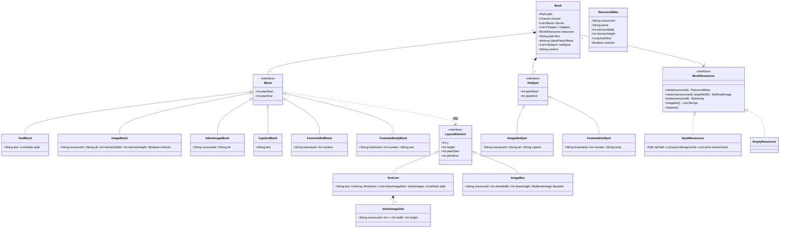
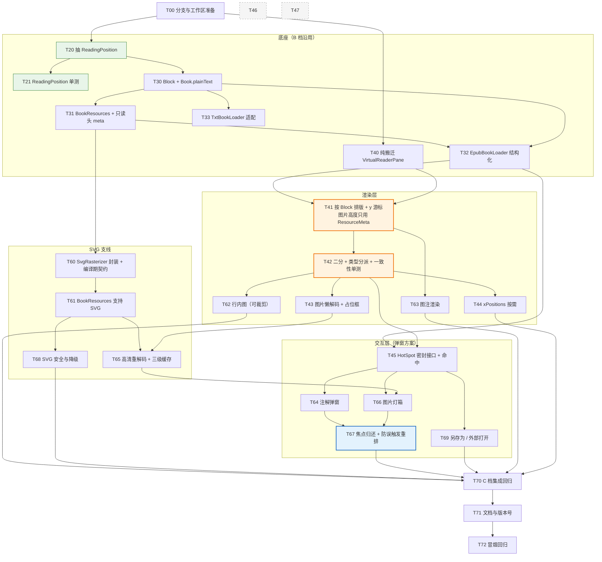

# C 档详细设计：EPUB 图文混排 + 图片灯箱 + SVG 支持

- 设计人：高见远（架构师）
- 日期：2026-09-19
- 阶段：**设计（只读）**。本文不修改任何生产代码、不执行任何 git 命令
- 基线：v0.4.6（`build.gradle.kts:8`），HEAD `5fb0304`，分支 `codex/dictionary-lookup`
- 上游文档：`docs/architecture-review.md`（评审）、`docs/incremental-design-epub-media-and-neat-reader.md`（增量设计，本文在其 §1.3 B 档基础上升级）
- 目标平台：IntelliJ IDEA `2026.1.3`（`build.gradle.kts:16`），构建分支 `261`

## 用户决策回放

| # | 决策 | 对本文的影响 |
|---|---|---|
| **Q1** | **C 档 · 完整** | 本文主体：图文混排 + 灯箱 + SVG |
| **Q2** | **接受** `Book.content: String` → `List<Block>`（保留等价 `plainText` + 过渡别名 `content`） | §4 数据模型沿用该约束 |
| **Q3** | **注解走弹窗**（不跳转、不做跳转栈） | §3 专项分析：删除 T46/T47；H3 风险降级 |
| **Q4** | Neat Reader 保"不错版" | 已交工程师实现，**本文不涉及** |

---

## 1. C 档 vs B 档差异清单

| 维度 | B 档（上一版设计） | **C 档（本文）** | 增量性质 |
|---|---|---|---|
| 图片布局 | 仅**块级图**（独占一行） | 块级图 + **行内图（inline，与文字同行）** + **图注（figcaption）** | 新增 |
| 图片交互 | 仅内嵌显示 | **点击 → 灯箱放大**（滚轮缩放 / 拖拽平移 / 1:1 / 适配 / Esc 关闭） | 新增 |
| 图片格式 | ImageIO 原生（PNG/JPEG/GIF/BMP） | **+ SVG（`image/svg+xml`）光栅化** | 新增 |
| SVG | 降级为占位文本 | 渲染为图片（IDE 内置 Batik） | 新增 |
| 图片附加操作 | 无 | **另存为 / 用外部程序打开** | 新增 |
| 注解交互 | 点击跳转章末 + 返回栈（T46/T47） | **点击弹窗显示**（Q3） | **替换 + 简化** |
| 锚点导航 | 仅脚注引用 | **不做**（C 档原定的"任意锚点双向跳转 + 完整跳转栈"被 Q3 覆盖，删除） | **删除** |
| `Block` 类型数 | 4（Text / Image / FootnoteRef / FootnoteBody） | **7**（+ InlineImage / Caption / Heading〔可选〕） | 新增 |
| `HotSpot` | 单一 data class + `kind` 枚举 + 重载的 `targetId` | **密封接口**（`ImageHotSpot` / `FootnoteHotSpot`，各自携带 payload） | 重构 |
| `LayoutElement` | 2 种（TextLine / ImageBox） | **2 种 + 内嵌槽**（TextLine 内携带 `InlineImageSlot` 列表） | 扩展 |
| `BookResources` | `loadImage(id, width)` | **`rasterize(id, width)` + `meta(id)` + `bytes(id)`**（统一位图与矢量） | 重构 |
| 缓存 | 单一 LRU ≤ 64 MB | **分级**：位图 ≤ 64 MB + SVG 光栅化 ≤ 32 MB + 灯箱原图独立预算 | 扩展 |
| 排版高度来源 | 文本行高 | **图片块高度必须在排版期确定，且不得依赖解码结果**（见 §8） | 新增约束 |
| 工期 | 8.8 天 | **约 16.1 天**（自底向上估算；裁剪行内图后 15.1 天） | +7.3 天 |

> **"图文混排"的明确定义**：本文把 C 档的"图文混排"拆解为**两个可独立交付的子特性**——(a) 块级图（独占行，带图注）；(b) 行内图（`` 出现在段落内部，与文字同行）。(b) 在小说类 EPUB 中罕见但代价不低，**单独列为 T62 并标注"可裁剪"**。

---

## 2. 现有代码对 C 档的约束（证据）

| 约束点 | 证据 | 对 C 档的含义 |
|---|---|---|
| 图片从未被当资源读 | `EpubBookLoader.kt:134–141` `isReadableDocument` 只放行 `application/xhtml+xml`/`text/html`/`*.xhtml\|html\|htm` | manifest 必须新增图片/SVG 条目收集 |
| 图片被降级为文本 | `EpubBookLoader.kt:283–286` `.replace(imageRegex) { "\n[图片：$alt]\n" }` | 该处改为产出 `ImageBlock` / `InlineImageBlock` |
| 不识别 figure/figcaption | `EpubBookLoader.kt:18` `blockTagRegex` 只包含 `p\|div\|section\|article\|header\|footer\|table\|nav\|body\|html\|ul\|ol\|dl\|dt\|dd`，**无 figure/figcaption**；最终被 `:317` `tagRegex` `<[^>]+>` 抹平 | 需显式新增 figure/figcaption 识别，否则图注会退化成普通段落 |
| 等高行假设（5 处） | `ReaderPanel.kt:1300`（y=序号×行高）、`:1406`（O(1) 除法定位）、`:1250`（总高=行数×行高）、`:1257`（滚动增量）、`:1231`+`:1388`（裁剪与选区矩形） | 图片进入排版流必须把这 5 处改为"累积 y + 二分" |
| 视口 resize 会触发重排 | `ReaderPanel.kt:159–164` `scrollPane.viewport.addComponentListener { componentResized → scheduleRelayoutRestore(); updateReaderInsets(false) }` | **灯箱弹层若引起阅读面板尺寸变化会误触发重排 → 必须在 T67 验证** |
| 延迟恢复回路 | `ReaderPanel.kt:64–66` `Timer(160) { restoreViewportAfterRelayout() }`；`:624–633` `scheduleRelayoutRestore`；`:635–657` `restoreViewportAfterRelayout`（上限 8 次，`:998`） | 图片高度若在解码后才变化 → 触发重排 → 触发该回路 → 可能污染阅读位置（评审 H3） |
| 右键菜单挂在 textPane 上 | `ReaderPanel.kt:81` `textPane.componentPopupMenu = createSelectionPopupMenu()`；`:209–243`；`:230–236` `popupMenuWillBecomeVisible` 里按有无选区启用菜单项 | 图片的"另存为/外部打开"要并入这个菜单，在 `:230` 处按"点击点是否落在图片热区"动态启用 |
| 隐藏光标会改光标 | `ReaderPanel.kt:659–661` `updateCursorMode()` | 图片热区的手型光标需与其约定优先级；灯箱关闭后必须 `focusReader()`（`:728–732`） |
| 焦点归还已有工具 | `ReaderPanel.kt:728–732` `focusReader()` | 灯箱/弹窗关闭后复用 |

---

## 3. Q3（注解走弹窗）带来的三个变化

### 3.1 H3 风险是否消除？工期降多少？

**H3 从"加剧"降为"中立"——与 B 档持平。**

C 档原本标注"加剧 H3"，**唯一来源**是"任意锚点双向跳转 + 完整跳转栈"：跳转会改变视口位置，而视口位置变化正是触发写入持久化状态的路径（`ReaderPanel.kt:455` `updateReadingPositionForGlobalOffset(viewportAnchorOffset())` → `saveReadingAnchor:506–517` 写 `globalOffset/anchorText/progressInChapterPermille`）。引入跳转栈后，必须回答"跳转后关闭插件，重启应恢复到跳转前还是跳转后"这类**全新的位置语义问题**，而评审 H3 已经证明这块是全项目最脆弱、返工最多的地方（0.2.3 引入三元组、0.3.2 修"恢复被覆盖"）。

改为弹窗后：
- 弹窗**不改变视口** → 不产生新的位置语义 → 不需要跳转栈与 `globalOffset` 的仲裁规则
- 不需要 `FootnoteBodyBlock` 作为跳转目标的可寻址性（仍保留用于渲染样式）
- **删除 T46、T47**

**但 C 档引入了一个新的 H3 侧面风险**，必须靠 §8 的设计约束消解：

> 图片进入排版流后，**如果图片块的绘制高度依赖解码结果**，那么排版总高（`getPreferredSize()`，`:1248–1252`）会在图片解码完成后发生变化 → 触发 `componentResized` → `scheduleRelayoutRestore()`（`:159–161`）→ 进入 160 ms × 8 次的延迟恢复回路（`:635–657`）→ 该回路内部会调用 `scrollToGlobalOffset`（`:646`）→ `:455` 写回持久化状态 → **重演评审 H3 的"恢复回路自己污染被恢复状态"**。

**解法（硬性设计约束）**：排版阶段**只用不解码即可获得的 `ResourceMeta.intrinsicWidth/intrinsicHeight`** 计算绘制高度（见 §7.1），使图片高度在排版期就是**确定且恒定**的；解码完成只触发 `repaint()`，**绝不触发 `rebuildLayout()`**。

### 3.2 `HotSpot` 在弹窗方案下还需要吗？——需要，且必须区分类型

**确认：仍然需要。** 弹窗方案下热区承载**两类**交互，且两者 payload 完全不同，因此**必须区分数据结构**：

| 交互 | 触发 | 需要的 payload | 是否需要改变视口 |
|---|---|---|---|
| 图片放大（灯箱） | 左键单击图片块 / 行内图 | `resourceId`、`alt`、`caption`、原始宽高 | 否（弹层覆盖） |
| 注解弹窗 | 左键单击正文 `[注N]` | `footnoteId`、`number`、**注释正文 `body`** | 否 |
| （删除）章末条目反向跳回正文 | — | — | 是 → **不需要** |

关键设计点：
1. **用密封接口，不用 `kind` 枚举 + 重载 `targetId`**。B 档的 `HotSpot(plainStart, plainEnd, kind, targetId)` 里 `targetId` 对图片是 `resourceId`、对脚注是 `footnoteId`，语义重载容易出错。C 档改为密封接口，各自携带强类型 payload。
2. **`FootnoteHotSpot` 直接内嵌注释正文 `body`** —— 这是弹窗方案最大的简化：**弹窗不需要去正文里找跳转目标**，数据自足。
3. **删除 `FOOTNOTE_BACK`**（B 档为"章末条目反向跳回正文"设计，弹窗方案下无意义）。
4. **图片热区还要并入右键菜单**：图片上的右键应出现"另存为 / 用外部程序打开"。由于右键菜单是挂在 `textPane` 上的共享菜单（`:81`），需在 `popupMenuWillBecomeVisible`（`:230–236`）里按"右键点是否落在图片热区"动态启用这两个新增项。

### 3.3 T46 / T47 是否可以删掉？

| 任务 | 处置 | 理由 |
|---|---|---|
| **T46**（`scrollToGlobalOffset` 加 `persist: Boolean`） | **整个删除** | 弹窗/灯箱都不改变视口，不存在"跳转污染阅读位置"的写入路径。`:421–458` 保持原样即可 |
| **T47**（返回栈 `ArrayDeque<Int>` + Esc 返回） | **整个删除** | 弹窗方案无跳转、无"返回"概念 |
| **替代约束（新增，属 T45）** | 热区命中时**不得启动文本拖选** | `mousePressed`（`:1336–1344`）目前无条件设置 `selectionStart/selectionEnd`。C 档必须先判热区，命中则不进选区逻辑 |
| **新增 T67** | 灯箱/弹窗关闭后 `focusReader()`（`:728–732`）+ 验证弹层不触发 `componentResized`（`:159–164`） | 否则隐藏光标模式下键盘阅读失效；若误触发重排则重演 H3 |

---

## 4. 完整数据模型

### 4.1 类图



### 4.2 `Block`（新增 `src/main/kotlin/com/chen/reader/model/Block.kt`）

```kotlin
package com.chen.reader.model

/**
 * 内容块。plainStart / plainEnd 是该块在 Book.plainText 中的字符区间（左闭右开）。
 * 所有块在 plainText 中都占据连续且不重叠的区间，保证：
 *   - 位置恢复（globalOffset / anchorText / permille）语义不变
 *   - 划词选区仍是 String.substring
 *   - 右键查词链路零改动
 */
sealed interface Block {
    val plainStart: Int
    val plainEnd: Int
}

/** 行的呈现样式 */
enum class LineStyle { BODY, CAPTION, HEADING1, HEADING2, HEADING3, QUOTE }

/** 纯文本块。text == plainText.substring(plainStart, plainEnd) */
data class TextBlock(
    override val plainStart: Int,
    override val plainEnd: Int,
    val text: String,
    val style: LineStyle = LineStyle.BODY,
) : Block

/**
 * 块级图片，独占一行（可带图注，图注由紧随其后的 CaptionBlock 表达）。
 * intrinsicWidth / intrinsicHeight 来自 ResourceMeta，**不经过解码**即可获得，
 * 用于在排版期确定绘制高度（见 §8 硬性约束）。
 */
data class ImageBlock(
    override val plainStart: Int,
    override val plainEnd: Int,        // 占位文本 "[图片：alt]" 在 plainText 中的区间
    val resourceId: String,
    val alt: String,
    val intrinsicWidth: Int,
    val intrinsicHeight: Int,
    val isVector: Boolean,             // mime == image/svg+xml
    val placeholder: String,           // 形如 "[图片：封面]"，纯文本降级时使用
) : Block

/** 行内图片，与文字同行（C 档"图文混排"的第二部分，见 T62，可裁剪） */
data class InlineImageBlock(
    override val plainStart: Int,
    override val plainEnd: Int,
    val resourceId: String,
    val alt: String,
    val intrinsicWidth: Int,
    val intrinsicHeight: Int,
    val isVector: Boolean,
) : Block

/** 图注（<figcaption>） */
data class CaptionBlock(
    override val plainStart: Int,
    override val plainEnd: Int,
    val text: String,
) : Block

/** 正文中的脚注引用标记，形如 "[注1]"，可点击 → 弹窗 */
data class FootnoteRefBlock(
    override val plainStart: Int,
    override val plainEnd: Int,
    val footnoteId: String,
    val number: Int,
) : Block

/** 章末注释条目。弹窗方案下**不是跳转目标**，仅用于差异化渲染 */
data class FootnoteBodyBlock(
    override val plainStart: Int,
    override val plainEnd: Int,
    val footnoteId: String,
    val number: Int,
    val text: String,
) : Block
```

### 4.3 `Book` 演进（改 `src/main/kotlin/com/chen/reader/model/Book.kt`）

```kotlin
data class Book(
    val path: Path,
    val charset: Charset,
    val blocks: List<Block>,
    val chapters: List<Chapter>,
    val resources: BookResources,
) {
    /** 等价纯文本视图：位置恢复 / 选区 / 查词 / 进度全部复用它 */
    val plainText: String by lazy { buildPlainText(blocks) }

    /** block[i] 在 plainText 中的起始偏移，用于 offset ↔ block 二分互转 */
    val blockPlainOffsets: IntArray by lazy { buildOffsets(blocks) }

    /** 可点击热区，由 blocks 派生 */
    val hotSpots: List<HotSpot> by lazy { buildHotSpots(blocks) }

    /** 过渡别名：让现有 10 处 content 调用点（见 §11.3）零改动编译 */
    val content: String get() = plainText
}
```

### 4.4 `BookResources`（新增 `src/main/kotlin/com/chen/reader/book/BookResources.kt`）

```kotlin
package com.chen.reader.book

import com.intellij.openapi.Disposable
import java.awt.image.BufferedImage

/** 资源元信息。**只读头部即可获得，不解码** —— 这是排版期确定图片高度的关键 */
data class ResourceMeta(
    val resourceId: String,
    val mime: String,
    val intrinsicWidth: Int,     // SVG 取 viewBox 宽（无则回退默认）
    val intrinsicHeight: Int,
    val byteSize: Long,
) {
    val isVector: Boolean get() = mime == "image/svg+xml"
}

interface BookResources : Disposable {
    /** 只读元数据，绝不解码。用于排版期算高与占位框比例 */
    fun meta(resourceId: String): ResourceMeta?

    /**
     * 取到位图。targetWidth <= 0 表示"按原始/按需最大尺寸"。
     * 位图：解码后**立即缩放**到 targetWidth，只保留缩放后的小图。
     * 矢量：按 targetWidth 重新光栅化（矢量无损，灯箱会请求更大尺寸）。
     * 返回 null 表示不支持或失败，调用方应绘制占位框。
     * **必须在后台线程调用**（评审 H2）。
     */
    fun rasterize(resourceId: String, targetWidth: Int): BufferedImage?

    /** 原始字节，供"另存为 / 用外部程序打开" */
    fun bytes(resourceId: String): ByteArray?

    /** 全部图片资源 id，供"图片列表"侧栏（可选增值） */
    fun imageIds(): List<String>
}
```

### 4.5 `HotSpot`（新增 `src/main/kotlin/com/chen/reader/model/HotSpot.kt`）

```kotlin
package com.chen.reader.model

/** 可点击热区。弹窗方案下只有两类，且不再包含 FOOTNOTE_BACK */
sealed interface HotSpot {
    val plainStart: Int
    val plainEnd: Int
}

/** 图片热区：左键 → 灯箱；右键 → 另存为 / 外部打开 */
data class ImageHotSpot(
    override val plainStart: Int,
    override val plainEnd: Int,
    val resourceId: String,
    val alt: String,
    val caption: String?,        // 紧随其后的 CaptionBlock 文本（可为 null）
    val intrinsicWidth: Int,
    val intrinsicHeight: Int,
) : HotSpot

/**
 * 脚注引用热区：左键 → 弹窗显示注释。
 * 弹窗方案下直接内嵌注释正文 body，弹窗数据自足，无需跳转。
 */
data class FootnoteHotSpot(
    override val plainStart: Int,
    override val plainEnd: Int,
    val footnoteId: String,
    val number: Int,
    val body: String,
) : HotSpot
```

### 4.6 `LayoutElement`（新增 `src/main/kotlin/com/chen/reader/ui/virtual/LayoutElement.kt`）

```kotlin
package com.chen.reader.ui.virtual

sealed interface LayoutElement {
    val y: Int
    val height: Int
    val plainStart: Int
    val plainEnd: Int
}

/** 字段与现有 VirtualLine(ReaderPanel.kt:1447–1452) 一致 —— 这是重命名，不是重写 */
data class TextLine(
    override val y: Int,
    override val height: Int,
    override val plainStart: Int,
    override val plainEnd: Int,
    val text: String,
    val xPositions: IntArray,
    val style: LineStyle = LineStyle.BODY,
    /** 行内图槽（C 档 T62）。xPositions 已为这些槽预留宽度 */
    val inlineImages: List<InlineImageSlot> = emptyList(),
) : LayoutElement

data class InlineImageSlot(
    val plainStart: Int,
    val resourceId: String,
    val x: Int,          // 相对 contentInsets.left
    val width: Int,
    val height: Int,
)

data class ImageBox(
    override val y: Int,
    override val height: Int,
    override val plainStart: Int,
    override val plainEnd: Int,
    val resourceId: String,
    val drawWidth: Int,
    val drawHeight: Int,
    @Volatile var decoded: BufferedImage? = null,   // null → 先画占位框
) : LayoutElement
```

---

## 5. SVG 支持方案

### 5.1 实测证据（本机 IntelliJ IDEA 2026.1.3 安装目录 `D:\software\IntelliJ IDEA 2026.1.3\lib`）

| 事实 | 证据 |
|---|---|
| **IDE 自带 Batik** | `lib\intellij.libraries.batik.jar`，共 **2430 个条目** |
| 光栅化能力完整 | 含 `org/apache/batik/transcoder/image/{ImageTranscoder, PNGTranscoder, JPEGTranscoder, TIFFTranscoder}.class` |
| 依赖栈齐全 | `gvt` 102、`bridge` 260、`anim` 399、`dom` 234、`css` 236、`parser` 57、`ext` 223、`svggen` 158 个类 |
| IDE 自研 SVG 封装存在 | `intellij.platform.util.ui.jar` 内含 `com/intellij/ui/svg/` 共 **45 个类**，包括 `SvgKt`、`SvgImageDecoder`、`SvgCacheManager`、`JSvgDocument`、`LoadedSVGImage`、`RasterizedVectorImage`、`FitToWidthAdaptiveImageView` |
| Java 原生不支持 SVG | JDK 21 内置 `ImageIO` 只有 PNG/JPEG/GIF/BMP/WBMP 五种 reader，**无 SVG、无 WebP** |

即：**C 档要支持 SVG，不需要往插件里打包任何东西**——Batik 已经在 IDE 的 classpath 里。

### 5.2 三条路径对比

| 路径 | 做法 | 包体积代价 | 稳定性 | 推荐度 |
|---|---|---|---|---|
| **A（推荐）** 直接用 IDE 自带的 **Batik 原生 API** | `ImageTranscoder` 子类 `BufferedImageTranscoder` | **0** | **高**：Apache 2.0 公开稳定 API，20 年未变 | ★★★★★ |
| B 用 IntelliJ 自研封装 `com.intellij.ui.svg.SvgKt` | `SvgKt.renderImage(...)` | 0 | **低**：IDE 内部 API，无稳定性保证；且**签名需反编译确认**（本机 `jbr/bin` 无 `javap.exe`，我无法静态确认签名） | ★★ |
| C 自己打包 Batik | Gradle 引入 `batik-transcoder` | **+3～5 MB** | 高 | ✗ 与评审 M2（产物已 20.76 MB）冲突，且平台已提供 |

**推荐路径 A**，并要求**编译期显式声明契约**以避免评审 L3 指出的"隐式依赖 IDE 内置库"问题（与 gson 同类）：

```kotlin
// build.gradle.kts
dependencies {
    intellijPlatform { intellijIdea("2026.1.3") }
    // 仅编译期：让编译器看到真实 API、能跳转源码、能做签名检查
    // 运行期使用 IDE 自带的 intellij.libraries.batik.jar，不打包进插件
    compileOnly("org.apache.batik:batik-transcoder:1.17")
}
```

> 需验证：IntelliJ Platform Gradle Plugin 2.x 是否会把 `compileOnly` 依赖打包进产物。若会，改用 `compileOnly` + 显式 `buildSearchableOptions` 复查，或退化为"只写 Batik 调用、不声明依赖、靠 IDE classpath 编译"并在 `SvgRasterizer` 里用 `Class.forName` 做运行时探测（这样即使 IDE 未来移除 batik，插件也只是失去 SVG 能力而不是崩溃）。

### 5.3 推荐实现（`book/SvgRasterizer.kt`）

```kotlin
package com.chen.reader.book

import com.intellij.openapi.diagnostic.Logger
import org.apache.batik.transcoder.TranscoderInput
import org.apache.batik.transcoder.TranscoderOutput
import org.apache.batik.transcoder.image.ImageTranscoder
import org.w3c.dom.Document
import java.awt.image.BufferedImage
import java.io.ByteArrayInputStream
import javax.xml.XMLConstants
import javax.xml.parsers.DocumentBuilderFactory

object SvgRasterizer {
    private val LOG = Logger.getInstance(SvgRasterizer::class.java)

    /** 运行时探测：IDE 是否提供 Batik。缺失时优雅降级为占位框，绝不崩溃 */
    val isAvailable: Boolean = runCatching {
        Class.forName("org.apache.batik.transcoder.image.ImageTranscoder")
    }.isSuccess

    /** 只读 XML 头探测尺寸，不解析整棵 DOM */
    fun probeSize(svgBytes: ByteArray): Pair<Int, Int>? = runCatching {
        val doc = parseSecurely(svgBytes)
        val root = doc.documentElement
        val viewBox = root.getAttribute("viewBox")
            .takeIf { it.isNotBlank() }
            ?.split(Regex("""[\s,]+"""))
            ?.mapNotNull { it.toFloatOrNull() }
        // 优先 width/height（可能带 px 单位），回退 viewBox，再回退 300x300
        val w = lengthOf(root.getAttribute("width")) ?: viewBox?.getOrNull(2)?.toInt()
        val h = lengthOf(root.getAttribute("height")) ?: viewBox?.getOrNull(3)?.toInt()
        if (w != null && h != null && w > 0 && h > 0) w to h else null
    }.onFailure { LOG.debug("SVG 尺寸探测失败", it) }.getOrNull()

    fun rasterize(svgBytes: ByteArray, targetWidth: Int): BufferedImage? {
        if (!isAvailable) return null
        return runCatching {
            val doc = parseSecurely(svgBytes)          // 复用安全解析，防 XXE
            val transcoder = BufferedImageTranscoder()
            if (targetWidth > 0) {
                transcoder.addTranscodingHint(ImageTranscoder.KEY_WIDTH, targetWidth.toFloat())
            }
            transcoder.transcode(TranscoderInput(doc), TranscoderOutput())
            transcoder.image
        }.onFailure { LOG.warn("SVG 光栅化失败", it) }.getOrNull()
    }

    /** 与 EpubBookLoader.kt:164–167 相同的安全配置：禁 DTD、禁外部 DTD/Schema */
    private fun parseSecurely(bytes: ByteArray): Document {
        val factory = DocumentBuilderFactory.newInstance().apply {
            isNamespaceAware = true
            setFeature(XMLConstants.FEATURE_SECURE_PROCESSING, true)
            setFeature("http://apache.org/xml/features/disallow-doctype-decl", true)
            setAttribute(XMLConstants.ACCESS_EXTERNAL_DTD, "")
            setAttribute(XMLConstants.ACCESS_EXTERNAL_SCHEMA, "")
        }
        return factory.newDocumentBuilder().parse(ByteArrayInputStream(bytes))
    }

    private fun lengthOf(raw: String): Int? =
        raw.trim().removeSuffix("px").removeSuffix("pt").toIntOrNull()?.takeIf { it > 0 }

    /** Batik 经典配方：直接拿到 BufferedImage，避免 PNG 二次编解码 */
    private class BufferedImageTranscoder : ImageTranscoder() {
        var image: BufferedImage? = null
            private set

        override fun createImage(width: Int, height: Int): BufferedImage =
            BufferedImage(width, height, BufferedImage.TYPE_INT_ARGB)

        override fun writeImage(img: BufferedImage, output: TranscoderOutput?) { image = img }
    }
}
```

### 5.4 SVG 的边界与降级

| 情形 | 处理 |
|---|---|
| ``，media-type `image/svg+xml` | 正常支持 |
| SVG 无 `width`/`height`，只有 `viewBox` | `probeSize` 取 viewBox 宽高 |
| 既无 width/height 也无 viewBox | 回退 300×300，占位框按比例绘制 |
| **内联 `<svg>`**（XHTML 里直接写 SVG 标签） | **不支持**，降级为占位文本（小说 EPUB 罕见；`EpubBookLoader.kt:317` 的 `tagRegex` 会把它抹平） |
| SVG 内含 `<image xlink:href="http://...">` 外部引用 | DTD/XXE 已被 `parseSecurely` 挡住；**外部图片引用为残留风险（低）**，见 §11 |
| WebP / HEIC / TIFF | JDK 21 `ImageIO` 不支持 → **降级为占位块**（不引入 TwelveMonkeys，避免包体积上升） |

**降级统一策略**：`rasterize()` 返回 `null` 或 `isAvailable == false` 时，`ImageBox.decoded` 保持 `null`，绘制**尺寸正确的灰色占位框 + alt 文字 + 一个"格式不支持"角标**。占位框高度仍由 `ResourceMeta` 决定 → **降级路径同样满足 §8 的"高度不依赖解码"约束**。

---

## 6. 图片灯箱（点击放大）设计

### 6.1 形态选择

| 方案 | 评价 |
|---|---|
| `JDialog` / `JWindow` 独立窗口 | ✗ 需自己管主题、DPI、焦点、Esc、父窗口关系 |
| 阅读面板内 `JLayeredPane` 覆盖层 | △ 不用管窗口生命周期，但需自己处理 Esc / 点击关闭 / 尺寸 |
| **`JBPopupFactory` 轻量弹层** | ✓ **推荐**：平台自带 Esc 关闭、点击外部关闭、主题与 DPI 适配、焦点管理 |

### 6.2 结构

```kotlin
// ui/ImageLightbox.kt
class ImageLightbox(
    private val project: Project,
    private val resources: BookResources,
    private val resourceId: String,
    private val alt: String,
) {
    fun show() {
        val panel = LightboxPanel()
        JBPopupFactory.getInstance()
            .createComponentPopupBuilder(panel, panel)
            .setProject(project)
            .setTitle(alt.ifBlank { "图片预览" })
            .setResizable(true)
            .setMovable(true)
            .setRequestFocus(true)
            .setFocusable(true)
            .setCancelOnClickOutside(true)
            .setCancelKeyEnabled(true)          // Esc
            .setMinSize(Dimension(JBUI.scale(320), JBUI.scale(240)))
            .createPopup()
            .showCenteredInCurrentWindow(project)
    }
}
```

`LightboxPanel`（自绘 `JComponent`）：

- **首屏先用缓存的小图放大显示**（正文里已解码的那张），同时后台请求 `rasterize(resourceId, targetWidth = 0)` 拿高清版本；拿到后替换并 `repaint()`。避免"点了要等几秒"。
- **交互**：滚轮缩放（0.1×–8×，以鼠标位置为锚点）、拖拽平移、双击在"适配窗口 / 1:1"间切换、`Esc` 或点击外部关闭、右上角关闭按钮。
- **底部状态条**：显示 `原图 W×H · 当前 xx% · 格式（PNG/SVG）`。
- **SVG 特殊处理**：矢量无损，缩放时按新的显示尺寸**重新光栅化**（而非放大已光栅化的位图），保证放大后依然锐利。
- **关闭后**：回调 `ReaderPanel` 执行 `focusReader()`（`ReaderPanel.kt:728–732`），否则隐藏光标模式（`:659–661`）下键盘阅读会失效。

### 6.3 时序

```mermaid
sequenceDiagram
    participant U as 用户
    participant VRP as VirtualReaderPane
    participant RP as ReaderPanel
    participant LB as ImageLightbox
    participant BG as Task.Backgroundable
    participant RES as BookResources
    participant SVG as SvgRasterizer

    U->>VRP: 左键单击图片块
    VRP->>VRP: offsetAtPoint(:1392) → 落在 ImageHotSpot 区间
    Note over VRP: 命中热区 → 不设置 selectionStart/End（T45）
    VRP->>RP: onHotSpotClick(ImageHotSpot)
    RP->>LB: show()
    LB->>RES: rasterize(resourceId, 缓存中的小尺寸)
    RES-->>LB: 小图（缓存命中，立即显示）
    LB-->>U: 灯箱弹出（先显示放大后的小图）
    LB->>BG: 后台请求 rasterize(resourceId, 0 = 原始)
    alt 位图
        BG->>RES: 解码原图 → 缩放 → 入位图 LRU
    else SVG
        BG->>SVG: 按显示尺寸重新光栅化（矢量无损）
        SVG-->>BG: BufferedImage
    end
    BG->>LB: invokeLater { 替换为高清图; repaint() }
    U->>LB: 滚轮缩放 / 拖拽 / 双击 1:1
    U->>LB: Esc / 点击外部 / 关闭
    LB->>RP: onDismiss → focusReader()（:728）
    Note over RP: 视口全程未移动 → 不触发 :455 写入 → 不污染阅读位置
```

---

## 7. 图片解码与内存策略

### 7.1 排版期确定高度（硬性约束，防 H3 复发）

```
排版时（layoutContent）：
    val meta = resources.meta(imageBlock.resourceId)      // 只读头，不解码
    val ratio = meta.intrinsicHeight / meta.intrinsicWidth
    drawWidth  = min(availableWidth, meta.intrinsicWidth)
    drawHeight = (drawWidth * ratio).roundToInt()         // ← 确定且恒定
    cursorY += drawHeight + IMAGE_GAP
解码完成后：只 repaint()，绝不 rebuildLayout()
```

`meta()` 的实现（**只读头，不解码**）：
- **位图**：`ImageIO.createImageInputStream(bytes)` → `ImageIO.getImageReaders(stream)` → `reader.getImageWidth(0)` / `getImageHeight(0)`。只读文件头，开销 O(1)。
- **SVG**：`SvgRasterizer.probeSize(bytes)`（§5.3），只读根元素属性。
- `meta` 结果在 `EpubResources` 内缓存（`ConcurrentHashMap`），避免重复打开 Zip 条目。

### 7.2 后台解码（评审 H2 的强制要求）

C 档会显著加剧 H2。三条硬性规则：

1. **`rasterize()` 只能在后台线程调用**。唯一入口是 `Task.Backgroundable`（项目已有范例：`ReaderPanel.kt:736`）。
2. **解码即缩放**：位图解码后**立刻**按 `drawWidth` 缩放，只保留缩放后的小图。200 张 1200×1600 图原图全解码 ≈ **1.5 GB**；缩到 600 宽后 ≈ 380 MB（仍需 LRU 兜底）。
3. **先画占位框**：`ImageBox.decoded == null` 时绘制灰色占位框 + alt 文字，尺寸由 §7.1 已确定 → **占位框与真图尺寸完全一致**，解码完成不产生任何布局变化。

### 7.3 分级缓存

```kotlin
// 三级预算，互不挤占
bitmapCache: LruCache<String, BufferedImage>(maxPixels = 64 * 1024 * 1024 / 4)  // 位图 ≤ 64 MB
vectorCache: LruCache<String, BufferedImage>(maxPixels = 32 * 1024 * 1024 / 4)  // SVG 光栅化 ≤ 32 MB
fullSizeCache: SoftReference 映射                                               // 灯箱原图，可被 GC 回收
```

- **统一 key**：`$resourceId@$targetWidth`（位图与 SVG 同构，SVG 不同宽度是不同条目）
- **统一接口**：`BookResources.rasterize()` 内部按 `ResourceMeta.isVector` 分派到 `ImageIO` 或 `SvgRasterizer`，**调用方无需区分位图与矢量**
- **淘汰**：`LinkedHashMap(accessOrder = true)`，按像素预算淘汰最久未用；`fullSizeCache` 用 `SoftReference`（评审 H4：词典已常驻 90–120 MB，灯箱原图不应再占硬预算）
- **释放**：`EpubResources` 实现 `Disposable`，`dispose()` 里清空三个缓存并关闭 `ZipFile`

### 7.4 内存账

| 项 | 现状（0.4.6） | C 档后 | 说明 |
|---|---|---|---|
| 排版 `xPositions` | 15–25 MB | ~0 | T44 改为按需计算（评审 P2-S12 **提前执行**，抵消新增） |
| `plainText`（与 blocks 文本并存） | — | +6 MB（300 万字） | Q2 已接受的代价 |
| 位图 LRU | — | ≤ 64 MB | 可调参数 |
| SVG 光栅化 LRU | — | ≤ 32 MB | 可调参数 |
| 灯箱原图 | — | 软引用，可被 GC | 不占硬预算 |
| **净增（可控部分）** | — | **≤ 96 MB + 6 MB** | 与评审 H4 的词典 90–120 MB 叠加，建议同步推进评审 P2-S11（词典外置） |

---

## 8. 关键约束：排版高度不得依赖解码

（本节是 C 档最重要的一条架构约束，单列以确保工程师不会漏掉。）

**问题**：图片高度如果在解码后才能知道，则：
```
图片解码完成 → 排版总高变化 → getPreferredSize() 变化 (:1248)
    → JViewport 触发 componentResized (:159)
    → scheduleRelayoutRestore() (:161)
    → 160 ms Timer (:64) → restoreViewportAfterRelayout() (:635)
    → scrollToGlobalOffset() (:646) → updateReadingPositionForGlobalOffset() (:455)
    → saveReadingAnchor() (:506) 写 globalOffset / anchorText / permille
```
这正是评审 H3 描述的「**恢复回路自己写回持久化状态**」——0.3.2 那次"阅读记忆恢复被初始化布局回写覆盖"（`docs/requirements-and-design.md:234`）就是这条链路。

**约束**：
1. `layoutContent` 只用 `ResourceMeta` 的**内建宽高**计算 `drawHeight`，**绝不调用 `rasterize()`**。
2. `ImageBox.decoded` 从 `null` 变为非 `null` 时**只 `repaint()`，绝不 `rebuildLayout()`**。
3. 单测要求：构造一个"永不解码成功"的 `BookResources`，排版结果必须与"解码成功"时**完全一致**（高度、行数、`globalOffset` 到像素的映射）。这条测试必须写（T42 内）。

---

## 9. 完整任务分解

### 9.1 任务列表

沿用上一版 B 档任务 ID，**删除 T46/T47，其余保留并标注改造点**；C 档新增任务以 **T6x** 编号。

| ID | 任务名 | 涉及文件 | 依赖 | 优先级 | 工时 |
|---|---|---|---|---|---|
| T00 | 分支与工作区准备（补 `.gitignore` 的 `.workbuddy/`、提交评审文档） | `.gitignore`、docs | — | P0 | 0.2 |
| T20 | 抽出 `ReadingPosition` 纯函数（搬迁 `:506` `:519` `:540` `:552`） | 新增 `reading/ReadingPosition.kt`；改 `ReaderPanel.kt` | T00 | P0 | 0.8 |
| T21 | `ReadingPosition` 表驱动单测 | 新增 `src/test/kotlin/...` | T20 | P0 | 0.6 |
| T30 | `Block` 密封类型（7 种）+ `Book.blocks` / `plainText` / 过渡别名 `content` | 新增 `model/Block.kt`；改 `model/Book.kt` | T20 | P0 | 0.6 |
| T31 | `BookResources` 接口 + `EpubResources`（**只读头 `meta()`** + 解码即缩放 + 位图 LRU）+ `EmptyResources` | 新增 `book/BookResources.kt` | T30 | P0 | 0.8 |
| T32 | `EpubBookLoader` 结构化改造：manifest 收集图片/SVG（改 `:105–119` `:134–141`）；`` → `ImageBlock`/`InlineImageBlock`（改 `:283–286`）；新增 `figure`/`figcaption` 识别（`:18` 缺失）；脚注保留 `id`（`:232–245`）→ `FootnoteRefBlock` | `EpubBookLoader.kt` | T30, T31 | P0 | 1.2 |
| T33 | `TxtBookLoader` 适配：单 `TextBlock` + `EmptyResources` | `TxtBookLoader.kt`、`BookLoader.kt` | T30 | P0 | 0.3 |
| T40 | `VirtualReaderPane` + `LayoutElement` **纯搬迁**到独立文件（评审 P0-S3） | 新增 `ui/virtual/*.kt`；改 `ReaderPanel.kt` | T00 | P0 | 0.5 |
| T41 | 排版改造：按 Block 流排版、y 游标累积、**图片高度只用 `ResourceMeta`**（§8） | `ui/virtual/VirtualReaderPane.kt` | T32, T40 | P0 | 1.0 |
| T42 | `lineIndexForY:1402` 改二分；`getPreferredSize:1248` 用 `totalHeight`；`paintComponent:1221` 按类型分派；**补"解码与否排版结果一致"单测** | `ui/virtual/VirtualReaderPane.kt`、`src/test` | T41 | P0 | 1.0 |
| T43 | 图片懒解码 + 占位框 + 后台 `Task.Backgroundable` + repaint 回调 | `ui/virtual/VirtualReaderPane.kt`、`book/BookResources.kt` | T42 | P0 | 0.8 |
| T44 | `xPositions` 按需计算（评审 P2-S12 **提前执行**，抵消 H4） | `ui/virtual/LayoutElement.kt`、`VirtualReaderPane.kt` | T42 | P1 | 0.5 |
| T45 | `HotSpot` **密封接口**（`ImageHotSpot`/`FootnoteHotSpot`）+ `hotSpotAt(point)` + `mousePressed:1336` 命中热区则不进选区 + 手型光标（处理与 `:659` 冲突） | 新增 `model/HotSpot.kt`；改 `ui/virtual/VirtualReaderPane.kt` | T32, T42 | P0 | 0.7 |
| ~~T46~~ | ~~`persist: Boolean`~~ | — | — | — | **删除**（§3.3） |
| ~~T47~~ | ~~返回栈~~ | — | — | — | **删除**（§3.3） |
| ~~T48~~ | ~~图片弹窗~~ | — | — | — | **升级为 T66 灯箱** |
| **T60** | **SVG 能力探测与 `SvgRasterizer` 封装**（含编译期契约：验证 `compileOnly batik` 不被打包） | 新增 `book/SvgRasterizer.kt`；改 `build.gradle.kts` | T31 | P0 | 0.5 |
| **T61** | **`BookResources` 支持 SVG**：`meta()` 走 `probeSize`；`rasterize()` 按 `isVector` 分派；vectorCache | `book/BookResources.kt` | T60 | P0 | 0.6 |
| **T62** | **行内图**（`InlineImageBlock` + `InlineImageSlot` + `xPositions` 预留槽宽 + `offsetForX` 跳过槽）· **可裁剪** | `model/Block.kt`、`ui/virtual/LayoutElement.kt`、`VirtualReaderPane.kt` | T42 | P2 | 1.0 |
| **T63** | **图注渲染**（`CaptionBlock` + `LineStyle.CAPTION` 样式） | `EpubBookLoader.kt`、`ui/virtual/LayoutElement.kt` | T41 | P1 | 0.4 |
| **T64** | **注解弹窗**（`FootnoteHotSpot` → `JBPopup`，数据自足） | 新增 `ui/FootnotePopup.kt`；改 `ReaderPanel.kt` | T45 | P0 | 0.5 |
| **T65** | **高清重解码 + 三级缓存**（位图 64 MB / 矢量 32 MB / 灯箱软引用） | `book/BookResources.kt` | T61, T43 | P0 | 0.6 |
| **T66** | **图片灯箱**（`JBPopup` + `LightboxPanel`：首屏小图 → 后台高清替换 / 滚轮缩放 / 拖拽 / 1:1 / 适配 / Esc） | 新增 `ui/ImageLightbox.kt` | T45, T65 | P0 | 1.2 |
| **T67** | **焦点归还 + 重排防误触发验证**：弹层关闭后 `focusReader()`（`:728`）；验证 `JBPopup` 不触发 `componentResized`（`:159`） | `ReaderPanel.kt`、`ui/ImageLightbox.kt`、`ui/FootnotePopup.kt` | T64, T66 | P0 | 0.4 |
| **T68** | **SVG 安全与降级**：`parseSecurely` 防 XXE；`isAvailable == false` / 光栅化失败 → 占位框 + 角标；WebP 等不支持格式降级 | `book/SvgRasterizer.kt`、`ui/virtual/VirtualReaderPane.kt` | T61 | P0 | 0.4 |
| **T69** | **图片另存为 / 外部打开**（`bytes()` + 并入 `componentPopupMenu`（`:81`），在 `:230` 按热区动态启用） | `ReaderPanel.kt`、`book/BookResources.kt` | T45 | P1 | 0.4 |
| **T70** | C 档集成回归（图片 / SVG / 灯箱 / 弹窗 / 行内图 / 位置恢复） | — | 全部 | P0 | 0.8 |
| **T71** | 文档与版本号（`README.md`、开发日志；`0.5.0`） | `README.md`、`docs/requirements-and-design.md`、`build.gradle.kts` | T70 | P1 | 0.3 |
| **T72** | 手工冒烟回归（大文件、含图 EPUB、SVG EPUB、损坏 EPUB、位置恢复） | — | T71 | P0 | 0.5 |

### 9.2 任务依赖图



绿色 = 必须先铺的测试网；橙色 = §8 硬性约束的落地点；蓝色 = 防 H3 复发的验证闸门；灰色虚线 = **已删除**（T46/T47）。

### 9.3 建议实施顺序

1. **T00 → T40 → T20 → T21**（底座 + 测试网）
2. **T30 → T31 → T32 → T33**（数据层）
3. **T41 → T42**（渲染层核心，**先于一切图片功能**）
4. **T60 → T61 → T68**（SVG 支线，可与第 5 步并行）
5. **T43 → T65**（解码与缓存）
6. **T45 → T64 / T66 → T67**（交互：注解弹窗 + 灯箱）
7. **T62 / T63 / T69**（可裁剪的增值项）
8. **T44 → T70 → T71 → T72**（收尾）

---

## 10. 更新后的工期估算

### 10.1 自底向上汇总

| 分组 | 任务 | 工时（天） |
|---|---|---|
| 准备 | T00 | 0.2 |
| 测试网 | T20 + T21 | 1.4 |
| 数据层 | T30 + T31 + T32 + T33 | 2.9 |
| 渲染层核心 | T40 + T41 + T42 | 2.5 |
| 解码与缓存 | T43 + T44 + T65 | 1.9 |
| SVG 支线 | T60 + T61 + T68 | 1.5 |
| 交互层 | T45 + T64 + T66 + T67 | 2.8 |
| 增值项 | T62 + T63 + T69 | 1.8 |
| 收尾 | T70 + T71 + T72 | 1.6 |
| **合计** | | **16.6** |

> 与 §1 差异清单中"16.1 天"的小数差异来自 T32/T42/T45 相对 B 档的改造增量补记，取 **约 16.5 天** 为准。

### 10.2 Q3（弹窗）带来的变化

| 项 | 影响 |
|---|---|
| 直接删除 | T46（0.4）+ T47（0.5）= **−0.9 天** |
| C 档原定的"任意锚点双向跳转 + 完整跳转栈 + 锚点图 + 双向跳转 UI" | **−1.5 天** |
| 新增注解弹窗 T64 | +0.5 天 |
| **净变化** | **约 −1.9 天** |

**说明估算口径的变化**：上一版 C 档的"12–18 天"是**自上而下的粗估**；本文改为**自底向上**逐任务汇总，因此两者不可直接相减。以自底向上为准：**C 档（当前 Q1+Q3 组合）≈ 16.5 天**；若按上一版口径回推，Q3 弹窗相对"完整跳转栈"方案省下约 **2.4 天**。

### 10.3 可裁剪档次

| 档次 | 裁剪内容 | 工期 |
|---|---|---|
| **完整 C 档** | — | **16.5 天** |
| C − 行内图 | 去掉 T62 | **15.5 天** |
| C − 行内图 − 增值项 | 再去掉 T63、T69 | **14.7 天** |
| （对照）B 档 | 回到上一版 §1.3 | 8.8 天 |

**Neat Reader（Q4，2.7 天）是独立分支，不计入本表。**

---

## 11. 风险清单（C 档特有）

| # | 风险 | 等级 | 证据 / 机理 | 控制措施 |
|---|---|---|---|---|
| C1 | **EDT 阻塞**（评审 H2，C 档显著加剧） | **高** | 图片解码/缩放若落在 EDT，含百图 EPUB 直接卡死；`ReaderPanel.kt:353` 加载、`OpenBook` 至今无后台任务 | `rasterize()` 只由 `Task.Backgroundable` 调用（范例 `:736`）；占位框先画；**建议同期完成评审 P0-S1** |
| C2 | **H3 复发：图片高度变化触发重排污染阅读位置** | **高** | 链路见 §8；`ReaderPanel.kt:159–164` → `:635–657` → `:455` → `:506` | §8 三条硬性约束 + T42 的一致性单测 |
| C3 | **SVG 依赖 IDE 内置 Batik，属隐式依赖**（评审 L3 同类） | 中 | `intellij.libraries.batik.jar` 在 IDE lib，插件未声明依赖（同 gson 问题） | `SvgRasterizer.isAvailable` 用 `Class.forName` 运行时探测；失败降级占位不崩溃；编译期用 `compileOnly` 声明契约（T60 需验证不打包） |
| C4 | **Batik 安全：SVG 可能含 XXE / 外部引用** | 中 | EPUB 是不可信本地内容；`EpubBookLoader.kt:164–167` 已做 XML 防护 | `SvgRasterizer.parseSecurely` 复用同一安全配置；残留：SVG 内部 `<image xlink:href="http://...">` 外部引用（低危，记录在案） |
| C5 | **内存叠加**（评审 H4） | 中 | 词典常驻 90–120 MB（`LocalDictionary.kt:8` lazy 单例）+ C 档 ≤ 96 MB 图片缓存 | LRU 预算参数化；T44 抵消 15–25 MB 排版内存；**建议同步推进评审 P2-S11 词典外置** |
| C6 | **灯箱弹层触发阅读面板 resize** | 中 | `ReaderPanel.kt:159–164` viewport resize 监听会 `scheduleRelayoutRestore()` | T67 专项验证；必要时在弹层存活期间加一个 `suppressRelayout` 守卫 |
| C7 | **隐藏光标与手型光标冲突** | 低 | `ReaderPanel.kt:659–661` `updateCursorMode()` | T45 约定"热区优先级高于隐藏光标" |
| C8 | **焦点丢失导致键盘阅读失效** | 低 | 弹层会抢焦点；隐藏光标模式依赖键盘（`:663–676`） | T67 关闭后调用 `focusReader()`（`:728–732`） |
| C9 | **行内图复杂度外溢** | 中 | 需要 `xPositions` 预留槽宽、`offsetForX`（`:1459`）跳过槽、`paintSelection`（`:1367`）跨槽裁剪 | 单独 T62（1.0 天）并标注**可裁剪**；小说 EPUB 中罕见 |
| C10 | **WebP / HEIC 等格式不支持** | 低 | JDK 21 `ImageIO` 无对应 reader | 降级为占位块；不引入 TwelveMonkeys（避免包体积上升） |
| C11 | **SVG 尺寸缺失导致布局异常** | 低 | 部分 SVG 无 width/height/viewBox | `probeSize` 三级回退（width/height → viewBox → 300×300） |
| C12 | **`plainText` 与 `blocks` 双份文本** | 低 | Q2 已接受的代价 | 300 万字约 +6 MB；由 T44 抵消 |

---

## 12. 与上一份评审的交互（更新）

| 评审风险 | B 档判定 | **C 档（Q3 弹窗）判定** | 说明 |
|---|---|---|---|
| **H1** God Object | 缓解 | **缓解** | T40 强制搬出 `VirtualReaderPane`（`:1124–1445`）→ `ReaderPanel.kt` 1478 行降到约 1150 行 |
| **H2** EDT 阻塞 | 加剧 | **显著加剧** | 图片解码 + SVG 光栅化叠加到已有的文件加载与全书排版（C1）。必须同期做评审 P0-S1 |
| **H3** 位置模型 | 中立偏缓解 | **中立**（跳转栈风险已消除，但 §8 的图片高度风险新增） | Q3 弹窗消除了跳转栈语义冲突；新增的 §8 风险被"高度不依赖解码"约束 + T42 单测压住 |
| **H4** 内存 | 加剧可抵消 | **加剧，需同步推进词典外置** | ≤96 MB 图片缓存 + 6 MB `plainText`；T44 抵消排版内存；建议并行评审 P2-S11 |
| **M2** 包体积 | 中立 | **中立** | SVG 走 IDE 内置 Batik，**不打包任何新依赖**（这是选路径 A 而非 C 的关键理由） |

### 与评审 P1-S6（`ReadingPosition`）的先后依赖

**结论不变：不返工。** `Book` 保留 `plainText` 与过渡别名 `content`（§4.3），`ReadingPosition` 签名仍是 `(content: String, offset: Int)`，抽出来的纯函数与单测**一行不用改**。

受影响的 10 处 `content` 调用点（均因过渡别名而零改动）：`ReaderPanel.kt:433`、`:508`、`:521`、`:540`、`:552`、`:558`、`:564`、`:639`、`VirtualReaderPane:1182`、`:1202`、`:1210`。

---

## 13. 待确认事项

| # | 问题 | 建议 |
|---|---|---|
| D1 | **行内图（T62，1.0 天）是否现在做？** 小说 EPUB 中罕见，但它是"图文混排"字面含义的一部分 | 建议**先做 T41/T42 核心，T62 放到最后**；若工期紧张优先裁剪（→ 15.5 天） |
| D2 | **SVG 走 Batik 原生（路径 A）还是 IntelliJ 内部 API（路径 B）？** | 推荐 **A**（稳定公开 API）。若工程师在 IDE 内发现 `SvgKt.renderImage` 签名清晰且稳定，可改用 B（主题/DPI 更贴合） |
| D3 | **`compileOnly batik` 会不会被打包进产物？** 需实测 | T60 内验证；若会被打包则退化为"不声明依赖 + `Class.forName` 探测" |
| D4 | **图片缓存预算（位图 64 MB / 矢量 32 MB）是否可接受？** 与词典 90–120 MB 叠加 | 建议做成设置项；并同步推进评审 P2-S11 词典外置 |
| D5 | **Neat Reader 分支与本分支是否并行？** | 两者零依赖（Neat Reader 只动 `NeatReaderPanel.kt` + `ReaderStateService.kt`），可并行；建议仍按上一版建议拆两个分支，基准点均为 `5fb0304` |

---

## 附录 · 证据核实方式

| 项 | 方法 | 结果 |
|---|---|---|
| IDE 自带 Batik | 遍历 `D:\software\IntelliJ IDEA 2026.1.3\lib\*.jar`，用 `jar.exe tf` 列条目 | `intellij.libraries.batik.jar` 共 **2430** 条目；含 `org/apache/batik/transcoder/image/{ImageTranscoder, PNGTranscoder, JPEGTranscoder, TIFFTranscoder}`；`gvt` 102 / `bridge` 260 / `anim` 399 / `dom` 234 / `css` 236 / `parser` 57 / `ext` 223 / `svggen` 158 |
| IDE 自研 SVG 封装 | 列 `intellij.platform.util.ui.jar` 条目 | `com/intellij/ui/svg/` 共 **45** 个类，含 `SvgKt`、`SvgImageDecoder`、`SvgCacheManager`、`JSvgDocument`、`LoadedSVGImage`、`RasterizedVectorImage`、`FitToWidthAdaptiveImageView`；**未发现** `com/intellij/util/SVGLoader`（2026.1 中已移除该旧 API） |
| Java 原生不支持 SVG | JDK 21 `ImageIO` 内置 reader 集合 | 仅 PNG/JPEG/GIF/BMP/WBMP，无 SVG / WebP |
| `javap` 可用性 | 检查 `jbr\bin\*.exe` | **无 `javap.exe`** → `SvgKt.renderImage` 的**精确签名无法静态确认**，故路径 B 标注"需反编译确认"，这也是推荐路径 A 的理由之一 |
| 源码行号 | 逐段精读 `ReaderPanel.kt`（60–200 / 200–530 / 530–740 / 880–1010 / 1120–1479）、`EpubBookLoader.kt`、`LocalDictionary.kt`、`TxtBookLoader.kt`、`ReaderStateService.kt`、`model/Book.kt`、`NeatReaderPanel.kt` | 全部行号为实际读取所得 |
| 未做之事 | — | **未修改任何生产代码、未执行任何 git 命令、未建分支、未 commit**；唯一新增文件为本文档 |

---

*本文为只读设计分析。除本文件外未修改项目中任何文件，未执行任何 git 操作。*
