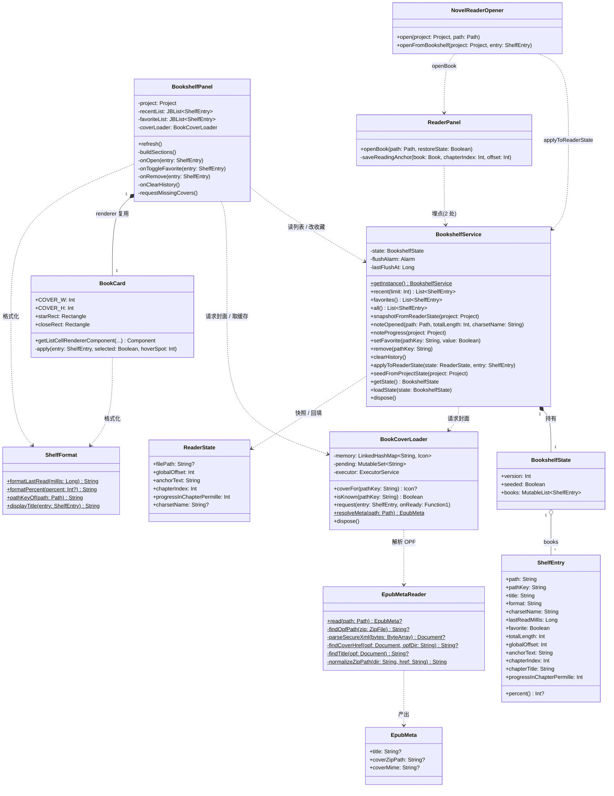
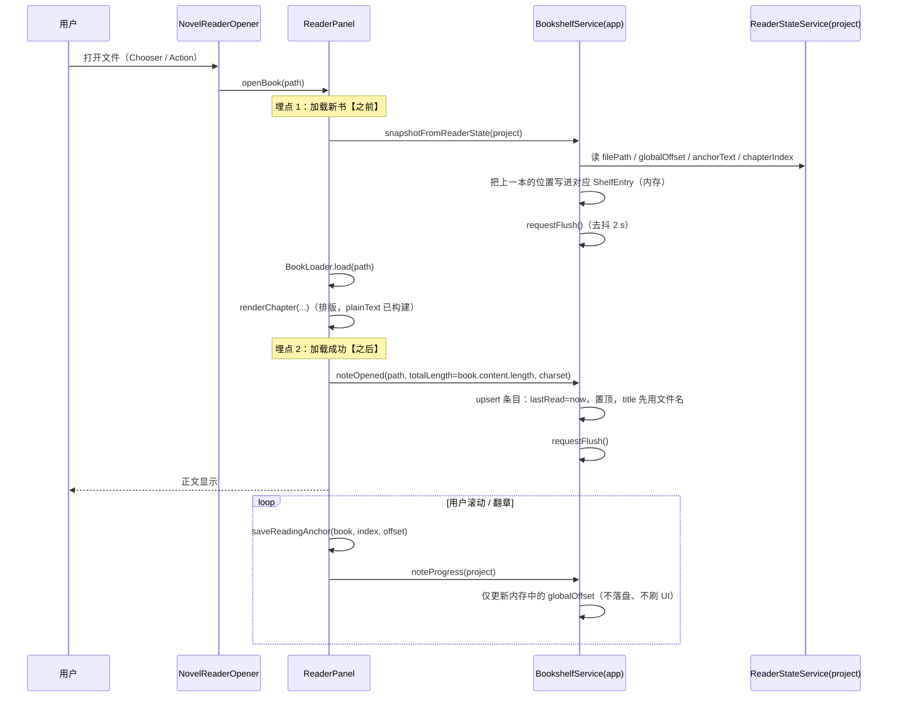
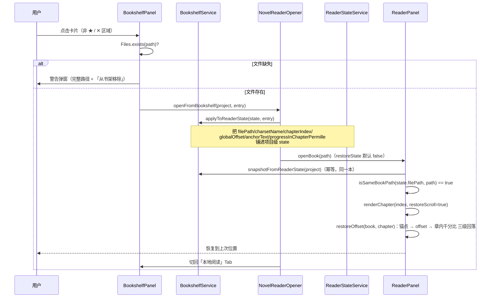
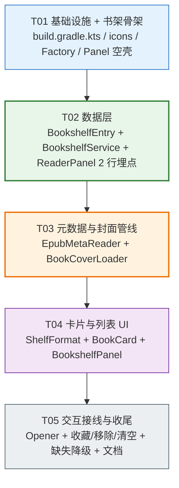

# 0.11.0 书架（增量设计）

> 本文由架构角色产出，针对 team-lead 转达的需求：**在右侧工具窗口新增「书架」Tab**，
> 内含「最近阅读」与「我的收藏」两个分区，卡片展示 书名 / 进度 / 最后阅读时间 / 封面 / 悬浮看路径，
> 支持点击续读、收藏、移除。
>
> 本文所有"现状"结论均来自**当前分支实测**（`codex/epub-media-and-footnote`，HEAD = `e1341eb`，版本 `0.10.1`），不使用估算值。
>
> 本文是**增量**设计：遵循最小变更原则，不重写 `ReaderPanel.kt`（实测 1202 行）或 `EpubBookLoader.kt`（实测 2017 行），
> 不动 `Book.plainText` 的口径。

---

## 0. 结论速览（6 个决策）

| # | 问题 | 结论 | 一句话理由 |
|---|---|---|---|
| **1** | 持久化层级 | **新建应用级 `@Service(Service.Level.APP)` → `BookshelfService`**，存储 `bookshelf.xml`；**不迁移**旧项目级数据，只做一次性"播种" | 书架是用户资产，跟工程无关；项目级会换工程就丢；旧数据只有单本书、无时间戳，搬过去是脏数据 |
| **2** | 何时记录历史 | **打开书时 upsert + 换书前快照 + 进度只进内存 + IDE 自动保存兜底 + 主动操作后去抖落盘** | `saveReadingAnchor` 是唯一漏斗（实测 1 处），在那里挂一行即可；落盘交给 IDEA 自带的 5 分钟自动保存，不新增定时器 |
| **3** | 封面获取与缓存 | **书架展示时懒加载**，只解 `container.xml` + OPF（几 KB，不碰正文）；缩略图（最长边 320 px PNG）存 **IDEA 系统缓存目录**；内存 LRU 32 张；**全部在自建单线程后台队列 + `invokeLater` 回填**，EDT 零 IO | 打开书时顺手缓存会让开书变慢；原图几 MB × 20 本写成 PNG 会爆；缓存是可再生派生数据，放 `system/` 符合平台约定 |
| **4** | 进度百分比 | **为书架单独存轻量 `totalLength`**（打开书时写一次 `book.content.length`）；`percent = globalOffset * 100 / totalLength` | 为了算分母去重新解析 20 本几 MB 的书 = 打开书架卡 20 秒 |
| **5** | UI 结构 | **新增 `ui/bookshelf/` 一组类**；列表用 **两个 `JBList` + 自定义 `ListCellRenderer`**（单元格复用），外层单个 `JBScrollPane` 包纵向 `JPanel` 承载两个分区 | renderer 单实例复用 → 100 本也不涨组件数；两个分区各自排序比在一个 List 里插分组头简单得多 |
| **6** | 异步填充 | **先出文字骨架 + 封面后台逐张补**（渐进式），不是"等全部加载完再显示" | 打开 Tab 的 EDT 工作量 ≤ 一帧；封面 3–5 s 陆续到位，用户立刻就能点 |

**改动量预估**：新增 7 个文件（约 900 行），修改 4 个文件（其中 `ReaderPanel.kt` 只加 **2 行埋点**）。

---

## 1. 现状基线（实测）

| 项 | 实测结果 | 对本次设计的影响 |
|---|---|---|
| `ReaderStateService` | `@State(name="NovelReaderState", storages=[Storage("novelReader.xml")])` + `@Service(Service.Level.PROJECT)`，17 个字段 | **项目级、单槽位**：只有 `filePath` 一个位置槽，换书即覆盖上一本的位置 → 书架必须自己存"每本书的位置" |
| `ReaderPanel.kt` | **1202 行**（不是 1400+），`stateService.state.` 出现 **40 次** | 不能再往里堆代码 → 书架必须是独立一组类，埋点 ≤ 2 行 |
| 位置写入漏斗 | `updateReadingPositionForGlobalOffset → saveReadingAnchor`（`ReaderPanel.kt:518/534`），**全项目只有这一处**写 `globalOffset/anchorText/progressInChapterPermille` | 挂 1 行即可拿到"最新进度"，不需要在每个滚动回调里埋点 |
| `EpubBookLoader.kt` | **2017 行**，`findPackagePath` / `parseXml` / `readManifest` / `newSecureDocumentBuilder` **全部是 `private`** | 为了复用去改可见性 = 动既有文件 → 元数据读取改为**自包含新文件**（见 §3.2） |
| `EpubResourceEntry` | `book/BookResources.kt:93`，含 `zipPath / mime / byteSize / width / height` | 封面解码需要"zip 内路径"，但**不需要**构造 `EpubResources`（那要先跑完 2000 行主流程） |
| EPUB 元数据 | 全文 grep `cover` / `dc:title`：**零命中**，`readManifest` 只取 `id/href/media-type`，**没取 `properties`** | 封面定位必须新写；`properties="cover-image"` 目前根本没被解析过 |
| 工具窗口 | `NovelReaderToolWindowFactory` 用 `ContentFactory.createContent` 加 2 个 Tab（本地阅读 / Neat Reader） | 加第三个 Tab 是 3 行改动 |
| 打开入口 | `NovelReaderOpener.open(project, path)` → `toolWindow.activate { panel.openBook(path) }`；`openBook` 内部 `shouldRestoreState = restoreState \|\| isSameBookPath(state.filePath, path)` | **关键杠杆**：先把目标书的位置铺进项目级 state，`isSameBookPath` 就为 true，走现有恢复分支 → `ReaderPanel` 零改动 |
| 测试目录 | `src/` 下**只有 `main`**，无 `src/test` | 本批不引入测试框架（保持最小变更），但数据结构设计成纯函数、可后置单测 |

---

## 2. 决策 1：持久化层级 —— 新建应用级服务

### 2.1 结论

**新建 `BookshelfService`：`@Service(Service.Level.APP)` + `@State(name = "NovelReaderBookshelf", storages = [Storage("bookshelf.xml")])`。**

存储位置：`<IDE config>/options/bookshelf.xml`（应用级 `Storage` 的默认落点）。

### 2.2 为什么不复用 / 扩展项目级 `ReaderStateService`

| 方案 | 问题 |
|---|---|
| 扩展项目级 `ReaderState` 加一个 `books: MutableList<ShelfEntry>` | ① 换工程书架就空了 —— 用户 A 工程读了 20 本，打开 B 工程一本不剩，这与"书架是用户个人资产"的语义直接冲突；② 每个工程一份副本，同一本书在两个工程里进度不同步；③ `BookshelfPanel` 是应用级 UI，却要先拿 `Project` 才能读数据，测试与复用都别扭 |
| 把 `ReaderStateService` 整体改成应用级 | **breaking change**：`novelReader.xml` 从 `<project>/.idea/` 搬到 `config/options/`，所有 17 个阅读偏好（字体、字号、主题、Neat Reader 缩放…）在老用户升级后**全部丢失**。为了书架丢了 17 个偏好，不可接受 |

### 2.3 旧数据怎么办：**不迁移，改为一次性播种**

旧的项目级 `novelReader.xml` 里只有**一本书**的位置，且**没有任何时间戳**。
如果遍历所有历史工程把它们的 `filePath` 全搬进应用级书架，会得到"几十条时间全相同的脏数据"，还会把用户从没真正读过的工程垃圾带进来。

**采纳方案（幂等、只读、20 行）**：

```
触发时机：BookshelfService 首次构造（state 为空 && seeded == false）
动作：    project 级 ReaderStateService 里若 filePath 非空 且 Files.exists(path)
         → 生成 1 条 ShelfEntry：
             path / pathKey / format / charsetName 从 state 与扩展名取
             title        = 文件名去扩展名（EPUB 真实书名交给后台管线补，见 §3）
             lastRead     = Files.getLastModifiedTime(path)   // 兜底，没有真实阅读时间
             totalLength  = 0                                  // 未知 → 卡片进度显示 "—"
             globalOffset / anchorText / chapterIndex / progressInChapterPermille 从 state 直接拷
         → seeded = true（持久化，永不重复）
```

`totalLength = 0` 时的展示口径见 §11.2（显示 `—`，**不显示 0%**，否则会误导"这本书你一页没读"）。

> **红线**：播种**只读**项目级 state，不写、不删、不改 `ReaderStateService` 的任何字段。老用户升级后阅读位置、字体偏好全部原样保留。

### 2.4 应用级 vs 项目级的第二次确认：进度快照放哪

`architecture-review.md:484` 早已预警：

> 若要支持书架，**位置恢复的粒度必须从"项目级单例"升级为"每本书独立记录"**——这是数据模型的根本变化。

本次采纳，但**只在应用级书架里加"每本书独立记录"**，项目级 `ReaderState` **保持单槽位不动**。
代价与收益：

- 收益：`ReaderPanel` 改动 ≤ 2 行（§2.5），`restoreLastBook` / `restoreOffset` / `findAnchorNear` 全部原样工作。
- 代价：**两个工程同时开着、各读一本、频繁来回切换**时，项目级单槽位仍会互相覆盖，最坏丢 30 s 内进度（因为书架的进度同步走内存 + 5 分钟自动保存）。
  → 本批接受，列入 §14 待确认（彻底修需要把恢复源改成应用级，是 0.12 的话题）。

### 2.5 `ReaderPanel` 的两处埋点（全部改动）

```kotlin
// ReaderPanel.openBook(path) —— 第 1 处：加载新书【之前】，把上一本的位置快照回书架
fun openBook(path: Path, restoreState: Boolean = false) {
    try {
        BookshelfService.getInstance().snapshotFromReaderState(project)   // ← 新增 1 行
        val state = stateService.state
        ...
        renderChapter(index, restoreScroll = shouldRestoreState)
        // 第 2 处：加载成功【之后】，登记"打开过这本书"
        BookshelfService.getInstance().noteOpened(                        // ← 新增 1 行
            path = path,
            totalLength = book.content.length,
            charsetName = book.charset.name(),
        )
    } catch (error: Throwable) { ... }
}
```

第 2 处放在 `renderChapter` 之后，是因为 `book.content.length` 会触发 `plainText` 的 lazy 拼接 ——
此时排版已经把它算过了（`:461` 就用 `book.content.length`），**不产生额外成本**。

---

## 3. 决策 2：什么时候记录阅读历史

### 3.1 三层时机（内存 / 排序 / 落盘分开看）

| 事件 | 内存动作 | 是否重排"最近阅读" | 是否触发落盘 |
|---|---|---|---|
| `openBook` 加载前 | `snapshotFromReaderState(project)`：把**上一本**的 `globalOffset / anchorText / chapterIndex / progressInChapterPermille` 从项目级 state 拷进对应 `ShelfEntry` | 否 | ✅ 去抖 2 s |
| `openBook` 加载后 | `noteOpened`：upsert 条目，写 `totalLength / charsetName / format`，`lastRead = now` | ✅ 置顶 | ✅ 去抖 2 s（与上一条合并） |
| `saveReadingAnchor`（滚动停 / 翻章 / 跳转） | `noteProgress(project)`：把最新 offset 写进当前 `ShelfEntry`（**纯内存赋值，微秒级**） | 否 | ❌ 不触发 |
| 收藏 / 取消收藏 / 移除 / 清空历史 | 改内存 + 刷新 UI | 视情况 | ✅ 去抖 2 s |
| IDE 自动保存（≈5 分钟 / 失焦 / 退出） | — | — | IDEA 自己序列化 `getState()` |

### 3.2 为什么"进度只进内存"是安全的

`PersistentStateComponent` 的落盘由 IDEA 的 `SaveAndSyncHandler` 统一驱动：
**改内存对象 = 下一次自动保存就会带上**。所以：

- 不需要自己造定时器去写盘；
- 也不需要（**且绝不能**）在 `saveReadingAnchor` 里调 `ApplicationManager.getApplication().saveSettings()` ——
  那是**全量保存所有组件**，滚动一次触发一次会直接把 IDE 卡出顿挫感。

**最坏情况**：IDE 被强杀 → 丢失 ≤ 最近一次自动保存之后的进度。
这与**现状完全一致**（现有项目级 `ReaderState` 也是同一套机制），不引入新的可靠性退步。

### 3.3 去抖落盘的实现口径

```kotlin
// BookshelfService 内部
private val flushAlarm = Alarm(Alarm.ThreadToUse.SWING_THREAD, this)

private fun requestFlush() {
    flushAlarm.cancelAllRequests()
    flushAlarm.addRequest({
        if (System.currentTimeMillis() - lastFlushAt < MIN_FLUSH_INTERVAL_MS) return@addRequest  // 60 s
        lastFlushAt = System.currentTimeMillis()
        ApplicationManager.getApplication().saveSettings()
    }, FLUSH_DELAY_MS)   // 2000 ms
}
```

- 用 `Alarm` 而不是 `javax.swing.Timer`：`Alarm` 随 `Disposable` 自动取消，不会在应用关闭后还在排队。
- 只在 **SWING 线程** 调 `saveSettings()`，避免后台线程触发保存时的锁竞争。
- 最小间隔 60 s：连续换书、连点收藏只会落一次。

### 3.4 记录时机的一处已知行为（不是 bug）

启动时 `restoreLastBook()` 会走 `openBook` → `noteOpened` → 把最后那本书的 `lastRead` 刷成"刚刚"。
即：**开着 IDE 就等于"最近阅读"里那一本置顶**。语义上说得过去（确实恢复了阅读），本批保留，列入 §14 待确认。

---

## 4. 决策 3：封面的获取、缓存与失效

### 4.1 定位封面的优先级（EPUB）

只打开 zip 的**两个小文件**（`META-INF/container.xml` + OPF，通常几 KB），**不读正文、不构造 `EpubResources`、不跑 `EpubBookLoader` 主流程**。

```
1. OPF metadata 里 <meta name="cover" content="{id}">  → manifest[id].href
2. manifest item 的 properties 含 "cover-image"        → 该 item.href
3. manifest 里 mime 以 image/ 开头且 (id 或 href 含 "cover"/"封面"，忽略大小写)
4. 以上都无 → "无封面"，走默认图标（负结果也要缓存，见 §4.5）
```

> **为什么必须新写**：实测 `readManifest` 只取 `id/href/media-type`，**`properties` 属性目前根本没被解析**，
> `cover` 在 `EpubBookLoader` 里零命中。这不是"复用现成函数"，是补一个洞。

### 4.2 为什么是"书架展示时懒加载"，而不是"打开书时顺手缓存"

| | 打开书时顺手缓存 | **书架展示时懒加载（采纳）** |
|---|---|---|
| 开书耗时 | +1 次 zip 打开 + 解码 + 写 PNG（几十~几百 ms）叠加在本来就要 1–2 s 的解析上 | 无影响 |
| 从未打开过的书 | 永远没有封面 | 一样能拿到（只要它在书架里） |
| 书架里有 20 本书 | 用户可能只翻几本，却要为每本付一次成本 | 首次打开书架时集中付一次，**之后全部命中磁盘** |
| 缓存命中后的成本 | 同 | 一次 `Files.exists` + PNG 解码（几 ms） |

结论：懒加载 + **持久化磁盘缓存**，把"每本书只付一次"和"开书零成本"同时拿到。

### 4.3 缓存什么、存到哪、多大

| 项 | 取值 | 理由 |
|---|---|---|
| 存储目录 | `PathManager.getSystemPath()/novel-reader/covers/` | 封面是**可再生的派生数据**，符合 IDEA `system/` = 缓存的约定；被 IDE 的缓存清理带走上也无所谓（下次自动重建）。**不**放 `config/`（那是会被设置同步带走的用户数据） |
| 内容 | **缩略图 PNG**，最长边 ≤ **320 px**，保持宽高比 | 原图常见 1600×2400 JPEG ≈ 1–3 MB，20 本 = 20–60 MB，且直接写成 PNG 会再膨胀数倍。缩略图 ~30–80 KB/本 |
| UI 显示尺寸 | `JBUI.scale(64) × JBUI.scale(96)`（3:4） | 320 px 存图在 2× HiDPI 下显示 128×192 仍清晰 |
| 内存 LRU | `LinkedHashMap<pathKey, Icon?>`，上限 **32 张** | 320×320×4B×32 ≈ 13 MB 上限；`accessOrder = true` 自动淘汰 |
| 缓存目录上限 | 超过 **300** 个文件时按 mtime 删到 200 | 防止书多了以后无限增长；启动时检查一次 |

### 4.4 缓存键与失效（关键）

```
缓存文件名 = sha1(absPath) + "_" + fileSize + "_" + lastModifiedMillis + ".png"
```

- 分母三元组里带上 **大小 + 修改时间**：书被替换 / 重新导出 / 修复后封面自动失效重建，不需要任何版本号表。
- 旧文件不主动逐个删，靠 §4.3 的"目录上限 300"自然淘汰。
- **文件被删除**时：磁盘缓存文件**保留**（用户可能把 U 盘插回来），卡片走"文件缺失"降级（§8.4），不报错。

### 4.5 负结果缓存（必须做，否则每次打开书架都重解）

`LinkedHashMap<String, Icon?>` 的 value 允许为 `null`，表示**"已确认这本书没有封面"**。
另加一个 `Set<String> pending` 防止同一本书被重复提交进队列。
三个状态：`UNKNOWN`（未探测）/ `LOADING` / `DONE(icon 或 null)`。

### 4.6 绝不阻塞 EDT

```kotlin
// BookCoverLoader（应用级 service，自建单线程 daemon 线程）
private val queue = Executors.newSingleThreadExecutor { r ->
    Thread(r, "novel-reader-cover").apply { isDaemon = true }
}

fun request(entry: ShelfEntry, onReady: (String) -> Unit) {
    if (memory.containsKey(entry.pathKey) || pending.contains(entry.pathKey)) return
    pending += entry.pathKey
    queue.execute {
        val icon = runCatching { resolveCover(entry) }.getOrNull()   // 读 zip + 解码 + 写 PNG，全在这里
        ApplicationManager.getApplication().invokeLater {
            if (disposed) return@invokeLater
            pending -= entry.pathKey
            memory[entry.pathKey] = icon          // null 也存（负结果）
            trimMemory()
            onReady(entry.pathKey)                // → list.repaint()
        }
    }
}
```

- **单线程**而不是池：20 本顺序解码，不会瞬间打爆 IO 与内存峰值；也天然保证"先请求的先到位"。
- `disposed` 检查放 `invokeLater` **里面**（不是外面），避免应用已关闭还在碰 UI。
- 所有 `ZipFile` / `ImageIO` / 文件读写都在 `runCatching` 里，**任何异常都只降级为"无封面"**。

---

## 5. 决策 4：进度百分比怎么算

### 5.1 结论：为书架单独存一个轻量分母

```kotlin
percent = if (totalLength > 0) (globalOffset * 100 / totalLength).coerceIn(0, 100) else null
```

- `totalLength` = `Book.plainText.length`，**只在 `openBook` 成功时写一次**（此时 `plainText` 已因排版而构建，O(1) 取长度）。
- `globalOffset` 与阅读区状态栏的 `bookProgress()`（`ReaderPanel.kt:923`）**同源同口径**：都是 `viewportAnchorOffset()` 落下来的值，不存在"书架 37% / 状态栏 41%"的对不上。

### 5.2 为什么不重新解析整本书算分母

打开书架要显示 20 本。若每本都 `BookLoader.load()` 一次：
几 MB 的 EPUB 解析 + 全量 `plainText` 拼接 ≈ 1–2 s/本 → **打开 Tab 卡 20 秒**，且是白屏等。
存一个 `int` 分母是唯一合理选择。

### 5.3 分母失效的处理

| 场景 | 处理 |
|---|---|
| 书被改写变长/变短 | `globalOffset > totalLength` → 钳到 100%；下次打开该书时 `noteOpened` 刷新 `totalLength` |
| 播种的旧数据（`totalLength = 0`） | `percent = null` → 卡片显示 `—`，**不显示 0%** |
| `totalLength > 0` 但 `globalOffset = 0` | 显示 0%（确实一页没读） |

---

## 6. 决策 5：UI 结构

### 6.1 组件选型：`JBList` + 自定义 renderer（采纳）

| 方案 | 20 本 | 100 本 | 交互实现 | 结论 |
|---|---|---|---|---|
| `JBScrollPane` + 每书一个 `BookCard : JPanel` | OK | 100 张卡 × 4 子组件 ≈ 500 个组件，滚动与重绘吃力 | 直白（真按钮、真 listener） | ❌ 规模上不去 |
| **`JBList` + `ListCellRenderer`（采纳）** | OK | **renderer 是单实例复用**，组件数恒定 ≈ 6 个 | 需按坐标算热区（§6.4） | ✅ |

`JBList` 额外白送：选中态、键盘上下键、`ToolTipManager` 转发到 renderer 的 tooltip、主题/缩放跟随。

### 6.2 两个分区 = 两个 `JBList`，共享一个滚动容器

```
JBScrollPane
  └ JPanel(BoxLayout.Y_AXIS)          ← 唯一滚动条
      ├ sectionHeader("最近阅读")      + (清空历史按钮放在这一行右侧)
      ├ JBList(recent)                 ← setVisibleRowCount(n)，禁止自身滚动
      ├ sectionHeader("我的收藏")       （为空时整段隐藏）
      ├ JBList(favorites)
      └ Box.Filler(垂直弹性空白)
```

- 每个 `JBList` 设 `preferredSize = Dimension(1, rowCount * CELL_HEIGHT)`，并 `maximumSize` 同值 → 不产生嵌套滚动条。
- 收藏区为空时 `isVisible = false` 整个 section（标题 + 列表一起藏），避免"我的收藏（0）"这种空壳。
- 一条 `ShelfEntry` 可以同时出现在两个区（读过 + 收藏了），**数据只有一份**。

### 6.3 卡片布局（`BookCard.kt`，固定高度 `JBUI.scale(120)`）

```
┌────────────────────────────────────────────────┐
│ ┌────────┐  书名（最多 2 行，溢出 …）        ★ ✕ │
│ │ 封面    │  ▓▓▓▓▓▓▓░░░░░░░  37%                │
│ │ 64×96  │  3 小时前 · EPUB                     │
│ └────────┘                                      │
└────────────────────────────────────────────────┘
             tooltip（悬浮）：书名 / 完整路径 / 最后阅读 / 进度
```

- 封面：命中则 `ImageIcon`，否则默认 SVG 图标（`icons/book.svg`）；文件缺失时叠加"缺失"角标。
- 进度：`javax.swing.JProgressBar`（`stringPainted=false`、`borderPainted=false`，颜色跟随 IDE 主题）。
- 收藏 ★/☆、移除 ✕：**不是真按钮**，是 renderer 画出来的图形 + 坐标热区（§6.4）。

### 6.4 renderer 内交互：坐标热区（必须这样做）

`JBList` 的 renderer 组件**不是**真的加进视图树 —— 在 renderer 里 `addActionListener` 永远不会触发。
正确做法（IDEA 插件通用套路）：

```kotlin
// BookCard 暴露常量矩形（布局固定，可静态计算）
val starRect  = Rectangle(width - 2 * GAP - 2 * ICON, GAP, ICON, ICON)
val closeRect = Rectangle(width - GAP - ICON,         GAP, ICON, ICON)

// BookshelfPanel 给 list 装 listener
list.addMouseListener(object : MouseAdapter() {
    override fun mouseClicked(e: MouseEvent) {
        val index = list.locationToIndex(e.point)          // 行
        val bounds = list.getCellBounds(index, index)      // 行的屏幕矩形
        val local = Point(e.x - bounds.x, e.y - bounds.y)  // 行内坐标
        when {
            closeRect.contains(local) -> onRemove(entry)
            starRect.contains(local)  -> onToggleFavorite(entry)
            else                      -> onOpen(entry)    // 其余区域 = 继续阅读
        }
    }
})
list.addMouseMotionListener(...)   // 记 hoverIndex / hoverSpot → list.repaint() 出 hover 高亮
```

### 6.5 `ReaderPanel` 不能碰，UI 全部落在 `ui/bookshelf/`

| 文件 | 职责 |
|---|---|
| `ui/bookshelf/BookshelfPanel.kt` | 主面板：工具栏（打开 / 清空历史）+ 两个 section + 两个 `JBList` + 全部交互接线 + `refresh()` |
| `ui/bookshelf/BookCard.kt` | 单卡片 renderer（继承 `JPanel`，实现 `ListCellRenderer<ShelfEntry>`），含常量热区矩形 |
| `ui/bookshelf/ShelfFormat.kt` | 纯函数：相对时间、进度文本、缺失/degraded 文案 |

### 6.6 Tab 顺序与刷新

- **顺序：`本地阅读` → `书架` → `Neat Reader`**。理由：书架与阅读入口语义相邻，应在 Neat Reader（另一个产品）之前。
  （若 team-lead 要求严格"第三位"，`NovelReaderToolWindowFactory` 里换一行 `addContent` 顺序即可。）
- **刷新时机**：`ContentManagerListener.selectionChanged` 命中 `BookshelfPanel` 时调 `refresh()`。
  在 `ContentFactory.createContent` 之后注册；`ContentManagerListener` 的方法在新版平台里是 `default` 空实现，
  Kotlin 只需 override `selectionChanged`（若编译报"未实现"，补齐空实现即可）。
- **备选**（若 listener 有坑）：`BookshelfService` 埋点时直接通知已注册的 `BookshelfPanel`（照抄 `ReaderPanel.panelsByProject` 的 `WeakHashMap` 模式）。

---

## 7. 决策 6：封面 / 书名的异步填充 —— 渐进式

### 7.1 结论：先出文字骨架，封面后台逐张补

```
t=0       EDT：读内存 state → 排序 → 组装 2 个 ListModel → 组件可见
              （纯内存，20 本 < 5 ms；封面槽位全是默认图标，书名先用持久化的 title / 文件名）
t=0       EDT：把"UNKNOWN 且文件存在"的条目按顺序 submit 进 BookCoverLoader 队列
t=+50ms   后台：第 1 本 → sha1 缓存命中 → invokeLater → repaint → 封面出现
t=+300ms  后台：第 2 本 → 无缓存 → 读 OPF（几 KB）→ 解码封面 → 缩放 → 写 PNG → invokeLater → 封面 + 真实书名一起出现
...
t=+3s     全部到位（磁盘缓存命中后，下次打开书架全程 < 200 ms）
```

### 7.2 为什么不等全部加载完再显示

- 等全部 = 打开 Tab 白屏 3 秒起步（首次），且**每次**打开都要等（哪怕只有 1 本没缓存）。
- 渐进式下用户 t=0 就能点、就能看进度，封面是"锦上添花"，不是阻塞项。
- 回填补的是**两张信息**：封面 `Icon` + EPUB 真实 `dc:title`（写回 `ShelfEntry.title` 并落盘）。

### 7.3 书名跳动的处理

EPUB 首次入库时 `title` 是文件名，后台补成 `dc:title` 后卡片文字会变一次。
- 幅度有限（几百 ms、只在首次）；
- 之后 `title` 已持久化，再打开不会跳；
- TXT 永不跳（书名就是文件名）。

### 7.4 规模保护

条目 > 30 时，只为**前 30 个**提交封面请求；滚动到底部时再补提交（P2 优化，本批可先只做前 30，因为历史上限 50）。

---

## 8. 数据结构与接口

### 8.1 类图



### 8.2 数据类定义

```kotlin
// ---------- bookshelf/BookshelfEntry.kt ----------

/** 书架里的一本书。**只存可序列化字段**；封面 Icon 等运行时态一律放 BookCoverLoader。 */
class ShelfEntry {
    /** 绝对路径原样（用于打开、tooltip 展示） */
    var path: String = ""
    /** 归一化键：见 §11.1，用于 Map / 去重 / 封面缓存 */
    var pathKey: String = ""
    /** 书名：EPUB 后台补 dc:title，补不到就是文件名去扩展名 */
    var title: String = ""
    /** "txt" / "epub" */
    var format: String = ""
    var charsetName: String = ""
    /** 最后阅读时间（epoch millis）；0 = 未知（播种数据） */
    var lastReadMillis: Long = 0L
    var favorite: Boolean = false

    /** 全书字符数（= Book.plainText.length）；0 = 未知 → 进度显示 "—" */
    var totalLength: Int = 0
    /** 阅读位置：与 ReaderState 同名同义同口径 */
    var globalOffset: Int = 0
    var anchorText: String = ""
    var chapterIndex: Int = 0
    var chapterTitle: String = ""
    var progressInChapterPermille: Int = 0

    /** 进度百分比；分母未知返回 null */
    fun percent(): Int? =
        if (totalLength > 0) (globalOffset * 100 / totalLength).coerceIn(0, 100) else null
}

// ---------- bookshelf/BookshelfService.kt ----------

class BookshelfState {
    var version: Int = 1
    /** 是否已从项目级旧状态播种过（幂等标记） */
    var seeded: Boolean = false

    @XCollection(elementName = "book")
    var books: MutableList<ShelfEntry> = mutableListOf()
}
```

> **XmlSerializer 注意**：`ShelfEntry` 用**普通 class + `var` 默认值**（不是 data class），
> 保证"字段缺失 → 取默认值"而不是"反序列化失败 → 整个 IDE 启动崩"。
> 若 `@XCollection` 在当前平台版本不可用，去掉注解直接用 `MutableList<ShelfEntry>`
> （XmlSerializer 同样支持，只是 XML 元素名叫 `ShelfEntry`）。**绝不要**用 `Map<String, ShelfEntry>`，
> bean 值 + String 键的 Map 在 XmlSerializer 下坑更多。

```kotlin
// ---------- bookshelf/EpubMetaReader.kt ----------

/** 只解 container.xml + OPF，不读正文、不构造 EpubResources。 */
data class EpubMeta(
    val title: String?,        // dc:title，已做实体解码与空白折叠
    val coverZipPath: String?, // 封面资源在 zip 内的路径
    val coverMime: String?,
)

object EpubMetaReader {
    /** 任何异常都返回 null，调用方降级为"无封面" */
    fun read(path: Path): EpubMeta?
}
```

### 8.3 `BookshelfService` 关键方法契约

| 方法 | 线程 | 语义 |
|---|---|---|
| `recent(limit)` | EDT | 按 `lastReadMillis` 倒序，取前 `limit`；**每次调用现排序**（纯函数，好测）。含收藏的书 |
| `favorites()` | EDT | `favorite == true` 的子集，按 `lastReadMillis` 倒序 |
| `snapshotFromReaderState(project)` | EDT | 读项目级 `ReaderState.filePath`，若存在对应条目则把 `globalOffset/anchorText/chapterIndex/chapterTitle/progressInChapterPermille` 拷进去；不存在则不新建（避免把没登记的垃圾写进来）。**换书时必调** |
| `noteOpened(path, totalLength, charsetName)` | EDT | upsert；新条目 `title = 文件名去扩展名`；`lastReadMillis = now`；写 `totalLength/charsetName/format`；超过 `MAX_RECENT(50)` 时按 `lastReadMillis` 淘汰最旧的**非收藏**条目 |
| `noteProgress(project)` | EDT | 只把项目级 state 的最新 offset 同步到当前条目的内存字段；**不排序、不刷 UI、不落盘** |
| `setFavorite / remove / clearHistory` | EDT | 改内存 + `requestFlush()`；`clearHistory` 只删 `!favorite` 的条目 |
| `applyToReaderState(state, entry)` | EDT | 把 `ShelfEntry` 的位置字段铺进项目级 `ReaderState`（用于续读，见 §9.3） |
| `loadState(state)` | EDT（启动） | **清洗**：丢 `path` 空 / `pathKey` 空 / 格式非 txt|epub 的；`lastReadMillis` 钳到 `[0, now]`；`pathKey` 去重（保留最近）；条数截到 50；整体 `runCatching`，异常 → `LOG.warn` + 空书架 |

### 8.4 缺失文件的展示策略

- `missing = !Files.exists(Path.of(entry.path))`（20 次 `stat`，EDT 上可忽略）。
- 缺失卡片：**照常显示**（不自动删 —— 用户可能插回 U 盘 / 重连网络盘），但：
  - 封面换成"破书"占位（`icons/book.svg` + 灰化，或叠加一个小 `!`）；
  - 书名后追加 `（文件已不存在）`；
  - 进度 / 时间照旧显示（历史事实，不该抹掉）；
  - tooltip 显示完整路径 + 「文件已被移动或删除」；
  - **点击不打开**，弹 `Messages.showWarningDialog`，文案里带完整路径，并提供「从书架移除」二次确认。
- `format` 非 txt/epub（数据被手工改坏）→ 在 `loadState` 清洗阶段直接丢弃。

---

## 9. 关键调用流程

### 9.1 打开书 → 记录历史（含换书快照）



### 9.2 打开「书架」Tab → 渲染 + 封面异步回填

```mermaid
sequenceDiagram
    participant U as 用户
    participant CM as ContentManager
    participant BP as BookshelfPanel
    participant BS as BookshelfService(app)
    participant CL as BookCoverLoader(app)
    participant BG as 后台单线程
    participant FS as 磁盘缓存目录

    U->>CM: 选中「书架」Tab
    CM->>BP: selectionChanged → refresh()
    BP->>BS: recent(50) / favorites()
    BS-->>BP: List<ShelfEntry>（内存排序，< 1 ms）
    BP->>BP: 构建 2 个 ListModel + 卡片骨架（默认封面图标）
    BP-->>U: 列表立刻可见（EDT 工作量 ≤ 一帧）

    BP->>CL: request(entry, onReady) ×N（最多 30）
    CL->>CL: memory 命中? → 直接回调；pending? → 跳过
    CL->>BG: execute { resolveCover(entry) }
    BG->>FS: 查 sha1(path)_size_mtime.png
    alt 磁盘命中
        FS-->>BG: PNG bytes
    else 未命中
        BG->>BG: EpubMetaReader.read(path)（只读 container.xml + OPF）
        BG->>BG: ZipFile 取封面字节 → ImageIO 解码 → 缩放到 320 px
        BG->>FS: 写 PNG 缩略图
    end
    BG->>CL: invokeLater { memory[pathKey] = icon; trimMemory() }
    CL->>BP: onReady(pathKey)
    BP->>BP: list.repaint()（+ 若拿到 dc:title 则写回 ShelfEntry.title）
    BP-->>U: 封面逐张出现
```

### 9.3 点击卡片 → 恢复上次位置继续阅读



> **这里的关键技巧**：`openBook(path)` 的 `restoreState` 传 `false` 也能恢复，
> 因为 `isSameBookPath(state.filePath, path)` 在 `applyToReaderState` 之后必然为 `true`。
> **因此 `ReaderPanel` 不需要新增任何参数或分支**。

### 9.4 收藏 / 移除 / 清空历史

```
★ 点击 → BookshelfService.setFavorite(pathKey, !favorite)
       → requestFlush()（去抖 2 s 落盘）
       → refresh()：favorites 列表增减，recent 列表不变（收藏不改变排序）

✕ 点击 → BookshelfService.remove(pathKey)（两个区同时消失，数据只有一份）
       → requestFlush()

清空历史 → Messages.showYesNoDialog("将移除全部未收藏的阅读记录，收藏的书会保留。")
       → BookshelfService.clearHistory()（只删 !favorite）
       → refresh()
```

---

## 10. 文件清单

| # | 路径 | 新增/修改 | 说明 | 预估行数 |
|---|---|---|---|---|
| 1 | `src/main/kotlin/com/chen/reader/bookshelf/BookshelfEntry.kt` | **新增** | `ShelfEntry` + `BookshelfState`（纯持久化数据） | ~60 |
| 2 | `src/main/kotlin/com/chen/reader/bookshelf/BookshelfService.kt` | **新增** | 应用级 service：`@Service(APP)` + `@State`，CRUD + 清洗 + 播种 + 去抖落盘 | ~280 |
| 3 | `src/main/kotlin/com/chen/reader/bookshelf/EpubMetaReader.kt` | **新增** | 只读 container.xml + OPF，取 `dc:title` 与封面 zip 路径（自包含，安全 XML 解析） | ~150 |
| 4 | `src/main/kotlin/com/chen/reader/bookshelf/BookCoverLoader.kt` | **新增** | 应用级 service：磁盘缩略图缓存 + 内存 LRU + 单线程后台队列 + `Disposable` | ~220 |
| 5 | `src/main/kotlin/com/chen/reader/ui/bookshelf/BookshelfPanel.kt` | **新增** | 主面板：工具栏 + 两个分区 + 两个 `JBList` + 全部交互接线 | ~300 |
| 6 | `src/main/kotlin/com/chen/reader/ui/bookshelf/BookCard.kt` | **新增** | 卡片 renderer（`ListCellRenderer<ShelfEntry>`）+ 常量热区矩形 | ~180 |
| 7 | `src/main/kotlin/com/chen/reader/ui/bookshelf/ShelfFormat.kt` | **新增** | 纯函数：相对时间 / 进度文本 / `pathKey` / 显示书名 | ~80 |
| 8 | `src/main/resources/icons/book.svg` | **新增** | 默认封面占位图标（16/64 复用一张，按 `JBUI.scale` 拉伸） | — |
| 9 | `src/main/kotlin/com/chen/reader/NovelReaderToolWindowFactory.kt` | **修改** | 加「书架」Tab + `ContentManagerListener` 刷新接线（+12 行） | +12 |
| 10 | `src/main/kotlin/com/chen/reader/ReaderPanel.kt` | **修改** | **仅 2 行埋点**：`openBook` 开头 `snapshotFromReaderState`、结尾 `noteOpened` | +2 |
| 11 | `src/main/kotlin/com/chen/reader/NovelReaderOpener.kt` | **修改** | 新增 `openFromBookshelf(project, entry)`（+18 行） | +18 |
| 12 | `build.gradle.kts` | **修改** | `version = "0.11.0"` | 1 |
| 13 | `README.md` / `docs/development-record.md` | **修改** | 功能清单 + 版本日志 | +30 |

**不动的文件（红线）**：`EpubBookLoader.kt`（零改动）、`Book.kt` / `Block.kt`（零改动）、
`Book.plainText` 口径（零改动）、`ReaderStateService.kt`（零改动，只新增应用级兄弟 service）、
`ReaderPanel.kt` 除 2 行埋点外零改动。

---

## 11. 任务分解

### 11.1 任务列表

| ID | 任务名 | 涉及文件 | 依赖 | 优先级 |
|---|---|---|---|---|
| **T01** | **项目基础设施与书架骨架**：版本号 → `0.11.0`；新增默认封面 `icons/book.svg`；`NovelReaderToolWindowFactory` 注册「书架」Tab + `ContentManagerListener` 刷新接线；`BookshelfPanel` 最小可运行骨架（工具栏 + 两个空分区 + `refresh()` 空实现 + 空态文案） | `build.gradle.kts`、`icons/book.svg`、`NovelReaderToolWindowFactory.kt`、`ui/bookshelf/BookshelfPanel.kt` | — | **P0** |
| **T02** | **数据层：应用级持久化**。`ShelfEntry` / `BookshelfState`；`BookshelfService`（`@Service(APP)` + `@State(bookshelf.xml)`）：`loadState` 清洗、`recent/favorites` 排序、`snapshotFromReaderState`、`noteOpened`、`noteProgress`、`setFavorite/remove/clearHistory`、`applyToReaderState`、播种、`Alarm` 去抖落盘；`ReaderPanel` 两处埋点 | `bookshelf/BookshelfEntry.kt`、`bookshelf/BookshelfService.kt`、`ReaderPanel.kt` | T01 | **P0** |
| **T03** | **元数据与封面管线**：`EpubMetaReader`（container.xml + OPF → `dc:title` + 封面 zip 路径，安全 XML 解析，四级定位兜底）；`BookCoverLoader`（系统缓存目录缩略图、文件名指纹失效、目录上限 300、内存 LRU 32、单线程后台队列、`invokeLater` 回填、`Disposable`） | `bookshelf/EpubMetaReader.kt`、`bookshelf/BookCoverLoader.kt`、`bookshelf/BookshelfEntry.kt` | T02 | **P0** |
| **T04** | **卡片与列表 UI**：`ShelfFormat`（相对时间 / 进度 / `pathKey` / 书名）；`BookCard` renderer（封面 + 书名 + `JProgressBar` + 时间 + ★/✕ + tooltip + 常量热区矩形）；`BookshelfPanel` 两个 `JBList`（固定行高、禁自身滚动）+ `ListModel` + 悬浮高亮 + 坐标热区点击分派 + `refresh()` 真实实现 + 封面请求提交 | `ui/bookshelf/ShelfFormat.kt`、`ui/bookshelf/BookCard.kt`、`ui/bookshelf/BookshelfPanel.kt`、`icons/book.svg` | T03 | **P0** |
| **T05** | **交互接线与收尾**：`NovelReaderOpener.openFromBookshelf`（位置注入 → 切 Tab）；收藏 / 移除 / 清空历史（含二次确认）；文件缺失降级与点击拦截；`README.md` + `docs/development-record.md` 文档；手工冒烟回归 | `NovelReaderOpener.kt`、`ui/bookshelf/BookshelfPanel.kt`、`ui/bookshelf/BookCard.kt`、`README.md`、`docs/development-record.md` | T04 | **P0** |

> 每个任务 ≥ 3 个文件；T01 是唯一的"公用基础设施"任务；T02–T04 是严格线性的三层（数据 → 管线 → UI），
> 除此之外无横向依赖，便于单点返工。

### 11.2 建议实施顺序

```
T01（骨架，可先跑起来看到空书架）
 └─ T02（数据层：此时用 System.out/日志验证"打开书 → 书架有记录"，UI 先不画封面）
     └─ T03（封面管线：单独用一本书验证 OPF 定位 + 缩略图落盘）
         └─ T04（卡片 UI：先跑纯文字卡片，确认滚动/点击/热区，再接封面）
             └─ T05（交互 + 缺失降级 + 文档 + 冒烟）
```

### 11.3 任务依赖图



绿色（T02）是**数据正确性**的关键 —— 它错了后面全错；
橙色（T03）是**唯一可能卡 EDT / 撑爆内存**的一环，必须最晚在 T04 之前单独验证。

---

## 12. 共享约定（跨文件口径，必须全组一致）

1. **路径键 `pathKey`**（唯一实现：`ShelfFormat.pathKeyOf`）
   `path.toAbsolutePath().normalize().toString()`，Windows 上再 `.lowercase()`。
   **所有** Map 查找、去重、封面缓存 key、收藏/移除的入参都用它。
   展示与打开一律用 `entry.path`（原样绝对路径）。
2. **进度百分比**（唯一实现：`ShelfEntry.percent()`）
   `totalLength > 0 → (globalOffset * 100 / totalLength).coerceIn(0, 100)`；否则 `null` → 显示 `—`。
   **禁止**在别处用 `chapterIndex / chapters.size` 之类的替代口径。
3. **时间**（唯一实现：`ShelfFormat.formatLastRead`）

   | 条件 | 显示 |
   |---|---|
   | `millis <= 0` | `—` |
   | 差 < 1 min | `刚刚` |
   | 差 < 60 min | `N 分钟前` |
   | 同一自然日 | `今天 HH:mm` |
   | 昨天 | `昨天 HH:mm` |
   | 同一自然年 | `M月d日` |
   | 更早 | `yyyy-MM-dd` |

   时区和"自然日"一律用系统默认 `ZoneId`；`LocalDate` 比较，不要用毫秒差算"几天前"。
4. **封面常量**：磁盘缩略图最长边 `COVER_MAX_EDGE = 320`；UI 显示 `JBUI.scale(64) × JBUI.scale(96)`；
   内存 LRU `MAX_CACHED_ICONS = 32`；缓存目录上限 `MAX_CACHE_FILES = 300`（超出按 mtime 删到 200）。
5. **线程纪律**
   - **EDT 只准做**：读内存 state、排序、构建/更新 Swing 组件、`repaint()`。
   - **EDT 绝对禁止**：`ZipFile` / `ImageIO` / 文件读写 / `Files.exists` 之外的任何 IO。
   - 后台 → UI 一律 `ApplicationManager.getApplication().invokeLater { ... }`，**且**回调第一行检查 `disposed`。
   - 封面解码走 `BookCoverLoader` 的**单线程** executor，任何文件不得自己开线程。
6. **容错**：`EpubMetaReader` / `BookCoverLoader` / `loadState` 对外**永不抛异常**。
   内部一律 `runCatching` + `LOG.warn`（本项目目前零日志，本次新增的 `Logger.getInstance(...)` 只用于这两处降级点）。
   封面失败 → 默认图标；元数据失败 → 用文件名；state 解析失败 → 空书架（**绝不能让 IDE 启动失败**）。
7. **落盘纪律**：只有 `BookshelfService.requestFlush()` 允许调 `saveSettings()`，且必须走去抖（2 s 延迟 + 60 s 最小间隔）。
   **其它任何文件都不准调 `saveSettings()`**。进度更新只改内存。
8. **`ReaderPanel` 埋点固定 2 处**（`openBook` 首行 / 末行）。除这两处外，
   任何书架相关代码**不得**直接读写项目级 `ReaderStateService` 的位置字段（`globalOffset / anchorText / chapterIndex / progressInChapterPermille`）；
   读用 `snapshotFromReaderState`，写用 `applyToReaderState`。
9. **历史上限 `MAX_RECENT = 50`**，淘汰时**跳过收藏条目**。
10. **文件格式白名单**：只有 `txt` / `epub`（与 `BookLoader.supportedExtensions` 一致），`loadState` 里越界的直接丢弃。

---

## 13. 风险与最容易踩的坑

| # | 坑 | 后果 | 规避 |
|---|---|---|---|
| **1** | **封面解码 / zip 读取落到 EDT** | 打开书架卡死 3–20 s，IDEA 直接无响应 | 全部走 `BookCoverLoader` 单线程队列；renderer 里**只准**读内存 `Icon`，**不准**触发任何加载。Code review 红线：renderer 里出现 `ZipFile` / `ImageIO` / `Files.read*` 一律打回 |
| **2** | **在 `saveReadingAnchor` 里落盘** | 滚一次触发一次全量 `saveSettings()`，IDE 顿挫 | 进度只进内存（§3.2）。落盘只由 `requestFlush()` 触发 |
| **3** | **换书时忘了先快照** | 打开 B 之后，A 的进度永远停在"上一次换页前"，书架显示 30% 实际读到 80% | `snapshotFromReaderState` 必须在 `openBook` **加载新书之前**（第 1 行）。顺序反了 = 数据与 UI 全错，且症状隐蔽 |
| **4** | **`pathKey` 口径不统一**（一处 `toString()`、一处 `lowercase()`、一处用文件名） | 同一本书出现两条记录；收藏/移除点了没反应 | 唯一实现 `ShelfFormat.pathKeyOf`，其它地方禁止手写 |
| **5** | **`XmlSerializer` 反序列化失败** | 老用户升级后 **IDE 启动崩溃**（应用级 state 在启动期加载） | `ShelfEntry` 用普通 class + 默认值；`loadState` 整体 `runCatching` + 字段级清洗（§8.3） |
| **6** | **renderer 里放真按钮** | 点了没反应，且滚动时按钮状态串到别的行 | 坐标热区（§6.4）；renderer 无状态、每次全量 `apply()` |
| **7** | **缓存不失效** | 书换了封面/重新导出后封面不更新；或者缓存目录无限增长 | 文件名指纹 `sha1(path)_size_mtime.png` + 目录上限 300 |
| **8** | **把封面写进 `config/`** | 被 IDE 设置同步带着同步几十 MB 图片 | 只写 `PathManager.getSystemPath()` |

---

## 14. 待确认事项

| # | 问题 | 本文默认取向 | 影响 |
|---|---|---|---|
| 1 | **Tab 顺序**：书架放第 2 位（本地阅读之后）还是严格第 3 位（Neat Reader 之后）？ | **第 2 位** | 1 行代码 |
| 2 | **搜索过滤**做不做？ | **本批不做**（历史上限 50，滚动够用） | 若要加：需在两个 `ListModel` 之上加过滤层 + 空态文案，约 +0.5 天 |
| 3 | **历史上限 50** 够不够？ | 50 | 常量，改一个数 |
| 4 | 封面缓存放 `system/`（缓存，会被 IDE 缓存清理带走）可接受吗？ | **可接受**（可再生） | 若不可接受改 `config/`，但要加自己的体积治理 |
| 5 | EPUB 书名"先用文件名 → 后台补 `dc:title`"的**一次跳动**可接受吗？ | **可接受**（仅首次，几百 ms） | 若要消除，需在 `Book` 上加 `metaTitle` 字段（改 `Book.kt` + `EpubBookLoader.load` + `TxtBookLoader`，触碰红线，不推荐） |
| 6 | 启动时 `restoreLastBook()` 会把那本书的 `lastRead` 刷成"刚刚"，可接受吗？ | **可接受** | 若要求"只有真正在读才算"，需在 `openBook` 加一个 `fromRestore: Boolean` 参数（+3 行） |
| 7 | 收藏区排序按 `lastReadMillis` 还是单独记"收藏时间"？ | **按 `lastReadMillis`**（不新增字段） | 若用户希望"最近收藏的排前面"，需加 `favoritedAtMillis` 字段 |
| 8 | **两个工程同时开、各读一本、频繁来回切**时，项目级单槽位仍会互相覆盖（最坏丢 ≤ 5 分钟进度） | **本批接受**（与现状同等级） | 彻底修 = 把恢复源从项目级改成应用级（`ReaderPanel.restoreOffset` 改读 `BookshelfService`），是 0.12 的结构性改造 |
| 9 | 是否需要在 `plugin.xml` 的 `<description>` / change-notes 里体现书架？ | 本批**只改 README 与 development-record** | 上架 Marketplace 时才必需 |
| 10 | 历史上是否要记录"章节标题"以外的信息（如累计阅读时长）？ | **不做** | 需要新增埋点与字段 |

---

## 15. 硬约束申明

| 约束 | 状态 |
|---|---|
| `Book.plainText` 逐字符不变 | ✅ 本次不触碰 `Book.kt` / `Block.kt` / 两个 Loader 的正文产出逻辑 |
| offset ↔ 恢复语义不变 | ✅ `restoreOffset` / `findAnchorNear` / `anchorTextAt` 零改动；书架只是"多存了一份同口径的副本" |
| `ReaderPanel` 不膨胀 | ✅ 净增 2 行（1202 → 1204） |
| `EpubBookLoader` 不重写 | ✅ 零改动；元数据/封面解析走自包含新文件 |
| EDT 不阻塞 | ✅ 唯一 IO 路径是 `BookCoverLoader` 的单线程后台队列 |
| 数据损坏不让 IDE 崩 | ✅ `loadState` 清洗 + `runCatching`；所有解析/解码失败降级 |
| 不引入新第三方依赖 | ✅ 只用 JDK（`java.util.zip` / `ImageIO` / `java.time` / `MessageDigest`）+ IntelliJ Platform API |
