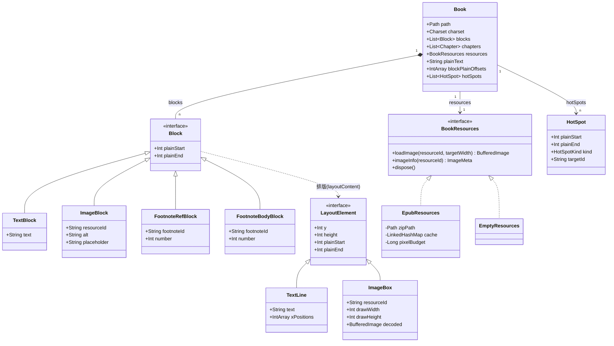
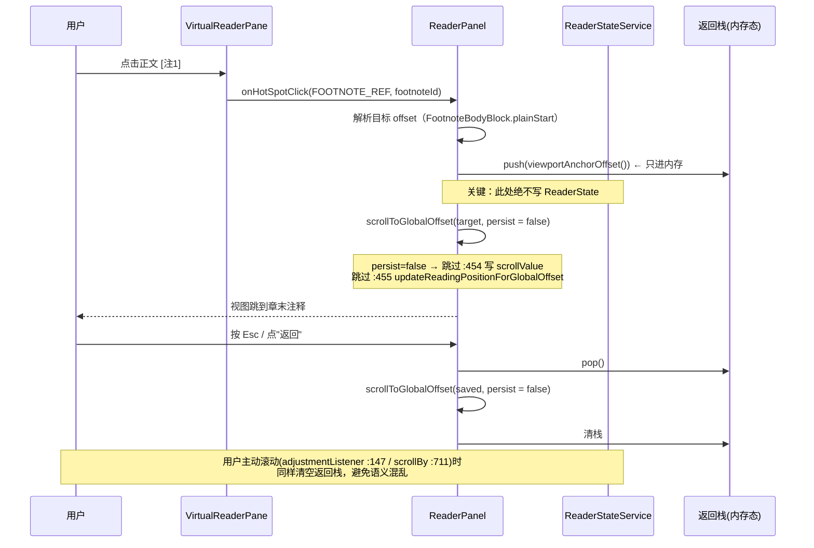
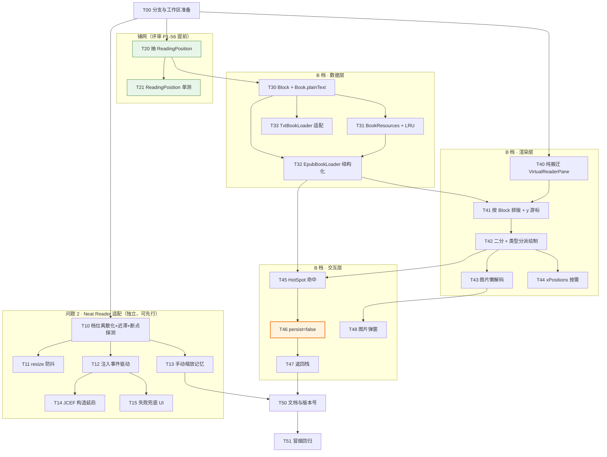

# 增量设计：EPUB 图片与注解跳转 + Neat Reader 网页适配

- 设计人：高见远（架构师）
- 日期：2026-09-19
- 阶段：**方案设计（只读）**。本文不修改任何生产代码、不建分支、不 commit
- 基线版本：v0.4.6（`build.gradle.kts:8`），HEAD = `5fb0304`，分支 `codex/dictionary-lookup`
- 前置阅读：`docs/architecture-review.md`（下文简称「评审」）
- 关联需求原文：
  > 1、epub 无法加载图片，注解无法跳转。2、neat-Reader 网页适配。先分析修改方案吧。如果要修改代码，新建一个分支处理。

---

## 0. 结论速览

| 问题 | 一句话根因 | 推荐方案 | 预估工作量 |
|---|---|---|---|
| EPUB 图片 | 图片在 `EpubBookLoader` 阶段就被降级成 `[图片：alt]` 文本（`EpubBookLoader.kt:283–286`），二进制数据从未从 zip 里读出；且 `VirtualReaderPane` 的排版建立在**等高文本行**假设上（5 处硬编码），图片无法进入排版流 | **B 档**：`Book.content` 升级为 `blocks: List<Block>`，**同时保留等价 `plainText`**，正文内嵌限宽图片 + 可点击注解跳转 | 5–8 天（含前置重构约 11.5 天） |
| 注解跳转 | 脚注在 `:254–273` 被替换成纯文本 `[注N]`，`EpubFootnote.id`（`:395–399`）生成后即丢弃，正文与章末注释之间**没有机器可读关联** | 复用现有 `offsetAtPoint` 命中测试 + `HotSpot` 表；跳转**显式不写持久化状态**（`persist=false`）以规避评审 H3 | 含在 B 档 |
| Neat Reader 适配 | 0.4.4 的失败本质是**插件缩放状态与站点响应式状态耦合在同一个变量（页面宽度）上**，形成反馈环；当前 96% 上限是"拍脑袋钉死"，未真正计算 effective CSS 宽度，且 resize 无防抖（`:136–140`） | **N1 档位离散化+迟滞 / N2 resize 防抖 / N3 注入改事件驱动 / N4 手动缩放记忆** | 1.5–2.5 天 |

**最重要的架构判断**：EPUB 图文混排**不必然**导致评审 P1 抽出的 `ReadingPosition` 返工——前提是采用本文的「`blocks` + 等价 `plainText`」混合模型，让 `ReadingPosition` 的签名保持 `(content: String, offset: Int)` 不变。详见 §4.1。

---

## 1. 问题 1：EPUB 图片与注解跳转

### 1.1 现状机理（逐条证据）

#### 1.1.1 图片：从 zip 到屏幕的整条链路是断的

| 环节 | 证据 | 现状 |
|---|---|---|
| 资源收集 | `EpubBookLoader.kt:105–119` `readManifest` + `:134–141` `isReadableDocument` | manifest **只保留** `application/xhtml+xml` / `text/html` / `*.xhtml|html|htm`，**图片条目被直接过滤掉**，从未进入任何数据结构 |
| 正文转换 | `EpubBookLoader.kt:283–286` | `imageRegex` 命中后替换为 `"\n[图片]\n"` 或 `"\n[图片：$alt]\n"` —— **图片退化成一行占位文本** |
| 数据模型 | `model/Book.kt:6–11` `Book(content: String, ...)` | 纯字符流，**没有任何位置能承载二进制资源** |
| 渲染 | `ReaderPanel.kt:1229–1242` `paintComponent` | 只画文本（`drawWeightedText`），无图片分支 |
| 资源取数 | — | 项目**不存在**任何 `ImageIO` / `BufferedImage` 的读取代码（全项目仅 `ReaderPanel.kt:16, :1475–1478` 用 `BufferedImage` 造隐藏光标） |

即：**EPUB 里的 `` 从头到尾就没被当资源看待过**。

#### 1.1.2 为什么这不是"加个功能"：`VirtualReaderPane` 的等高假设

`VirtualReaderPane`（`ReaderPanel.kt:1124–1445`）整条排版/绘制/命中链路建立在"**所有行等高**"的假设上。经逐行核对，该假设硬编码在 **5 处**：

| # | 位置 | 代码 | 假设 |
|---|---|---|---|
| 1 | `:1300` | `val y = contentInsets.top + result.size * lineHeight` | 行 y 坐标 = 行序号 × 行高 |
| 2 | `:1402–1407` | `lineIndexForY(y) = ((y - contentInsets.top) / lineHeight).coerceIn(...)` | y → 行序号是 **O(1) 除法** |
| 3 | `:1248–1252` | `getPreferredSize() = Dimension(w, top + bottom + lineCount * lineHeight)` | 总高 = 行数 × 行高 |
| 4 | `:1256–1258` | `getScrollableUnitIncrement() = lineHeight` | 单位滚动 = 行高 |
| 5 | `:1231–1232` + `:1388` | `lineIndexForY(clipTop - lineHeight)` / `g.fillRect(x, line.y, width, lineHeight)` | 可见区裁剪与选区绘制都用行高做矩形高度 |

配套地，还有 3 个依赖"字符偏移"的机制：

- `offsetAtPoint:1392–1400` —— 先 `lineIndexForY` 再 `line.offsetForX`
- `selectedText:1201–1211` —— `content.substring(from, to)`
- 位置恢复三件套 —— `saveReadingAnchor:506–517` / `restoreOffset:519–538` / `findAnchorNear:540–550` / `anchorTextAt:552–556`

**图片是块级、高度不定的元素**，会同时打破上述 5 处等高假设。所以"支持图片"的最小代价就是**把这 5 处从"除法"改成"累积 y + 二分查找"**——这也是 B 档工作量的主体。

#### 1.1.3 注解：正文与章末注释之间没有机器可读关联

| 环节 | 证据 | 现状 |
|---|---|---|
| 脚注收集 | `:232–245` `collectFootnotes` → `EpubFootnote(id, number, text)`（`:395–399`） | 收集到了 `id`，但 `EpubFootnote` 是 **private data class**（`:395`），**没有进入 `Book`**，生成完即丢弃 |
| 引用替换 | `:254–273` `replaceFootnoteLinks` | `<a href="#fn1">` → `"$label[注N]"`，**纯文本** |
| 注释汇总 | `:216–221` | 章末追加 `"【注释】\n[注1] xxx"`，同样是纯文本 |
| 交互 | `ReaderPanel.kt:209–243` `createSelectionPopupMenu` | 右键菜单只有「本地词典查找 / 汉典查词 / 百度搜索 / 复制」，**没有任何注解相关入口** |
| 命中能力 | `ReaderPanel.kt:1392–1400` `offsetAtPoint` | **已有**：`point → (lineIndex, offset)` 的坐标命中测试，可直接复用 |

好消息是：**命中测试能力是现成的**（`:1392`），注解跳转不需要从零造坐标系。

### 1.2 方案档位对比

| 维度 | **A 档 · 最小改动** | **B 档 · 中等（推荐）** | **C 档 · 完整** |
|---|---|---|---|
| 图片呈现 | 不进正文；点占位文本 → **弹窗/侧边预览** | **正文内嵌限宽图片** | 图文混排 + 灯箱缩放 + SVG 支持 |
| 注解交互 | 点 `[注N]` → **弹窗显示注释**（不跳转） | 点 `[注N]` → **跳转到章末注释 + 按键返回** | 任意 `<a href="#id">` 双向跳转 + 完整跳转栈 |
| `Book.content` | **不改**（旁路 `images` / `hotSpots` 表） | **改**为 `blocks`，但**保留等价 `plainText`** | 同 B，且需额外锚点图 |
| `VirtualReaderPane` 改动量 | ~30 行（只加热区命中） | **~180 行**（5 处等高假设 → 累积 y + 二分） | ~300 行 + 交互栈 |
| 位置恢复 / 选区 / 查词 | **零影响** | **零影响**（靠 `plainText` 保持 offset 语义） | 需重新定义"位置"语义 |
| 新增内存 | LRU ≤ 32 MB | `plainText` +6 MB，LRU ≤ 64 MB（**可被 S12 抵消**） | 更大 |
| 预估工作量 | **1–2 天**（含前置重构约 4.5 天） | **5–8 天**（含前置重构约 11.5 天） | 12–18 天 |
| 对 H1（God Object） | 略微加剧 | **缓解**（强制把排版引擎抽成独立文件 T40） | 缓解但风险高 |
| 对 H2（EDT 阻塞） | 中立 | **加剧**（图片解码/缩放必须严格后台化） | 显著加剧 |
| 对 H3（位置模型） | 中立 | **中立偏缓解**（跳转显式 `persist=false`，强制厘清写入路径） | **加剧**（跳转栈与恢复机制语义冲突） |
| 对 H4（内存） | 略微加剧 | 加剧，但可通过 S12 抵消至接近零 | 显著加剧 |
| 适用场景 | 偶尔看图，不愿承担工期 | 图文混排是刚需（图文书、技术书、插画本） | 漫画类 EPUB / 追求完整阅读体验 |

**推荐 B 档**，理由：
- A 档在图多的书里体验仍然很差（"只能弹窗看"约等于没解决用户诉求）；
- C 档的「任意锚点双向跳转 + 跳转栈」对小说阅读场景性价比低，且会显著加剧 H3（评审里返工最多的那块）；
- B 档是唯一既能真正解决问题、又能把风险控制在"可测、可回滚"范围的档位；
- B 档强制做的 `VirtualReaderPane` 抽文件（T40）正好顺带完成了评审 P0-S3。

### 1.3 B 档详细设计

#### 1.3.1 数据模型：为什么是「`blocks` + 等价 `plainText`」而不是彻底废除 String

这是本设计**最关键的一个决策**。

彻底改成"块坐标 `(blockIndex, charInBlock)`"意味着 `saveReadingAnchor` / `restoreOffset` / `findAnchorNear` / `anchorTextAt` 全部重写——**正好踩中 team-lead 担心的「刚抽出 `ReadingPosition` 又要改一遍」**。

采用「`blocks` + 等价 `plainText`」后：

- `ReadingPosition` 的签名保持 `(content: String, offset: Int)` → **评审 P1-S6 抽出来的纯函数一行不用改**
- 持久化字段 `globalOffset / anchorText / progressInChapterPermille`（`ReaderStateService.kt:34–36`）**语义不变** → **老版本存档仍可恢复**（向后兼容），评审 L1 指出的 `scrollValue` 遗留问题也可以借此一并清理
- `selectedText()`（`:1210`）仍是 `substring` → 右键查词链路（`:209–243`, `:734–788`）**零改动**
- `chapterIndexForOffset`（`:558–560`）**零改动**
- 新增的只是"offset ↔ block"的映射查询

**代价**：`plainText` 与 `blocks` 中的文本并存，多占约 1 份文本内存（300 万字 ≈ 6 MB UTF-16）。这个代价可接受，且可由 T44（`xPositions` 按需计算）抵消。



**类型定义**（新增 `src/main/kotlin/com/chen/reader/model/Block.kt`）：

```kotlin
package com.chen.reader.model

/** 内容块。plainStart/plainEnd 是该块在 Book.plainText 中的字符区间（左闭右开）。 */
sealed interface Block {
    val plainStart: Int
    val plainEnd: Int
}

/** 纯文本块。text == plainText.substring(plainStart, plainEnd) */
data class TextBlock(
    override val plainStart: Int,
    override val plainEnd: Int,
    val text: String,
) : Block

/** 图片块。占位文本仍在 plainText 中占据区间，保证纯文本降级与锚点匹配可用。 */
data class ImageBlock(
    override val plainStart: Int,
    override val plainEnd: Int,
    val resourceId: String,
    val alt: String,
    val placeholder: String,      // 形如 "[图片：封面]"
) : Block

/** 正文中的脚注引用标记，形如 "[注1]"，可点击。 */
data class FootnoteRefBlock(
    override val plainStart: Int,
    override val plainEnd: Int,
    val footnoteId: String,
    val number: Int,
) : Block

/** 章末注释条目，脚注引用的跳转目标。 */
data class FootnoteBodyBlock(
    override val plainStart: Int,
    override val plainEnd: Int,
    val footnoteId: String,
    val number: Int,
) : Block
```

**`Book` 的演进**（改 `model/Book.kt`）：

```kotlin
data class Book(
    val path: Path,
    val charset: Charset,
    val blocks: List<Block>,
    val chapters: List<Chapter>,
    val resources: BookResources,
) {
    /** 等价纯文本视图：位置恢复 / 选区 / 查词 / 进度全部复用它 */
    val plainText: String by lazy { buildPlainText(blocks) }

    /** block[i] 在 plainText 中的起始偏移，用于 offset ↔ block 二分互转 */
    val blockPlainOffsets: IntArray by lazy { buildOffsets(blocks) }

    /** 过渡别名：让现有 10 处 content 调用点零改动编译（见 §4.2） */
    val content: String get() = plainText
}
```

**资源取数接口**（新增 `book/BookResources.kt`）——**关键：`Book` 绝不持有 `BufferedImage`**：

```kotlin
interface BookResources : Disposable {
    /** 按目标宽度解码并缩放；会在后台线程调用，需线程安全 */
    fun loadImage(resourceId: String, targetWidth: Int): BufferedImage?
    /** 只探测宽高与 MIME，不解码 —— 用于先画占位框 */
    fun imageInfo(resourceId: String): ImageMeta?
}

data class ImageMeta(val width: Int, val height: Int, val mime: String, val byteSize: Long)

/** EPUB 实现：按需开 ZipFile → readBytes → ImageIO.read → 缩放 → 入 LRU */
class EpubResources(private val zipPath: Path) : BookResources { ... }

/** TXT 实现：空实现 */
object EmptyResources : BookResources { ... }
```

**热区**（新增 `model/HotSpot.kt`）：

```kotlin
enum class HotSpotKind { FOOTNOTE_REF, FOOTNOTE_BACK, IMAGE }

data class HotSpot(
    val plainStart: Int,
    val plainEnd: Int,
    val kind: HotSpotKind,
    val targetId: String,     // footnoteId 或 resourceId
)
```

#### 1.3.2 排版引擎改造（B 档核心工作量）

`VirtualReaderPane` 的 5 处等高假设改造对照表：

| # | 位置 | 现状 | 改为 |
|---|---|---|---|
| 1 | `:1300` | `y = top + result.size * lineHeight` | **游标累加**：`cursorY`；文本行 `cursorY += lineHeight`，图片块 `cursorY += drawHeight + JBUI.scale(IMAGE_GAP)` |
| 2 | `:1402–1407` `lineIndexForY` | `((y - top) / lineHeight)` | 对 `elements` 的 `y` 做**二分查找**（项目内已有先例：`lineForOffset:1413` 用 `binarySearch`） |
| 3 | `:1248–1252` `getPreferredSize` | `lineCount * lineHeight` | 用排版时累积出的 `totalHeight` |
| 4 | `:1256–1258` `getScrollableUnitIncrement` | `lineHeight` | **保持不变**（图片不改变"单位滚动 = 一行"的语义，代价最小） |
| 5 | `:1231–1232` + `:1388` | 按 index 画文本 / `fillRect(..., lineHeight)` | 二分定位首末可见 element，**按类型分派**；`paintSelection` 只对 `TextLine` 生效 |
| 6 | `:1392–1400` `offsetAtPoint` | `lines[lineIndexForY(y)].offsetForX(x)` | 二分定位 element：`TextLine` → 原逻辑；`ImageBox` → 返回 `plainStart`（供热区判定） |
| 7 | `:1201–1211` `selectedText` | `content.substring(from, to)` | **保持不变**（`plainText` 语义一致） |

新增 `ui/virtual/LayoutElement.kt`：

```kotlin
sealed interface LayoutElement {
    val y: Int
    val height: Int
    val plainStart: Int
    val plainEnd: Int
}

/** 字段与现有 VirtualLine(ReaderPanel.kt:1447–1452) 完全一致 —— 这是重命名，不是重写 */
data class TextLine(
    override val y: Int,
    override val height: Int,
    override val plainStart: Int,
    override val plainEnd: Int,
    val text: String,
    val xPositions: IntArray,
) : LayoutElement

data class ImageBox(
    override val y: Int,
    override val height: Int,
    override val plainStart: Int,
    override val plainEnd: Int,
    val resourceId: String,
    val drawWidth: Int,
    val drawHeight: Int,
    @Volatile var decoded: BufferedImage? = null,   // null = 未解码，先画占位框
) : LayoutElement
```

#### 1.3.3 图片解码与内存策略（直接回应评审 H4）

```mermaid
sequenceDiagram
    participant EDT as EDT
    participant VRP as VirtualReaderPane
    participant RES as EpubResources
    participant BG as Task.Backgroundable
    participant LRU as 像素预算 LRU

    EDT->>VRP: paintComponent(clip)
    VRP->>VRP: 二分定位可见 elements
    loop 每个可见 ImageBox
        alt decoded 已就绪
            VRP->>VRP: g.drawImage(decoded, ...)
        else decoded == null
            VRP->>VRP: 画灰色占位框（用 ImageMeta 原始宽高算比例，不解码）
            VRP->>BG: 提交解码请求(resourceId, drawWidth)
        end
    end
    BG->>RES: loadImage(resourceId, drawWidth)
    RES->>RES: ZipFile 打开 → readBytes → ImageIO.read
    RES->>RES: 缩放到 drawWidth（只保留缩放后小图）
    RES->>LRU: put(resourceId, scaled)，超预算则淘汰最久未用
    RES-->>BG: BufferedImage
    BG->>EDT: invokeLater { box.decoded = img; repaint() }
    EDT->>VRP: paintComponent → 这次画真图
```

四条硬性策略：

1. **解码即缩放，只保留小图**。`ImageIO.read` 得到原图后**立刻**按 `drawWidth` 缩放，只保留缩放后的 `BufferedImage`（内存 = w×h×4）。这是关键一步：一本含 200 张 1200×1600 图的 EPUB，原图全解码 ≈ **1.5 GB**；缩到 600 宽后 ≈ 380 MB（仍需 LRU 兜底）。
2. **LRU 按像素预算、不按张数**。`LinkedHashMap(resourceId, BufferedImage)` + `accessOrder=true`，总像素预算建议 **64 MB**（约占 IDE 默认 2–4 GB 堆的 2–3%）；超预算淘汰最久未用。
3. **懒解码，可见区驱动**。只有 `paintComponent` 判定为可见的 `ImageBox` 才触发解码；解码在 `Task.Backgroundable` 里做，**绝不在 EDT**。
4. **ZipFile 句柄不常开**。`EpubResources` 在 `Book` 生命周期内可持有一个 `ZipFile`，但必须在 `Disposable.dispose()` 里关闭（挂到 `ReaderPanel` 或 Project 的 Disposable 树上）。

**SVG 的处理**：`ImageIO` 默认不支持 SVG。B 档建议**显式跳过**，遇到 `.svg` 仍降级为占位文本并在设置里给一行说明。引入 Batik 之类解析器会显著增加包体积（与评审 M2 冲突），放到 C 档再评估。

**对 H4 的量化影响**：
- 现状：300 万字排版 ≈ 15–25 MB（`xPositions` 的 `IntArray` 主导）
- B 档新增：`plainText` +6 MB、LRU ≤ 64 MB
- **抵消项**：T44 把 `xPositions` 改为按需计算（评审 P2-S12 提前执行），可砍掉 15–25 MB 中的绝大部分 → **净增内存接近 LRU 预算本身，且预算可调**

#### 1.3.4 注解跳转设计（直接回应评审 H3）

**锚点表达**：**复用 `plainText` 偏移，不引入新坐标系**。
- `FootnoteRefBlock.plainStart` = 正文中 `[注N]` 的偏移
- `FootnoteBodyBlock.plainStart` = 章末 `[注N] xxx` 条目的偏移
- 两者通过 `footnoteId` 关联（把 `:395–399` 里现在被丢弃的 `EpubFootnote.id` 保留下来）
- `Book.hotSpots` 由 `blocks` 派生

**点击命中判定**：复用现成的 `offsetAtPoint`（`:1392`）：

```
hotSpotAt(point): HotSpot? =
    offsetAtPoint(point) → 在 hotSpots 里二分查 offset 落在哪个 [plainStart, plainEnd)
```

`mousePressed`（`:1336–1344`）改为：**先**判热区，命中则**不进入拖选**（`selectionStart/End` 不赋值），直接回调 `onHotSpotClick`；未命中才走原有拖选逻辑。鼠标悬停热区时改手型光标——**注意与隐藏光标模式冲突**：`updateCursorMode`（`:659–661`）会把光标设为 `hiddenCursor`，需约定「热区优先级高于隐藏光标」。

**跳转与回跳**（这是最容易踩 H3 坑的地方）：



**`scrollToGlobalOffset` 的改造**（`ReaderPanel.kt:421–458`）：

```kotlin
private fun scrollToGlobalOffset(
    targetOffset: Int,
    alignEnd: Boolean = false,
    preserveAnchor: Boolean = false,
    allowDeferredRestore: Boolean = false,
    persist: Boolean = true,          // ← 新增
) {
    ...
    scrollPane.viewport.viewPosition = Point(0, scrollValue)
    scrollBar.value = scrollValue
    if (persist) {                    // ← 原 :453–454 两行移入
        stateService.state.scrollValue = scrollValue
    }
    if (persist) {                    // ← 原 :455 移入
        updateReadingPositionForGlobalOffset(viewportAnchorOffset())
    }
    focusReader()
    updateStatus()
}
```

为什么这样能避开 H3：评审 H3 指出的核心问题是「**恢复回路自己会写回持久化状态**」（`:455` 无条件写 vs `:147–157` 有 `layoutRestoring` 守卫，两条写入路径守卫不一致）。跳转是**纯粹的视图操作**，把它显式标记为 `persist=false`，就等于在代码层面声明「**阅读位置永远只由真实阅读行为更新**」，从结构上杜绝了跳转污染存档。

**为什么不给 `ReaderState` 加字段记住跳转位置**：持久化跳转位置没有语义（重启 IDE 后回到"跳转前"还是"跳转后"都不对），且 `ReaderState` 已有 **16 个可变 public 字段**（`ReaderStateService.kt:29–47`），评审 L1/M5 已指出其中 3 个是冗余的，不应继续膨胀。返回栈用内存态 `ArrayDeque<Int>` 即可。

### 1.4 涉及文件清单（B 档）

| 相对路径 | 动作 | 说明 |
|---|---|---|
| `src/main/kotlin/com/chen/reader/model/Block.kt` | **新增** | `Block` 密封类型 + `TextBlock/ImageBlock/FootnoteRefBlock/FootnoteBodyBlock` |
| `src/main/kotlin/com/chen/reader/model/Book.kt` | 改 | `content: String` → `blocks` + `plainText` + 过渡别名 `content` |
| `src/main/kotlin/com/chen/reader/model/HotSpot.kt` | **新增** | `HotSpot` / `HotSpotKind` |
| `src/main/kotlin/com/chen/reader/book/BookResources.kt` | **新增** | `BookResources` 接口 + `ImageMeta` + `EpubResources` + `EmptyResources` + LRU |
| `src/main/kotlin/com/chen/reader/EpubBookLoader.kt` | 改 | `:105–119` manifest 收集图片；`:134–141` 过滤逻辑；`:283–286` → `ImageBlock`；`:216–221` → `FootnoteBodyBlock`；`:254–273` → `FootnoteRefBlock`；`:232–245` 保留 `id` |
| `src/main/kotlin/com/chen/reader/TxtBookLoader.kt` | 改 | 产出单 `TextBlock` + `EmptyResources` |
| `src/main/kotlin/com/chen/reader/BookLoader.kt` | 改 | 签名基本不变，透传 `resources` |
| `src/main/kotlin/com/chen/reader/ui/virtual/VirtualReaderPane.kt` | **新增（从 `ReaderPanel.kt` 搬出）** | 原 `:1124–1445` |
| `src/main/kotlin/com/chen/reader/ui/virtual/LayoutElement.kt` | **新增** | `LayoutElement` / `TextLine` / `ImageBox`（替代原 `VirtualLine` `:1447–1473`） |
| `src/main/kotlin/com/chen/reader/ReaderPanel.kt` | 改 | 删 `:1124–1478`；`:1336` 鼠标按下加热区判定；`:421` 加 `persist`；新增返回栈与 `Esc` 绑定 |
| `src/main/resources/META-INF/plugin.xml` | 可能改 | 若新增设置项或菜单入口 |
| `README.md` / `docs/requirements-and-design.md` | 改 | 功能清单 + 开发日志 + 版本号 |

---

## 2. 问题 2：Neat Reader 网页适配

### 2.1 现状机理（逐条证据）

| 现象 | 证据 | 机理 |
|---|---|---|
| 拖窗期间高频 native 调用 | `:136–140` `jcefBrowser.component.addComponentListener { componentResized → applyAutoZoom() }`；`:175–179` `applyZoom → browser?.zoomLevel = zoomLevel` | 每个 resize 事件同步设置 JCEF zoom（native 调用），**无防抖**（评审 M3 已标） |
| 缩放档位几乎无差别 | `:220–224` `DEFAULT=-0.2 / MIN=-2.0 / MAX=1.0 / STEP=0.4 / BASE=1.2`；`:166–171` 四档 `-0.8/-0.6/-0.4/-0.2` | 由 `zoomPercent = 1.2^z × 100`（`:209–211`）换算：四档实际是 **86% / 89% / 92% / 96%**，相邻档只差 **3 个百分点**，用户几乎感知不到，却各触发一次 native 调用 |
| 断点硬切换 | `:166–171` `width <= 560 → -0.8; <= 720 → -0.6; <= 900 → -0.4; else → -0.2` | 单一阈值，无迟滞 → 窗口在临界附近每 1px 变化都可能换档 |
| 脚本注入时机无保障 | `:141` 构造时注入一次；`:126` `onLoadEnd` 注入一次；`:152` `loadInEmbeddedBrowser` 注入一次；全部包在 `SwingUtilities.invokeLater`（`:182`） | 构造时页面尚未加载 → 这次注定白费；`:203` `cefBrowser.url ?: NEAT_READER_WEB_APP_URL` 说明 url 可能为 `about:blank` → 脚本可能打到空白文档上。幂等靠 `window.__novelReaderSingleWindowPatched`（`:186`），但**幂等标志打在错误的文档上时不会生效** → 表现为"偶尔仍弹出空白窗口" |
| 手动/自动语义混乱 | `:78` `:86` `manualZoom = true`（永久）；`:81–84` 只有"自适应"按钮能复位；`:161` `if (manualZoom \|\| browser == null) return` | 用户手动缩放后拖窗不再响应，且**状态不持久化**，重启即忘 |
| ETB 构造 JCEF | `:34–43`（`createToolWindowContent` 在 EDT 执行，`NovelReaderToolWindowFactory.kt:15`） | 打开工具窗口时 EDT 上同时发生：JCEF 构造 + `restoreLastBook()` 加载整本书 + 全书排版（评审 H2） |

### 2.2 0.4.4 页面级适配为什么失败

从残留脚本（`:181–207`）与开发日志（`docs/requirements-and-design.md:239`）可知，0.4.4 的做法是**注入 viewport / 横向溢出控制 / 宽度测量脚本，直接改页面 DOM 与 CSS**。

**失败机理（反馈环）**：

```
插件注入脚本改变页面视口/容器宽度
        ↓
Neat Reader 页面 JS 读到被改过的宽度 → 触发自身响应式断点
        ↓
站点切换到「宽屏版式」（双列 / 窄正文 + 侧边栏）→ 正文变窄列
        ↓
版式变化又改变了页面实际布局宽度
        ↓
插件的测量脚本再测、再改 → 抖动
```

**根本原因**：**插件的缩放状态与站点的响应式状态耦合在同一个变量（页面宽度）上**——两个状态机抢同一个状态。这与阅读器自身 0.2.6–0.2.8「滚轮事件、滚动条回写、窗口切换互相抢状态」（`docs/requirements-and-design.md:226–228`）是**同一类架构问题**。

**重做时如何避开**：
1. **绝不再改页面视口宽度或注入影响布局的 CSS**。只允许改不影响布局的属性（如 `overflow-x` 兜底），或干脆完全不改 DOM。
2. 缩放只能走 **JCEF 浏览器级 `zoomLevel`**（它改变渲染缩放比，不改 DOM）。
3. 但要清醒认识到：**浏览器级缩放仍会改变站点看到的 CSS 视口宽度**——`cssWidth = actualWidth / zoomFactor`。所以 zoom-out（zoomFactor < 1）会让站点以为窗口**更宽**。**这才是 0.4.6 那个 96% 上限的真正张力所在**（见 §2.3）。
4. 因此正确做法不是"钉死一个数"，而是把「避开站点断点」变成**显式可计算的约束**：离散档位 + 迟滞，且每个档位都保证 `cssWidth` 落在同一断点区间内。

### 2.3 当前 96% 上限方案的残余问题

`DEFAULT_ZOOM_LEVEL = -0.2`（`:220`）→ `1.2^-0.2 ≈ 0.964` → 显示"缩放 96%"（`:178`, `:209–211`）。

推断的残余症状：

| # | 症状 | 推断依据 |
|---|---|---|
| 1 | **调了没反应** | 四档实际是 86/89/92/96%，相邻只差 3 个百分点，肉眼几乎不可辨 |
| 2 | **临界抖动** | 560/720/900 三处单一阈值无迟滞（`:166–171`），且每次换档都是 native 调用（`:177`） |
| 3 | **96% 上限与"避开断点"目标方向相反（需实测确认）** | zoomFactor < 1 时，站点看到的 CSS 视口 = `W / zoomFactor` **大于** W。96% 对应 `cssWidth ≈ 1.036W`。也就是说"把渲染缩小"反而让站点以为窗口**更宽**了。若站点宽屏断点是 900 CSS px，则面板宽度 ≥ 869 px 时就会跨过——而 0.4.6 之前的 100% 对应阈值是 900 px。**从代码无法确知站点真实断点，这一点必须真机测量**（见 §2.4-N1 的探测步骤） |
| 4 | **手动后永久失去自动** | `manualZoom`（`:78` `:86`）只能靠"自适应"按钮复位，且不持久化 |
| 5 | **偶发空白弹窗** | 注入时机与页面加载无同步（`:141` `:152` `:182`），幂等标志可能落在错误文档上 |

> 注：第 3 条是对 0.4.6 设计的**质疑而非定论**。0.4.6 的日志（`docs/requirements-and-design.md:241`）说 96% 是为了"避免触发宽屏版式"，但按 CEF 缩放语义推算，它的效果是让 effective CSS 宽度变大。**这说明该参数的真实作用机理连作者本人也可能没完全摸清**——恰恰印证了评审 M6「零日志、零可观测性」的危害。N1 的探测步骤就是为了解决这个不确定性。

### 2.4 改进方案（推荐，全部在 `NeatReaderPanel.kt` 内）

#### N1 · 缩放档位离散化 + 迟滞（核心）

不再"窗口宽度 → zoomLevel"直接映射，改为**先算 effective CSS 宽度，再选档位，并加迟滞带**：

```kotlin
private data class ZoomTier(val minCssWidth: Int, val zoomLevel: Double)

// 目标：让站点看到的 CSS 宽度落在同一断点区间内，避免跨断点换版式
private val zoomTiers = listOf(
    ZoomTier(minCssWidth = 0,    zoomLevel = -1.2),   // ~80%
    ZoomTier(minCssWidth = 480,  zoomLevel = -0.8),   // ~86%
    ZoomTier(minCssWidth = 720,  zoomLevel = -0.4),   // ~93%
    ZoomTier(minCssWidth = 1024, zoomLevel = -0.2),   // ~96%（上限保留）
)

private const val HYSTERESIS_CSS_PX = 40   // 迟滞带半宽
```

选择逻辑：

```
cssWidth(tier) = viewportWidth / zoomFactor(tier.zoomLevel)
选满足 cssWidth >= minCssWidth 的最低档
换档条件（迟滞）：当前档的 cssWidth 落到 [min - H, min + H] 之外时才换
```

效果：临界附近不再每像素抖动；档位间距从 3 个百分点拉开到 6–7 个百分点，"调了有反应"。

**探测步骤（必须先做）**：由于站点断点未知，第一步应加一个临时诊断——用 `runJavaScript` 读取 `window.innerWidth`、`document.documentElement.clientWidth` 与关键容器宽度，在几个面板宽度下打印（配合评审 S5 引入的 `Logger`），**测出真实断点后再定档位表**。预留 1–2 轮调参。

#### N2 · resize 防抖

```kotlin
private val resizeDebounceTimer = Timer(RESIZE_DEBOUNCE_MS, ...)  // javax.swing.Timer, 150ms
// componentResized(:136) → resizeDebounceTimer.restart()   ← 不再直接 applyAutoZoom
// 定时器触发 → 真正 applyAutoZoom()
```

拖窗期间只更新内边距、不动 zoom（与阅读器 `updateReaderInsets(rebuildLayout=false)` 的做法一致，`ReaderPanel.kt:611–621`），松手后才设置 `zoomLevel`。

#### N3 · 脚本注入改为事件驱动

- **删除** `:141` 构造时的那次注入（此时页面未加载，注定白费）
- **`onLoadEnd`（`:122–132`）作为唯一注入点**，保留 `frame.isMain` 判断（`:123`），并额外记录"已注入成功的 URL"，URL 变化才重新注入
- 注入前确认 `cefBrowser.url` 不是 `about:blank`，避免 `:203` 那种 fallback 打到空白页
- 增加**轻量校验 + 重试上限**：注入后用一次 `runJavaScript("!!window.__novelReaderSingleWindowPatched")` 探针确认；未生效最多重试 2 次

#### N4 · 手动缩放记忆 + 锁定（建议做，成本低）

- `ReaderState`（`ReaderStateService.kt:29–47`）新增 `neatReaderZoomLevel: Double?` 与 `neatReaderZoomLocked: Boolean`
- 手动缩放后**记住档位**（重启恢复）；"自适应"按钮改名为"跟随窗口"，语义更清楚
- 锁定时 `applyAutoZoom` 直接 return（等价于现有 `manualZoom`，但**可持久化、可从菜单解锁**）
- 工具栏 `zoomLabel`（`:178`）增补"已锁定"状态提示

#### N5 · JCEF 构造延后（顺带缓解评审 H2）

`NeatReaderPanel` 构造时**不创建** `JBCefBrowser`，先放一个占位 `JBLabel`；在 `addNotify()` 或 Tab 首次被选中时再创建。收益：打开工具窗口时不再让 EDT 同时承担「JCEF 初始化 + 加载整本书 + 全书排版」三件事（评审 H2）。

#### N6 · 失败兜底

`JBCefApp.isSupported()` 为 false 时（`:44–49`）当前只有一行静态文字。建议补上「重试」+「外部打开」两个按钮。

**问题 2 工作量**：N1–N4 约 1–2 天（含 1–2 轮断点调参）；N5 约 0.5 天；N6 约 0.2 天。合计 **1.5–2.5 天**。

> **0.4.7 实现说明（对上面 N1 档位表的偏离）**
>
> 用户已拍板 **Q4 = 保"不错版"**。结合 §2.3 第 3 条：`cssWidth = W / zoomFactor`，
> `zoomFactor < 1`（缩小渲染）会让站点以为窗口**更宽**，与"避开宽屏断点"的目标方向相反，
> 所以上表按 `minCssWidth` 一路缩小渲染的取法不再适用。
>
> 0.4.7 改为两段式约束：**`cssWidth` 必须落在 `[TARGET_CSS_WIDTH_MIN, TARGET_CSS_WIDTH_MAX] = [600, 1024]` 内**
> ——窗口比下界窄才缩小渲染（补足站点 CSS 像素），比上界宽则**放大**渲染（把 CSS 像素压回上界内）。
> 档位粒度与迟滞沿用本文参数：`ZOOM_LEVEL_STEP = 0.4`（约 7.6%，肉眼可辨）、`HYSTERESIS_CSS_PX = 40`，
> 只是判据落在 cssWidth 轴上而非窗口宽度轴上。
>
> 五个常量集中在 `NeatReaderPanel.kt` 的 `companion object` 里，属于纯参数：
> 按 `README.md`「Neat Reader 缩放调参」一节的日志步骤真机实测后回填数值即可，**不需要改任何逻辑**。

---

## 3. 涉及文件清单（问题 2）

| 相对路径 | 动作 | 说明 |
|---|---|---|
| `src/main/kotlin/com/chen/reader/NeatReaderPanel.kt` | 改 | N1–N4、N6 的主体；`:34–43` 构造延后（N5） |
| `src/main/kotlin/com/chen/reader/ReaderStateService.kt` | 改 | 新增 `neatReaderZoomLevel` / `neatReaderZoomLocked` |
| `src/main/kotlin/com/chen/reader/NovelReaderToolWindowFactory.kt` | 可能改 | 若 N5 需要显式"Tab 选中时初始化"钩子 |
| `README.md` / `docs/requirements-and-design.md` | 改 | 功能描述 + 开发日志 + 版本号 `0.4.7` |

---

## 4. 与上一份评审的交互

### 4.1 关键结论：B 档**不会**导致 `ReadingPosition` 返工

team-lead 特别问到这一点。答案是：**按本文的模型设计就不会**。

理由链条：

1. 评审 P1-S6 抽出的 `ReadingPosition` 接口是**纯函数**形式的 `snapshot(content: String, offset: Int)` / `resolve(content: String, chapters, saved)`。
2. B 档虽然把 `Book.content: String` 改成了 `Book.blocks: List<Block>`，但**同时保留了等价的 `Book.plainText: String`**，并提供过渡别名 `val content: String get() = plainText`（`model/Book.kt`）。
3. 于是 `ReadingPosition` 拿到的仍然是**同一个语义的纯文本 + 同一个语义的字符偏移**，**接口零改动、单测零改动**。

因此两者可以**任意顺序**执行，也可以**并行**，都不会产生返工。

不过我仍**建议先做 T20/T21（抽 `ReadingPosition` + 补单测）再做 B 档**，理由不是"避免返工"，而是：
- B 档会动 `model/Book.kt`、`EpubBookLoader.kt`、`VirtualReaderPane` 三处，是本项目迄今风险最高的一次改动；
- 评审 M1 指出当前**零测试**，在这种无保护状态下做大改动风险很高；
- 先把 `ReadingPosition` 抽出来并补上表驱动单测（覆盖：锚点命中/漂移/失效回落 permille/offset 越界/章节增删），等于**先给最脆弱的那块铺一张网**，再动结构。

### 4.2 对评审四大高风险的影响

| 风险 | 影响 | 说明与控制措施 |
|---|---|---|
| **H1 · God Object** | **缓解** | T40 强制把 `VirtualReaderPane`（`:1124–1445`）从 `ReaderPanel.kt` 搬出 → `ReaderPanel.kt` 从 1478 行降到约 1150 行。这正是评审 P0-S3 的纯搬迁动作，B 档"顺手"完成它 |
| **H2 · EDT 阻塞** | **加剧（B 档最大实施风险）** | 图片解码/缩放若误放在 EDT，含 100 张图的 EPUB 会直接卡死。**强制措施**：① 解码必须走 `Task.Backgroundable`；② 未解码时先画占位框；③ 顺带做 N5（JCEF 构造延后）。另建议把评审 P0-S1（加载挪后台）一并做了 |
| **H3 · 位置模型** | **中立偏缓解** | B 档为跳转引入 `persist: Boolean`，**显式区分"阅读行为"与"视图操作"两条写入路径**，恰好把评审 H3 指出的「`:455` 无条件写 vs `:147–157` 有守卫」的不一致问题暴露并收敛。返回栈用内存态，不污染 `ReaderState` |
| **H4 · 内存** | **加剧，但可抵消** | 新增 `plainText` +6 MB 与 LRU ≤ 64 MB；但 T44（`xPositions` 按需计算，即评审 P2-S12 提前执行）可砍掉现存的 15–25 MB。**净增可控且可调**（LRU 预算是参数） |

### 4.3 与评审路线图的排序建议

评审原路线是 P0（止血）→ P1（拆分）→ P2（质量）。本次增量需求插入后的**建议排序**：

1. **P0-S3/S4/S5**（搬 `VirtualReaderPane`、删死代码、加 Logger）——**最先做**，为 B 档铺路，也让 N1 的断点探测有日志可依赖
2. **问题 2（Neat Reader）** —— 独立、低风险、见效快（1.5–2.5 天），用户能最先看到成果并验证"避开断点"的判断方向是否正确
3. **P1-S6 + 单测（`ReadingPosition`）** —— 为 B 档铺网
4. **B 档数据层 → 渲染层 → 交互层**
5. **P0-S1（加载挪后台）** —— 与 B 档的 H2 加剧对冲，**建议不晚于阶段 4**
6. **P2（词典外置等）** —— 维持原优先级，可延后

---

## 5. 任务分解

### 5.1 任务列表

| ID | 任务名 | 涉及文件 | 依赖 | 优先级 | 预估 |
|---|---|---|---|---|---|
| **T00** | 分支与工作区准备：补 `.gitignore`、提交评审文档、建分支 | `.gitignore`、`docs/architecture-review.md` | — | P0 | 0.2 天 |
| **T10** | Neat Reader 缩放档位离散化 + 迟滞 + **站点断点探测** | `NeatReaderPanel.kt` | T00 | P0 | 0.8 天 |
| **T11** | resize 防抖（150 ms `javax.swing.Timer`） | `NeatReaderPanel.kt` | T10 | P0 | 0.3 天 |
| **T12** | 脚本注入改为 `onLoadEnd` 事件驱动 + 注入校验与重试上限 | `NeatReaderPanel.kt` | T10 | P0 | 0.5 天 |
| **T13** | 手动缩放记忆 + 锁定（新增 2 个持久化字段） | `NeatReaderPanel.kt`、`ReaderStateService.kt` | T10 | P1 | 0.4 天 |
| **T14** | JCEF 构造延后到 `addNotify` / Tab 选中 | `NeatReaderPanel.kt`、`NovelReaderToolWindowFactory.kt` | T12 | P1 | 0.5 天 |
| **T15** | 加载失败兜底 UI（重试 + 外部打开） | `NeatReaderPanel.kt` | T12 | P2 | 0.2 天 |
| **T20** | 抽出 `ReadingPosition` 纯函数（搬迁 `saveReadingAnchor:506` / `restoreOffset:519` / `findAnchorNear:540` / `anchorTextAt:552`） | **新增** `reading/ReadingPosition.kt`、`ReaderPanel.kt` | T00 | P0 | 0.8 天 |
| **T21** | `ReadingPosition` 表驱动单测（命中/漂移/失效回落/越界/章节增删） | **新增** `src/test/kotlin/...` | T20 | P0 | 0.6 天 |
| **T30** | `Block` 密封类型 + `Book.blocks` / `plainText` / 过渡别名 `content` | **新增** `model/Block.kt`、改 `model/Book.kt` | T20 | P0 | 0.6 天 |
| **T31** | `BookResources` 接口 + `EpubResources`（按需取数 + 解码即缩放 + 像素预算 LRU）+ `EmptyResources` | **新增** `book/BookResources.kt` | T30 | P0 | 0.8 天 |
| **T32** | `EpubBookLoader` 产出结构化块（图片/脚注引用/注释条目），manifest 收集图片资源 | `EpubBookLoader.kt` | T30, T31 | P0 | 1.0 天 |
| **T33** | `TxtBookLoader` 适配：单 `TextBlock` + `EmptyResources` | `TxtBookLoader.kt`、`BookLoader.kt` | T30 | P0 | 0.3 天 |
| **T40** | `VirtualReaderPane` + `LayoutElement` 从 `ReaderPanel.kt` **纯搬迁**到独立文件（评审 P0-S3） | **新增** `ui/virtual/VirtualReaderPane.kt`、`ui/virtual/LayoutElement.kt`；改 `ReaderPanel.kt` | T00 | P0 | 0.5 天 |
| **T41** | 排版改造：`layoutContent:1284` 按 Block 流排版、y 游标累积 | `ui/virtual/VirtualReaderPane.kt` | T32, T40 | P0 | 1.0 天 |
| **T42** | `lineIndexForY:1402` 改二分；`getPreferredSize:1248` 用 `totalHeight`；`paintComponent:1221` 按类型分派 | `ui/virtual/VirtualReaderPane.kt` | T41 | P0 | 0.8 天 |
| **T43** | 图片懒解码 + 占位框 + 后台解码 + repaint 回调 | `ui/virtual/VirtualReaderPane.kt`、`book/BookResources.kt` | T42 | P0 | 0.8 天 |
| **T44** | `xPositions` 按需计算（评审 P2-S12 **提前执行**，抵消 H4） | `ui/virtual/LayoutElement.kt`、`VirtualReaderPane.kt` | T42 | P1 | 0.5 天 |
| **T45** | `HotSpot` 表 + `hotSpotAt(point)` + `mousePressed` 优先判热区 + 手型光标（处理与 `:659` 隐藏光标冲突） | **新增** `model/HotSpot.kt`；改 `VirtualReaderPane.kt` | T32, T42 | P0 | 0.6 天 |
| **T46** | `scrollToGlobalOffset:421` 增加 `persist: Boolean`，跳转传 `false`（跳过 `:454` `:455` 写入） | `ReaderPanel.kt` | T45 | P0 | 0.4 天 |
| **T47** | 返回栈 `ArrayDeque<Int>`（内存态）+ `Esc`/返回入口 + 主动滚动时清栈 | `ReaderPanel.kt` | T46 | P0 | 0.5 天 |
| **T48** | 图片点击 → 弹窗大图预览 | `ReaderPanel.kt` | T43 | P1 | 0.4 天 |
| **T50** | 文档与版本号：`README.md`、开发日志；`0.4.7`（问题 2）/ `0.5.0`（B 档） | `README.md`、`docs/requirements-and-design.md`、`build.gradle.kts` | 全部 | P1 | 0.3 天 |
| **T51** | 手工冒烟回归（重点：图片、跳转、位置恢复、缩放、大文件） | — | 全部 | P0 | 0.5 天 |

### 5.2 任务依赖图



图中绿色（T20/T21）是**必须先铺的网**；橙色（T46）是**防 H3 复发的关键闸门**。

### 5.3 建议实施顺序

1. **T00 → T40 → T10–T15**：先做 Neat Reader（独立、见效快、可真机验证方向）
2. **T20 → T21**：铺 `ReadingPosition` 测试网
3. **T30 → T31 → T32 → T33**：数据层
4. **T41 → T42 → T43 → T44**：渲染层（最大工作量）
5. **T45 → T46 → T47 → T48**：交互层
6. **T50 → T51**：收尾

**总工作量估算**：
- 仅问题 2（T10–T15）：**约 2.7 天**（含 1–2 轮断点调参）
- 仅 B 档（T20–T48）：**约 8.8 天**
- 两者合计（含 T00/T50/T51）：**约 12.5 天**
- 若改选 A 档（不做 T41–T44，图片走弹窗）：**约 5.5 天**

---

## 6. 风险与待用户拍板的问题

### 6.1 实施风险

| # | 风险 | 等级 | 控制措施 |
|---|---|---|---|
| R1 | **B 档显著加剧 H2**：图片解码/缩放若落在 EDT，含百图的 EPUB 直接卡死 | 高 | 强制后台解码（`Task.Backgroundable`）+ 占位框先画 + 解码即缩放只留小图；建议同期做评审 P0-S1 |
| R2 | **站点断点未知**：N1 的档位表无法从代码推导，只能实测；第一版很可能是"试"出来的 | 中 | T10 内显式安排一次探测（用 `runJavaScript` 读 `innerWidth`/容器宽度 + 评审 S5 引入的 `Logger`），预留 1–2 轮调参 |
| R3 | **`Book.content` 改名波及约 10 处调用点**（`:433` `:508` `:521` `:540` `:552` `:558` `:564` `:639` `:1182` `:1202` `:1210`） | 中 | 提供 `val content: String get() = plainText` 过渡别名，可做到**零改动编译**；待稳定后再逐步替换 |
| R4 | **SVG / 漫画类 EPUB**：B 档不支持 SVG；一页一图的漫画在"限宽内嵌"下体验一般 | 中 | B 档显式降级为占位文本并说明；若用户主要读漫画，应重新评估档位（可能 C 档更合适） |
| R5 | **图片 LRU 与 IDE 内存压力叠加**（评审 H4 已指出现存 90–120 MB 词典常驻） | 中 | LRU 预算做成参数（默认 64 MB）；T44 抵消排版内存；词典外置（评审 P2-S11）可再省 90–120 MB |
| R6 | **热区与隐藏光标冲突**：`:659–661` 会把光标设为 `hiddenCursor` | 低 | 约定"热区优先级高于隐藏光标"，T45 内处理 |
| R7 | **Neat Reader 站点改版**：注入脚本与断点档位依赖站点实现，站点一改就失效 | 中 | 注入脚本加校验探针（T12），失效时降级为"不注入 + 外部打开提示"，不静默失败 |

### 6.2 待用户拍板（4 个关键问题）

| # | 问题 | 选项 | 我的建议 |
|---|---|---|---|
| **Q1** | **图片档位选哪个？** | A（弹窗预览，约 5.5 天）/ **B（正文内嵌，约 12.5 天）** / C（完整混排，18 天+） | **B**。A 档在图多的书里等于没解决；C 档性价比低且显著加剧 H3。若用户不愿承担工期，A 档可作为过渡 |
| **Q2** | **是否接受 `Book.content: String` 改为 `List<Block>`？** | 接受（B/C 档前提）/ 不接受（只能走 A 档） | **接受，但必须保留等价 `plainText` + 过渡别名**。这是让 `ReadingPosition` 与选区/查词链路零改动的关键，也是"不返工"的保证 |
| **Q3** | **注解跳转的交互形态？** | (a) 点 `[注N]` 跳到章末 + 按键返回 / (b) 点 `[注N]` 弹窗显示（不跳转） / (c) 底部悬浮面板 | **(a)**，最符合阅读直觉。但若用户担心位置模型风险，**(b)/(c) 对位置模型零冲击**，可作为第一版先落地（代价低、可后续升级到 a） |
| **Q4** | **Neat Reader 适配的目标优先级？** | ① 保"不错版"（宁可字小，也不能出现宽屏窄列）/ ② 保"清晰"（宁可接受宽屏版式，也要字大） | 需用户明确。当前 96% 上限是在保 ①。若用户更看重 ②，则 0.4.6 的约束要**反过来改**（允许 zoom > 0），N1 的档位表目标函数完全不同 |

---

## 7. 分支策略建议

### 7.1 已核实的仓库状态

```
## codex/dictionary-lookup...github/codex/dictionary-lookup
?? .workbuddy/
?? docs/architecture-review.md

HEAD = 5fb0304  Avoid Neat Reader wide layout auto switch
       207eb15  Restore readable Neat Reader zoom
       132bb57  Fix Neat Reader page width fitting
       90c0caf  Fix Neat Reader embedded browser behavior
       69062ce  Embed Neat Reader web tab
       091e704  Improve EPUB footnotes and text layout
       9238b68  Add EPUB format support
       b4eae5f  Fix reading position restore

local master   = 954f5d2  Override text pane arrow navigation   ← 落后 HEAD 8 个 commit
origin/master  = 954f5d2   ← 阿里云 codeup 未同步 0.4.2~0.4.6
github/main    = 5fb0304   ← GitHub 与 HEAD 一致
master 是否为 HEAD 的祖先：YES
```

### 7.2 发现的两个隐患

1. **不能从 `master` 切分支**。两个远程默认分支名不一致（`github/HEAD → github/main`，`origin/HEAD → origin/master`），且 **codeup 的 `master` 停留在 954f5d2，缺 0.4.2–0.4.6 全部 8 个 commit**（包括 Neat Reader 的全部工作）。按习惯"从 master 切"会**丢掉 Neat Reader 与 EPUB 脚注的全部成果**。→ **基准点必须显式指定为 `5fb0304`**。
2. **`.gitignore` 没有忽略 `.workbuddy/`**（当前内容仅 `.gradle/ .intellijPlatform/ build/ out/ .idea/ *.iml`）。该目录现在处于未跟踪状态，**一旦执行 `git add -A` 就会被误提交**。

### 7.3 建议步骤（由工程师执行）

**第 1 步 · 在 `codex/dictionary-lookup` 上先清理工作区**

```bash
# .gitignore 追加一行
.workbuddy/

git add .gitignore
git add docs/architecture-review.md
git commit -m "docs: add architecture review and ignore .workbuddy"
```

> 评审文档单独一个 commit，既能同步到 GitHub，也让后续分支的基准点干净。

**第 2 步 · 同步远程，消除两边不一致**

```bash
git push origin 5fb0304:master      # 把 HEAD 同步给 codeup（建议）
```

**第 3 步 · 建分支（基准点 `5fb0304`）**

| 方案 | 分支名 | 说明 |
|---|---|---|
| **推荐：拆成两个** | `codex/neat-reader-fit` | 问题 2（T10–T15），约 2.7 天 |
| | `codex/epub-media-and-footnote` | 问题 1（T20–T48），约 8.8 天 |
| 备选：合并 | `codex/epub-media-and-neat-fit` | 一次做完，约 12.5 天 |

**我推荐拆成两个分支**，理由：
- 两者**零依赖**（问题 2 只动 `NeatReaderPanel.kt` + `ReaderStateService.kt`；问题 1 只动 `model`/`book`/`ui/virtual`/`ReaderPanel.kt`）；
- 问题 2 只需约 2.7 天，能**最快交付**、让用户先验证"避开站点断点"这个方向判断是否成立（R2 风险的唯一验证手段是实机）；
- 万一问题 2 的方向被证伪，不会污染问题 1 的分支。

两个分支都从 `5fb0304` 切：

```bash
git checkout -b codex/neat-reader-fit 5fb0304
git checkout -b codex/epub-media-and-footnote 5fb0304
```

**第 4 步 · 版本号**

`build.gradle.kts:8` 当前 `0.4.6`：
- 问题 2 分支 → `0.4.7`
- 问题 1（B 档）分支 → `0.5.0`（因为动了 `Book` 数据结构，属于 breaking change）

**第 5 步 · 合回**

建议各自完成后分别合回 `codex/dictionary-lookup`，再统一推 `github/main` 与 `origin/master`。

---

## 附录 · 本文证据的核实方式

| 项 | 方法 | 结果 |
|---|---|---|
| 源码行号 | 逐段精读 `ReaderPanel.kt`（200–530 / 530–740 / 880–1010 / 1120–1479）、`EpubBookLoader.kt`、`NeatReaderPanel.kt`、`TxtBookLoader.kt`、`ReaderStateService.kt`、`model/Book.kt` | 全部行号均为实际读取所得，非推测 |
| 缩放百分比 | 按 `:209–211` `zoomPercent = 1.2^z × 100` 计算四档 `-0.8/-0.6/-0.4/-0.2` | 86% / 89% / 92% / 96%（相邻差 3 个百分点） |
| 等高假设 | 逐条定位 `VirtualReaderPane` 中依赖 `lineHeight` 做除法/乘法的位置 | 确认 5 处 + 2 处配套（命中测试、选区绘制） |
| 仓库状态 | 用 `C:/Users/Chen/.workbuddy/binaries/PortableGit/versions/1.2.0/cmd/git.exe` 执行 `status` / `log` / `branch -a` / `merge-base --is-ancestor` | 见 §7.1；确认 `master` 落后 8 个 commit、codeup 未同步 |
| `.gitignore` | 直接读取 | 确认未忽略 `.workbuddy/` |
| 图片相关代码 | 全项目检索 `BufferedImage` / `ImageIO` | 仅 `ReaderPanel.kt:16, :1475–1478`（造隐藏光标），**无任何图片解码代码** |
| 未做之事 | — | 未修改任何生产代码、未建分支、未 commit；唯一新增文件为本设计文档 |

---

*本文为只读设计分析。除本文件外未修改项目中任何文件，未创建分支，未提交任何变更。*
